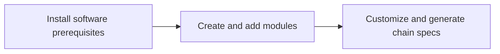

# Customize Your Tanssi-Powered Network

Tailor your network to meet your application's unique requirements. This section provides guidance on modifying and extending your network's functionality, offering instructions and best practices to help align it with your project's goals.

## Process for Customizing Your Network

The diagram below provides a simplified outline of the essential steps to get started with building and customizing your Tanssi-powered network.

To proceed, check out the following section where you can find detailed, step-by-step guides for each of these stages.

## Explore This Section

:::INSERT_GENERATED_CARDS:::
