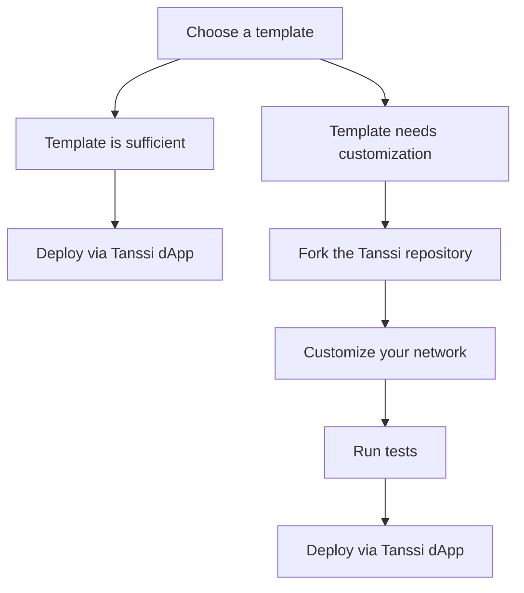

# Build Your Network

Launching your Tanssi-powered network gives you the flexibility to choose between pre-configured templates or fully customized solutions. Whether you're aiming for simplicity or fine-tuned control, Tanssi provides the tools and guidance to bring your vision to life. This section covers everything from selecting a template to customizing modules, testing, and deploying your network.

## The Path to Deployment

Deploying a network with Tanssi can be straightforward or highly customizable, depending on your requirements. The diagram below provides a clear breakdown of these options to guide your decision.

Now that you’ve explored the deployment paths, the next step is to [learn more about each template](/builders/build/templates) so you can choose the one that best fits your needs.

## Explore This Section

:::INSERT_GENERATED_CARDS:::
