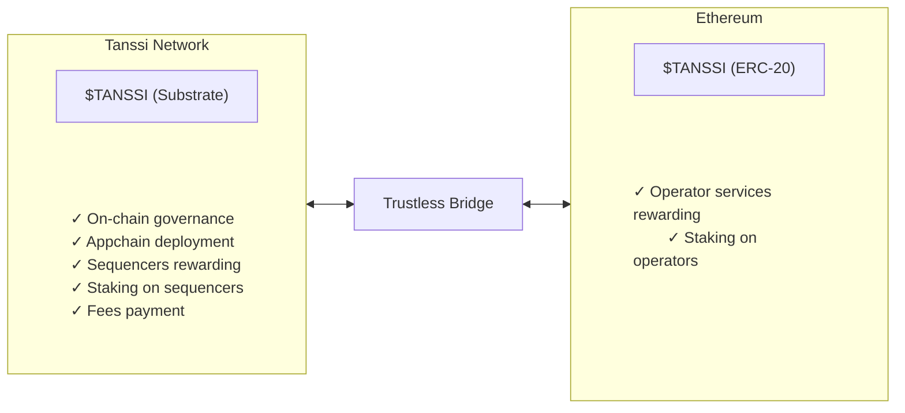

# TANSSI Token {: #tanssi-token }

## Introduction {: #introduction }

The Tanssi network token is the utility token that powers the Tanssi protocol. Considering [Tanssi's architecture](/learn/tanssi/overview/#tanssi-architecture){target=\_blank}, the token exists in two distinct yet interconnected representations: native substrate and Ethereum ERC-20. The two versions can be bridged between each other through the [Tanssi-Ethereum bridge](/learn/tanssi/tanssi-ethereum-bridge/){target=\_blank}.

In this guide, the token's utility and the differences between its two representations are covered, which is crucial for network operators, stakers, appchain managers, and general users who want to participate in the Tanssi ecosystem.

## Token Utility {: #token-utility }

Tanssi is a decentralized infrastructure protocol that makes deploying appchains with custom logic easy. It allows developers to focus on the use case instead of diverting time and energy to manage the [numerous components required](/learn/tanssi/overview/#what-tanssi-provides){target=\_blank} for a network to run smoothly.

Running a healthy decentralized protocol not only requires a robust governance mechanism to ensure that decisions are made transparently but also aligning incentives and coordinating among several ecosystem actors, including appchain developers, node operators, sequencer operators, data availability and RPC providers, as well as general users. The Tanssi token serves as the backbone, providing the economic mechanisms necessary to coordinate, incentivize proper behavior, and secure the entire ecosystem. It enables a verifiable and code-enforced protocol evolution through a fully on-chain decision-making process.

The token has several utilities:

- **On-chain governance**: token holders can use the token to propose and vote in governance decisions, such as software upgrades, how to spend treasury funds, change protocol rules, and more.
- **Appchain deployment**: use the token to register and launch your appchain in minutes.
- **Sequencing as a service payment**: use the token to keep your appchain live.
- **Sequencing and operator services rewarding**: get tokens as rewards for your nodes' services.
- **Staking on sequencers**: token holders can stake on sequencers, getting rewards with no risk of slashing.
- **Staking on operators**: token holders can stake on operators, getting rewards for their validation services.
- **Fees payment**: use the token to pay the fees for interacting with the Tanssi network.

!!! note
    All transaction fees on Tanssi are paid using the token, with the full amount going directly to fund the protocol's treasury account. These funds can only be spent via governance.

## Token Representations {: #token-representations }

The Tanssi network is built using the Substrate framework, leveraging its modular architecture and high performance. Therefore, the native token is of a Substrate type. The protocol's minting and burning mechanisms happen on the Tanssi network side, or, in other words, happen on the Substrate token representation.

Additionally, the Tanssi protocol relies on [external security providers](/learn/tanssi/external-security-providers/){target=\_blank}, such as [Symbiotic](/learn/tanssi/external-security-providers/symbiotic/){target=\_blank}, to secure the ecosystem through restaked assets. This restaking mechanism is implemented on Ethereum; therefore, an ERC-20 version of the token also exists to cover user cases on the Ethereum side.

Leveraging Tanssi's [built-in bridging capabilities](/builders/tanssi-network/bridge/){target=\_blank}, the token can be converted to (and from) the ERC-20  representation on Ethereum. When the token is bridged to Ethereum, the tokens are locked in the bridge's sovereign account, and a message is sent to the Ethereum contract to mint the equivalent amount in ERC-20. This lock-and-mint mechanism ensures the ERC-20 version is created through a trustless bridging mechanism, maintaining a 1:1 relationship with the native token.

### Tanssi (Substrate) - Native Token {: #tanssi-substrate }

The native Tanssi token exists on the Tanssi network as a Substrate-based asset and is the original form of the token that powers the core protocol operations.

This token uses as [Sr25519 subtrate-type account](/learn/tanssi/account-types/#key-types-in-tanssi-protocol){target=\_blank}, so it requires a wallet such as [Talisman](/builders/toolkit/substrate-api/wallets/talisman/){target=\_blank} or any other [substrate-compatible wallet](/builders/toolkit/substrate-api/wallets/){target=\_blank}.

!!! note
    The Tanssi (Substrate) native token has twelve (12) decimal places.

### Tanssi (ERC-20) - Ethereum Representation {: #tanssi-erc-20 }

Tanssi's ERC-20 version is a standard Ethereum token that represents the native token on the Ethereum network. This version is created through the trustless bridging mechanism, utilizing a lock-and-mint strategy, thereby maintaining a 1:1 relationship with the native token. 

This token, like any other Ethereum asset, uses an [ECDSA account](/learn/tanssi/account-types/#key-types-in-tanssi-protocol){target=\_blank}, so it requires a wallet such as [Metamask](/builders/toolkit/ethereum-api/wallets/metamask/){target=\_blank} or any other [Ethereum-compatible wallet](/builders/toolkit/ethereum-api/wallets/){target=\_blank}.

!!! note
    The Tanssi (ERC-20) has twelve (12) decimal places.

### Tanssi (Substrate) and Tanssi (ERC-20) Comparison {: #substrate-erc-20-comparison }

To better understand the differences between the two token representations, the following table provides a summary of their main features:

| **Feature**            | **Tanssi (Substrate)**                                                                                                                                                                                                  | **Tanssi (ERC-20)**                                                                                                                                                                               |
|------------------------|-------------------------------------------------------------------------------------------------------------------------------------------------------------------------------------------------------------------------|---------------------------------------------------------------------------------------------------------------------------------------------------------------------------------------------------|
| **Network**            | Tanssi Network                                                                                                                                                                                                          | Ethereum MainNet                                                                                                                                                                                  |
| **Token Standard**     | Native Substrate asset                                                                                                                                                                                                  | ERC-20 standard token                                                                                                                                                                             |
| **Decimal Places**     | Twelve (12) decimals                                                                                                                                                                                                    | Twelve (12) decimals                                                                                                                                                                              |
| **Account Type**       | [Sr25519](https://wiki.polkadot.network/learn/learn-cryptography/#keypairs-and-signing){target=_blank}                                                                                                                  | [ECDSA](https://en.wikipedia.org/wiki/Elliptic_Curve_Digital_Signature_Algorithm){target=_blank}                                                                                                  |
| **Compatible Wallets** | [Talisman](/builders/toolkit/substrate-api/wallets/talisman/){target=\_blank}, [SubWallet](/builders/toolkit/substrate-api/wallets/subwallet/){target=\_blank}, and others                                              | [MetaMask](/builders/toolkit/ethereum-api/wallets/metamask/){target=\_blank}, [Talisman](/builders/toolkit/ethereum-api/wallets/talisman/){target=\_blank}, and other Ethereum-compatible wallets |
| **Primary Utilities**  | - On-chain governance participation - Appchain registration and deployment - Sequencing services payment - Transaction fees on Tanssi network - Staking on sequencers - Sequencer operation rewards | - Operator validation rewards - Staking on operators                                                                                                                                          |
| **Staking Options**    | Sequencer staking (for keeping appchain liveness)                                                                                                                                                                       | Operator staking (for validating/securing the entire Tanssi ecosystem)                                                                                                                            |
| **Bridge Conversion**  | Can be bridged to ERC-20, paying fees in $TANSSI (Substrate)                                                                                                                                                            | Can be bridged to Substrate, paying fees in $ETH                                                                                                                                                  |