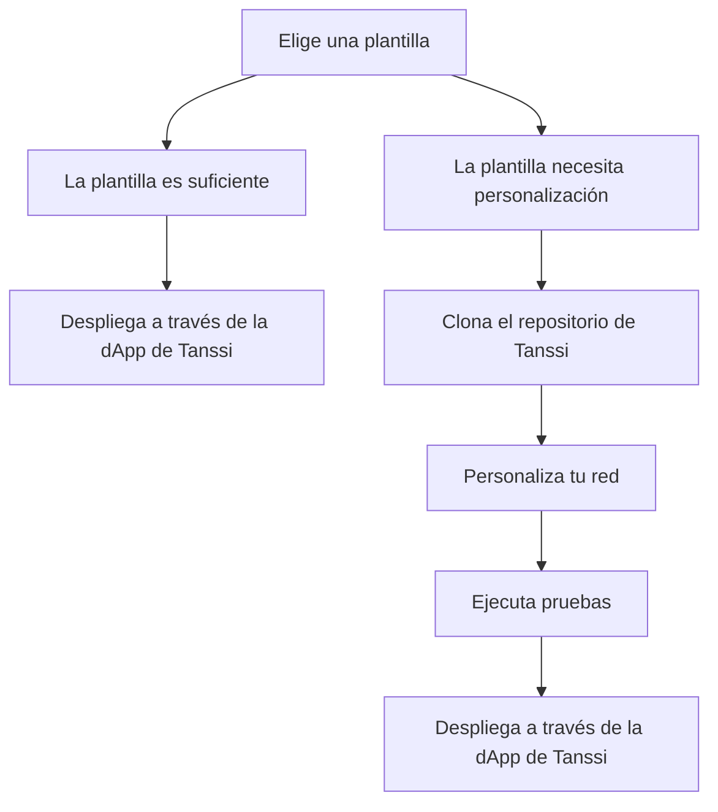

# Crea tu red

Lanzar tu red con Tanssi te da la flexibilidad de elegir entre plantillas preconfiguradas o soluciones totalmente personalizadas. Ya sea que busques simplicidad o control preciso, Tanssi proporciona las herramientas y la guía para hacer realidad tu visión. Esta sección cubre todo, desde la selección de una plantilla hasta la personalización de módulos, pruebas y despliegue de tu red.

## El camino hacia el despliegue

Desplegar una red con Tanssi puede ser sencillo o altamente personalizable, dependiendo de tus requisitos. El diagrama a continuación proporciona un desglose claro de estas opciones para guiar tu decisión.

Ahora que has explorado las rutas de despliegue, el siguiente paso es [aprender más sobre cada plantilla](/builders/build/templates) para que puedas elegir la que mejor se adapte a tus necesidades.

## Explora esta sección

:::INSERT_GENERATED_CARDS:::
