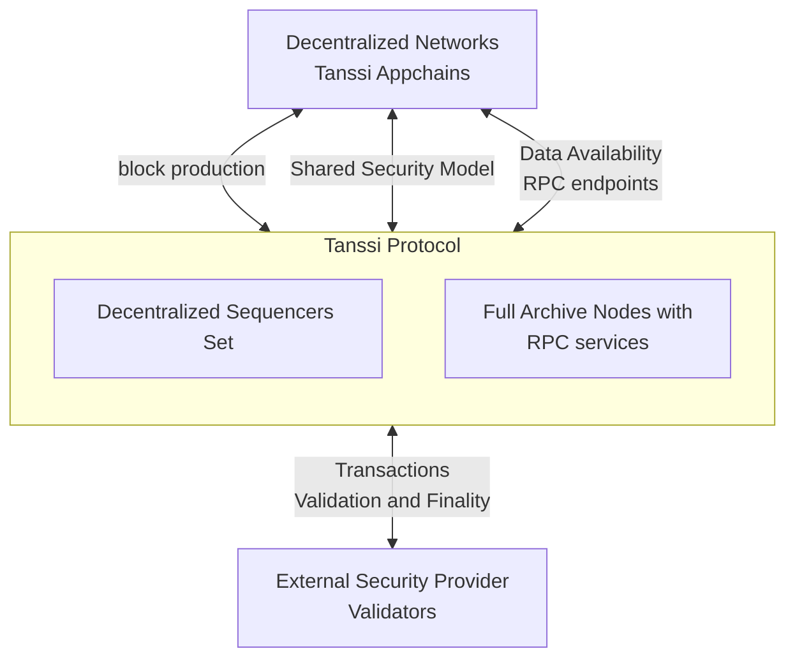

# Tanssi Appchains Overview {: #appchains-tanssi-overview }

## Introduction {: #introduction }

Appchains deployed through Tanssi receive many [benefits](/learn/tanssi/overview/#what-tanssi-provides){target=\_blank}, like block production as a service, data retrievability as a service, and security through an [external security providers](/learn/tanssi/external-security-providers/){target=\_blank} such as [Symbiotic](https://symbiotic.fi/){target=\_blank} on Ethereum.

Also, because Tanssi appchains are based on a [modular tech stack](/learn/framework/){target=\_blank}, they profit from unique advantages when customizations are required at a runtime level. This [modularity](/learn/framework/modules/){target=\_blank} allows developers to add functionality directly into the runtime or extend the capabilities of the EVM itself via precompiled contracts.

For example, Tanssi provides a ready-to-use [template](/learn/tanssi/included-templates/#baseline-evm-template){target=\_blank} that includes [Frontier](https://github.com/paritytech/frontier){target=\_blank} modules, enabling the effortless deployment of an EVM-compatible appchain, similar to [Moonbeam](https://moonbeam.network){target=\_blank}.

This section covers the fundamentals of a Tanssi appchain, its architecture, its core modules and functionalities, and the transaction fee mechanism.

## General Architecture {: #general-architecture}

As previously discussed, appchains deployed through Tanssi are customizable blockchains that, among other features, receive block production as a service and inherit security with deterministic block finality within seconds from an external security provider. 

Tanssi appchains are fully decentralized networks. The decentralized nature of the networks considerably increases their resilience and fault tolerance since they don't rely on a single authority or entity to ensure their liveness, security, and performance but on trustless, decentralized protocols. For example, they receive block production services from a decentralized and incentivized set of sequencers managed by Tanssi.

The Tanssi protocol runs with an external security provider, which has a set of validators with assets at stake, validating the transactions from the Tanssi network itself and all of the networks deployed through Tanssi. This way, all Tanssi appchains inherit the economic security derived from the Tanssi protocol and, indirectly, from the validators, which verify every transaction from every network. Tanssi appchains don't need to run their own validator set nor bootstrap liquidity to secure their protocol.

Tanssi appchains also benefit from a set of Data-Preservers, with full archive nodes, ensuring the data availability layer availability. These data-preservers are incentivized through Tanssi's data retrieval services and also provide the RPC infrastructure for apps and users interacting with Tanssi appchains.

## Appchain Transaction Flow {: #appchain-transaction}

A transaction submitted to a Tanssi appchain follows a complex yet seamless path from submission to block inclusion and finalization. The appchain infrastructure, Tanssi, and the chosen [security provider](/learn/tanssi/external-security-providers/){target=\_blank} work together at different levels to ensure the process happens as quickly as possible, usually taking around 30 seconds. Remember that a transaction in a Tanssi appchain reaches deterministic finality. Consequently, once the transaction is final, it becomes irreversible and unchangeable, and the state transition resulting from executing that transaction is final.

For example, a user initiates a transaction when interacting via an application deployed to a Tanssi appchain. The RPC provider will share the transaction, which sits in the chain's transaction pool, with all network participants. A sequencer assigned by Tanssi to that appchain will eventually pick up the transaction and include it in the next appchain block.

Then, the sequencer will share with the security provider's validators:

- The block itself with the state transitions
- The storage components in the Tanssi appchain database that the block is modifying
- The necessary hashes of the unaffected points in the Merkle tree of the storage

These components constitute the proof of validity (PoV).

Next, the PoV is verified by the security provider's validators. Note that the validators do not check that the Tanssi appchain storage is valid but that the state transitions that affect it are. A summary of that verification is then gossiped to other validators so they can verify it and include it in the next Tanssi block. Lastly, that Tanssi block with all the appchain's verifications is finalized.

The transaction flow process is summarized in the following diagram:

