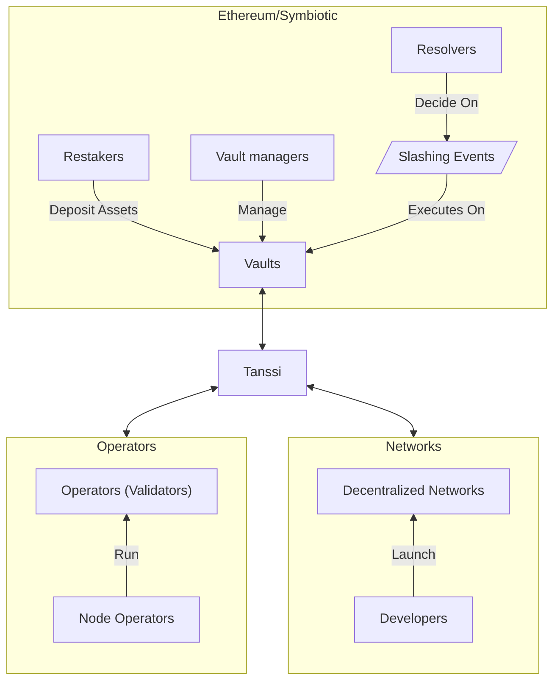
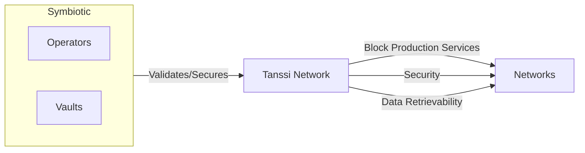
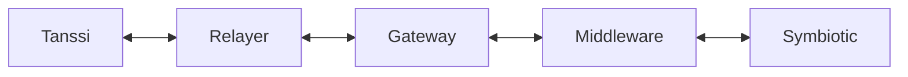
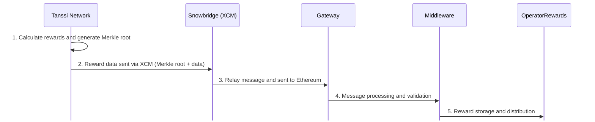
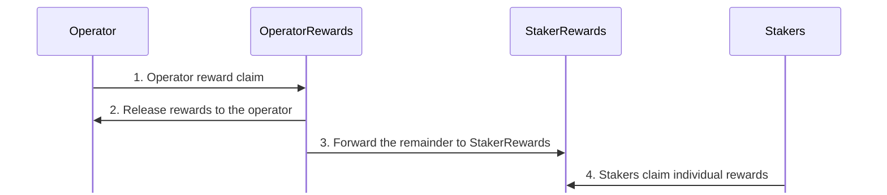
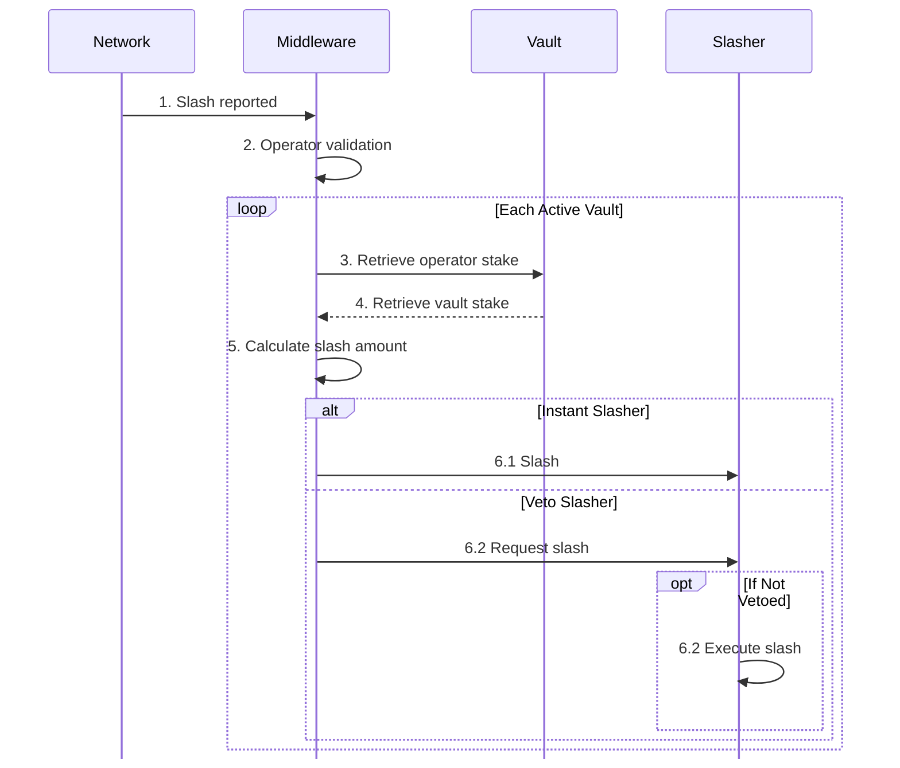

# Ethereum with Symbiotic {: #ethereum-symbiotic }

## Introduction {: #introduction }

The Tanssi protocol takes care of critical infrastructural components, making it easy for developers to launch their networks in a few minutes. In addition to block production, data retrievability, and integrations with essential tools such as wallets, RPC endpoints, block explorers, and others, another major task to tackle is providing security to the network.

Tanssi is designed to offer developers a shared security model, alleviating them from having to source enough economic security or negotiating with operators to run nodes opting-in for their networks. By deploying networks through Tanssi, and by choosing [Symbiotic](https://symbiotic.fi/){target=\_blank} as a security provider, developers benefit from Ethereum-grade security, tapping into billions of dollars in shared security from staked ETH.

The following sections describe how the Symbiotic protocol works and how Tanssi networks can leverage it as their consensus mechanism.

## Ethereum-Grade Security with Symbiotic {: #symbiotic }

[Symbiotic](https://symbiotic.fi/){target=\_blank} is a shared security protocol designed to be permissionless, multi-asset, and network-agnostic. It fosters capital efficiency by allowing users to extend the functionality of their staked assets to secure other networks while providing additional utility.

The protocol provides a coordination layer for its main components and participants, aligning incentives among parties while minimizing execution layer risks by deploying non-upgradeable core contracts on Ethereum. The following diagram resumes all the components and actors participating in the protocol:

Symbiotic's flexible design allows every party to decide on setups that best fit their use cases. For example, vaults can choose what forms of collateral they accept, operators can determine which networks they want to provide services to, and decentralized networks can customize their use case and define the level of security (which collaterals are accepted, for example) they need.

The following sections describe the protocol's main components.

### Vaults {: #vaults }

[Vaults](https://docs.symbiotic.fi/modules/vault/introduction){target=\_blank} are the Symbiotic protocol's economic backbone. They manage liquidity and deposits from restakers, connect operators and networks, and set up delegation strategies.

Each vault is bound to a specific token that satisfies the [IERC20](https://github.com/ethereum/ercs/blob/master/ERCS/erc-20.md){target=\_blank} interface and is accepted as collateral. Internally, the funds within the vault are represented as shares, which provide a mechanism for tracking ownership and distributing rewards. However, the reward token may differ from the collateral token.

A vault comprises three key modules, each serving a distinct function: the slasher, the delegator, and the accounting module. The implementation of these modules can vary depending on the vault manager's decisions.

- **Slasher module** - implements the [slashing](#slashing-process) logic, which penalizes bad actors
- **Delegator module** - defines how funds are delegated across operators and networks. Several [strategies](https://docs.symbiotic.fi/modules/vault/delegator){target=\_blank} are available, allowing the vault manager to select which operators and networks they want to work with
- **Accounting module** - handles the vault's financial operations, including processing user deposits, managing withdrawal requests, tracking active balances and total supply, and implementing epoch-based accounting for withdrawals and slashing events. The accounting module's standard implementation is [ERC-4626](https://ethereum.org/en/developers/docs/standards/tokens/erc-4626/){target=\_blank}, which provides a vault with a shares system included

Since the operators get delegated stake from the vault and could potentially get slashed, they must be approved by the vault managers beforehand. On a similar note, vault managers analyze and authorize each network the vault will secure, considering, for example, the rewards the network offers.

Vault managers also designate [resolvers](https://docs.symbiotic.fi/modules/counterparties/resolvers){target=\_blank}, responsible for approving or vetoing [slashing events](https://docs.symbiotic.fi/modules/vault/slasher){target=\_blank} caused by operators on networks with [veto-slashing](https://docs.symbiotic.fi/modules/vault/slasher#veto-slashing){target=\_blank} support, like the Tanssi Network.

### Operators {: #operators }

[Node operators](/node-operators/){target=\_blank} are entities or individuals responsible for running the [nodes (also known as operators or validators)](https://docs.symbiotic.fi/modules/counterparties/operators){target=\_blank}, which are the computational components validating the networks' transactions. They are responsible for the nodes' configuration, hardware setup, uptime, and performance.

Node operators opt-in to provide services to networks, which must accept their request. Also, they opt-in to provide services in vaults, which must accept their request.

Once an operator has been accepted by a vault and a network connected to that vault, the node can start providing validation services to that network, receiving rewards in exchange.

### Networks {: #networks }

[Networks](https://docs.symbiotic.fi/modules/counterparties/networks){target=\_blank} are the actively validated services or networks. These application-specific blockchains can be a use case from a wide range of industries, such as Gaming, Defi, RWAs, and others, and are the platforms that, through dApps, the end users interact with.

Since operators opt-in to provide services to networks and the vault managers must accept the networks, the developers are responsible for defining, controlling, and adapting their methodology for onboarding, rewarding, and slashing operators.

!!! note
    Networks deployed through Tanssi don't need to work on the relation with vaults and operators since the Tanssi protocol deals with those complexities.

## Tanssi with Symbiotic {: #tanssi-symbiotic }

Developers launching networks through Tanssi benefit from [block production services](/learn/tanssi/network-services/block-production/){target=\_blank}, data retrievability as a service, and the shared security model derived from every vault opting-in to support the Tanssi protocol. This eliminates the hurdle of dealing with infrastructural and security components developers would need to take on otherwise.

Vault managers running vaults can apply to offer the restaked collaterals as economic security for the Tanssi Network. Since Tanssi networks run in a sandbox-like environment, and the Tanssi protocol manages all the networks-related responsibilities, vault managers only need to analyze and opt-in to the Tanssi protocol, regardless of the quality and the quantity of networks that are running through the Tanssi protocol at any given moment.

Operators opting-in to provide services to the Tanssi protocol (provided that they participate in a vault that supports the Tanssi protocol) have the benefit of running the same setup to provide block production and validation services to the Tanssi Network and, consequently, to every network deployed through Tanssi. This unique architecture facilitates all the tasks related to running and maintaining the operators since there are no changes in the setup when a new Tanssi network is launched or decommissioned.

!!! note
    The Tanssi protocol effectively abstracts the details of the active set of networks away from vault managers and operators. Networks particularities don't require any additional setup from operators nor pose risks to vault assets.

All things combined shape a functional and elegant ecosystem where developers can focus on creating and innovating. Tanssi handles the infrastructural components, guaranteeing liveness and performance, and Symbiotic provides the economic safeguards to ensure the validity of the operations.

### Tanssi-Ethereum Communication {: #tanssi-ethereum-communication }

It is important to learn how Tanssi and Ethereum exchange data to understand the mechanics of the protocol. They connect through a two-way bridge that lets them communicate with each other. Each protocol has a specific job in making cross-chain operations possible.

There are three key components between Symbiotic and Tanssi:

- **`Relayer`** - is the software that continuously monitors both blockchains and transmits messages. Enabling reliable bidirectional communication between Tanssi and Ethereum, serving as the connection layer that ensures messages are correctly delivered across networks

- **`Gateway`** - operates on the Ethereum side of the bridge and serves three essential functions. It receives, verifies, and routes incoming messages from Tanssi to ensure they are correctly processed. The contract accepts outgoing messages destined for the Tanssi network, preparing them for relay. Finally, it handles higher-level application functionalities, most notably token transfers between the two networks, providing a secure interface for cross-chain asset movement

- **`Middleware`** - is Tanssi's implementation for handling network events and operations. It is the critical link between the `Gateway` and Tanssi's core protocol

The `Middleware` plays a central role in network coordination between Tanssi and Symbiotic. It distributes rewards to operators and vaults based on their network security and performance contributions. The contract sorts operators by stake to create a merit-based ranking system for their selection and transmits the list of sorted operator keys to Tanssi for assignment. Additionally, it facilitates operator registration processes and handles the reward and slashing protocols that maintain network incentive alignment.

#### From Ethereum to Tanssi {: #from-ethereum-tanssi }

The `Middleware` transmits operator set information to Tanssi for session assignment through the bridge. It sends details about active operators for each epoch, ordering them by their total stake aggregated across vaults. Tanssi then uses this information to assign operators for upcoming sessions, ensuring that the most economically aligned ones secure the network. This mechanism creates a stake-weighted operator selection process where economic security on Ethereum translates to operational security on Tanssi.

#### From Tanssi to Ethereum {: #from-tanssi-ethereum }

Tanssi sends operational data back to Ethereum through the same communication channel. This message includes reward information that enables proper distribution to stakeholders based on network performance. The network also transmits slashing event data when operators fail to perform correctly or violate protocol rules, allowing the protocol to apply penalties. Tanssi can also request new tokens to be created on Ethereum and register tokens, making managing assets between both networks easy.

### Rewards {: #rewards }

Well-behaved operators and restakers are rewarded for their participation with TANSSI tokens. The reward process consists of two main phases: [Reward Distribution Phase](#reward-distribution-phase) and [Reward Claiming Phase](#reward-claiming-phase).

#### Reward Distribution Phase {: #reward-distribution-phase }

The reward distribution phase calculates and allocates rewards through five key steps involving operators, restakers, and smart contracts. The steps are:

1. **Reward Calculation** - Tanssi calculates rewards based on the activity of operators and stakers and then creates a [Merkle root](https://en.wikipedia.org/wiki/Merkle_tree){target=\_blank}. This Merkle root is a cryptographic fingerprint that summarizes the reward allocations, indicating who receives what. Stakers are rewarded according to their stake in each vault
2. **Reward Data Sent via XCM** - reward allocation data is sent using [XCM](https://wiki.polkadot.network/learn/learn-xcm/){target=\_blank} (Cross-Consensus Messaging), a standardized protocol for blockchain communication. [Snowbridge](https://docs.snowbridge.network/){target=\_blank} acts as a trustless bridge between Tanssi and Ethereum
3. **Ethereum Message Reception** - once the message is relayed to the `Gateway` contract, this contract serves as Tanssi's authorized entry point on Ethereum for the Snowbridge bridge
4. **Message Processing and Validation** - the `Gateway` forwards the data to the [`Middleware`](https://github.com/moondance-labs/tanssi-symbiotic/blob/main/src/contracts/middleware/Middleware.sol){target=\_blank}, which is responsible for various tasks, including passing the information to the `OperatorReward` contract
5. **Reward Storage and Distribution** - this is the final destination for the data. The [`OperatorRewards`](https://github.com/moondance-labs/tanssi-symbiotic/blob/main/src/contracts/rewarder/ODefaultOperatorRewards.sol){target=\_blank} contract stores the Merkle tree of the reward allocations and handles the transfer of reward tokens when a claim is made

#### Reward Claiming Phase {: #reward-claiming-phase }

In the reward-claiming phase, operators and stakers can claim rewards based on their participation in the network. Tanssi determines the share distribution for operators and stakers, currently setting it at 20% for operators and 80% for stakers.

1. **Operator Reward Claim** - operators can claim their share by calling the `OperatorRewards` contract by using a cryptographic receipt that verifies their entitlement
2. **Token Release** - the operator call triggers the token release, and the `OperatorRewards` sends the established amount to the operator
3. **Token Distribution to Stakers** - the remaining rewards are forwarded to the `StakerRewards` contract for further claiming of the staker
4. **Staker Allocation** - the remaining 80% of the rewards are automatically directed to the [`StakerRewards`](https://github.com/moondance-labs/tanssi-symbiotic/blob/main/src/contracts/rewarder/ODefaultStakerRewards.sol){target=\_blank} contract, where stakers can claim rewards proportional to their stake in the vaults

### Slashing {: #slashing }

The Tanssi protocol implements slashing to penalize operators for misbehavior. When a slashing event is triggered, the authorities designated as resolvers by the vault managers can either accept or revert this action.

The following actions can trigger slashing events:

- Producing invalid blocks (e.g., blocks that include invalid transactions)
- Invalid validation (e.g., double-signing or breaking protocol rules)
- Downtime or unavailability
- Consensus violations

!!!note
    Slashing events can only be triggered by operators' misbehavior within the Tanssi Network. Even if Tanssi networks are faulty or malicious, they operate in a sandboxed environment and cannot cause slashing.

#### Slashing Process {: #slashing-process }

The slashing process follows a path similar to that of rewards. When an operator misbehaves, the Tanssi Network sends a slashing request message to the trustless bridge (Snowbridge). The message passes through the `Gateway` and into the `Middleware` where the slashing method gets called.

The slashing method receives a unique identifier for the operator's identity, the severity of the slash as a percentage of the operator's assigned stake in each vault, and the time context within which the offense occurred.

The slashing process consists of the following steps:

1. **Slash Reported** - Tanssi sends the slash request to the `Middleware` with the parameters `operatorKey`, `percentage`, and `epoch`
2. **Operator Validation** - the `Middleware` validates the operator's identity and checks if the operator is subject to slashing
3. **Retrieve Active Vaults** - the `Middleware` iterates through all active vaults during the offense epoch, skipping any inactive vaults
4. **Retrieve Operator Stake** - for each active vault, the `Middleware` retrieves the stake of the misbehaving operator
5. **Calculate Slash Amount** - the `Middleware` calculates the slashing amount by applying the slashed percentage to the operator's stake in each vault
6. **Slashing** - depending on the vault's slashing implementation, there are two possible routes

    - **Instant Slashing** - if the vault uses instant slashing, the stake is immediately reduced

    - **Veto Slashing** - if the vault uses veto slashing, the `Middleware` requests the slashing from a resolver. A time-limited veto window is created (e.g., 7 days)

    The slashing is canceled if the resolver vetoes the request within the time window. Otherwise, the slashing penalty is executed if no veto occurs within the time window

This process ensures that each vault's slashing is handled independently, preventing cross-contamination, and offers both instant and time-delayed slashing with dispute resolution mechanisms.

#### Burner {: #burner }

The `Burner` contract is an extension responsible for handling actions that follow a [slashing event](#slashing-process), notably the burning of slashed collateral. Once a slash is executed, the `Slasher` contract calls the `Burner` to carry out these post-slashing tasks.

Within the protocol, the `Burner` contract plays a crucial role in deciding what happens after slashing. While there are different ways to implement the burning process, the recommended approach is to burn the slashed assets.
When a slash is executed, the `Burner` contract's `onSlash` function is activated. This function kicks off the process of burning the slashed assets.

The vault manager chooses the specific implementation of the burning process during the vault's initialization phase, and once set, the vault manager cannot modify it. The exact design of the `Burner` contract may differ depending on the type of collateral asset involved. Below are some potential implementation options:

- **Burning Tokens** - if the slashed collateral is a regular ERC-20 token, the `Burner` destroys those tokens, permanently removing them from circulation
- **Unwrapping and Burning** - if the slashed tokens represent something like staked assets (e.g., liquid staking tokens) or liquidity provider (LP) tokens from a decentralized exchange (DEX), the `Burner` might convert them back into their original form before burning them
- **Cross-Chain Operations** - if the tokens are tied to assets on another blockchain, the `Burner` could unwrap them on Ethereum and trigger the burn process on the original network
- **Alternative Handling** - sometimes, burning isn't the best option. Instead, the `Burner` might redistribute the slashed assets to other operators, compensate affected users, or lock them in liquidity pools—whatever the system is designed to do

Burning slashed collateral is important because it penalizes misbehaving operators and reduces the total supply of tokens, which can have deflationary effects.
