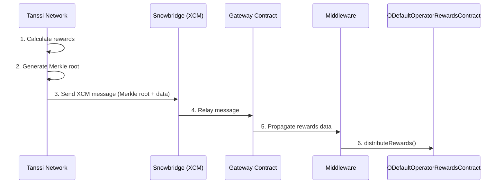
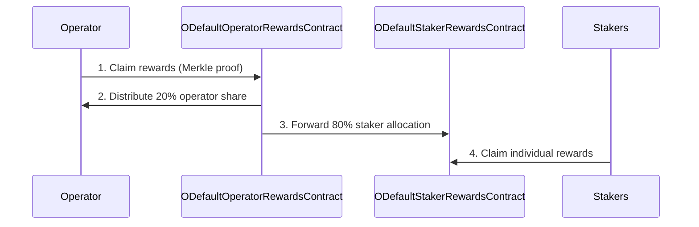

# Ethereum with Symbiotic {: #ethereum-symbiotic }

## Introduction {: #introduction }

The Tanssi protocol takes care of critical infrastructural components, making it easy for developers to launch their networks in a few minutes. In addition to block production, data retrievability, and integrations with essential tools such as wallets, RPC endpoints, block explorers, and others, another major task to tackle is providing security to the network.

Tanssi is designed to offer developers a shared security model, alleviating them from having to source enough economic security or negotiating with operators to run nodes opting-in for their networks. By deploying networks through Tanssi, and by choosing [Symbiotic](https://symbiotic.fi/){target=\_blank} as a security provider, developers benefit from Ethereum-grade security, tapping into billions of dollars in shared security from staked ETH.

The following sections describe how the Symbiotic protocol works and how Tanssi networks can leverage it as their consensus mechanism.

## Ethereum-Grade Security with Symbiotic {: #symbiotic }

[Symbiotic](https://symbiotic.fi/){target=\_blank} is a shared security protocol designed to be permissionless, multi-asset, and network-agnostic. It fosters capital efficiency by allowing users to extend the functionality of their staked assets to secure other networks while providing additional utility.

The protocol provides a coordination layer for its main components and participants, aligning incentives among parties while minimizing execution layer risks by deploying non-upgradeable core contracts on Ethereum. The following diagram resumes all the components and actors participating in the protocol:

```mermaid
flowchart TD
    %% Vaults subgraph
    subgraph Ethereum["Ethereum/Symbiotic"]
        slash[/Slashing Events/]
        Restakers -- Deposit Assets --> Vaults
        Curators -- Manage --> Vaults
        Resolvers -- Decide On --> slash
        slash -- Executes On --> Vaults
    end

    %% Validators subgraph
    subgraph Validators
        direction BT
        validators["Operators/Validators"]
        operators["Node Operators"]
        operators -- Run --> validators

    end

    %% Networks subgraph
    subgraph Networks
        direction BT
        developers["Developers"]
        networks["Decentralized Networks"]
        developers -- Launch --> networks
    end

    Vaults <--> Tanssi
    Tanssi <--> Validators
    Tanssi <--> Networks


    classDef container fill:#424242, rx:5px, ry:5px;
    class Networks container
    class Validators container
    class Ethereum container
```

Symbiotic's flexible design allows every party to decide on setups that best fit their use cases. For example, vaults can choose what forms of collateral they accept, operators can determine which networks they want to provide services to, and decentralized networks can customize their use case and define the level of security (which collaterals are accepted, for example) they need.

The following sections describe the protocol's main components.

### Vaults {: #vaults }

[Vaults](https://docs.symbiotic.fi/modules/vault/introduction){target=\_blank} are the Symbiotic protocol's economic backbone. They manage liquidity and deposits from restakers, connect operators and networks and set up delegation strategies.

Vaults are programmable, and many vaults with different setups can coexist, each serving a different purpose. Vaults are managed by curators, who have the responsibility of deciding on critical matters such as:

- **Accounting**: curators configure deposits, withdrawals, and collateral slashing. Each vault is tied to a specific asset that is used as collateral.
- **Delegation Strategies** - curators define the delegation and restaking strategy across networks. For example, using a multi-operator and network strategy involves higher capital efficiency and risk.
- **Reward Distribution** vaults provide historical information to external rewards contracts.

Vault managers also whitelist the operators and networks with which to work. Since the operators get delegated stake and could potentially get slashed, they must be accepted by the vault managers before providing validation services to the networks. On a similar note, vault managers analyze and authorize each network the vault will secure, taking into consideration, for example, the rewards the network offers.

Vault managers also designate [resolvers](https://docs.symbiotic.fi/modules/counterparties/resolvers){target=\_blank}, who are responsible for approving or vetoing [slashing events](https://docs.symbiotic.fi/modules/vault/slasher){target=\_blank} caused by operators on networks with [veto-slashing](https://docs.symbiotic.fi/modules/vault/slasher#veto-slashing){target=\_blank} support, like the Tanssi Network.

### Operators {: #operators }

[Node operators](/node-operators/){target=\_blank} are entities or individuals responsible for running the [nodes (also known as operators or validators)](https://docs.symbiotic.fi/modules/counterparties/operators){target=\_blank}, which are the computational components validating the networks' transactions. They are responsible for the nodes' configuration, hardware setup, uptime, and performance.

Node operators opt-in to provide services to networks, which must accept their request. Also, they opt-in to provide services in vaults, which must accept their request.

Once an operator has been accepted by a vault and a network connected to that vault, the node can start providing validation services to that network, receiving rewards in exchange.

### Networks {: #networks }

[Networks](https://docs.symbiotic.fi/modules/counterparties/networks){target=\_blank} are the actively validated services or networks. These application-specific blockchains can be a use case from a wide range of industries, such as Gaming, Defi, RWAs, and others, and are the platforms that, through dApps, the end users interact with.

Since operators opt-in to provide services to networks and the vault managers must accept the networks, the developers are responsible for defining, controlling, and adapting their methodology for onboarding, rewarding, and slashing operators.

!!! note
    Networks deployed through Tanssi don't need to work on the relation with vaults and operators since the Tanssi protocol deals with those complexities.

## Tanssi with Symbiotic {: #tanssi-symbiotic }

Developers launching networks through Tanssi benefit from [block production services](/learn/tanssi/network-services/block-production/){target=\_blank}, data retrievability as a service, and the shared security model derived from every vault opting-in to support the Tanssi protocol. This eliminates the hurdle of dealing with infrastructural and security components developers would need to take on otherwise.

Curators running vaults can apply to offer the restaked collaterals as economic security for the Tanssi Network. Since Tanssi networks run in a sandbox-like environment, and the Tanssi protocol manages all the networks-related responsibilities, vault curators only need to analyze and opt-in to the Tanssi protocol, regardless of the quality and the quantity of networks that are running through the Tanssi protocol at any given moment.

Operators opting-in to provide services to the Tanssi protocol (provided that they participate in a vault that supports the Tanssi protocol) have the benefit of running the same setup to provide block production and validation services to the Tanssi Network and, consequently, to every network deployed through Tanssi. This unique architecture facilitates all the tasks related to running and maintaining the operators since there are no changes in the setup when a new Tanssi network is launched or decommissioned.

!!! note
    The Tanssi protocol effectively abstracts the details of the active set of networks away from vault managers and operators. Networks particularities don't require any additional setup from operators nor pose risks to vault assets.

All things combined shape a functional and elegant ecosystem where developers can focus on creating and innovating. Tanssi handles the infrastructural components, guaranteeing liveness and performance, and Symbiotic provides the economic safeguards to ensure the validity of the operations.

```mermaid
flowchart LR
    subgraph Symbiotic
        direction LR
        Operators
        Vaults
    end
    Symbiotic  -- Validates/Secures --> tanssi["Tanssi Network"]
    tanssi -- Block Production Services--> Networks
    tanssi -- Security--> Networks
    tanssi -- Data Retrievability--> Networks

    classDef container fill:#424242, rx:5px, ry:5px;
    class Symbiotic container
```

### Rewards {: #rewards }

Well-behaved operators and restakers receive rewards for participating in TANSSI tokens. The reward process has two phases.

#### Reward Distribution Phase

The reward distribution process begins within the Tanssi Network, where rewards for operators and stakers are calculated, and a Merkle root is generated to represent the reward allocations cryptographically. This data is packaged into an XCM message and transmitted to the Gateway Contract on Ethereum via Snowbridge, a cross-chain communication protocol. The Gateway Contract verifies the message’s origin from Tanssi and propagates the reward data to the Middleware. The Middleware forwards the validated reward parameters to the ODefaultOperatorRewardsContract, finalizing the on-chain distribution without storing data or performing additional validation. This phase leverages Tanssi’s cross-chain infrastructure to ensure tamper-proof reward initialization.

#### Reward Claiming Phase

Once rewards are allocated, operators initiate claims by submitting Merkle proofs to the ODefaultOperatorRewardsContract, which enforces an automated 80/20 split: 20% of the claimed rewards are distributed directly to the operator, while 80% are routed to the dedicated ODefaultStakerRewardsContract. Through vault-based share calculations, stakers subsequently claim their proportional shares from the latter contract. This phase emphasizes decentralized, self-custodial access, with smart contracts autonomously executing the reward split and ensuring atomic settlement.

### Slashing {: #slashing }

The Tanssi protocol implements veto-slashing to penalize bad actors' misbehavings. These are the actions that cause slashing events:

1. Producing Invalid Blocks (blocks including invalid transactions, for example)
2. Invalid Validation (double-signing or breaking protocol rules, for example).
3. Downtime or Unavailability
4. Consensus Violations

When a veto-slashing event is triggered, the authorities designated as resolvers by the vault managers can accept or revert this action.
Consider that slashing events can only be triggered by operators' misbehavings in the Tanssi Network itself. Tanssi networks, even if faulty or malicious, run in a sandboxed environment and can not cause slashing.
