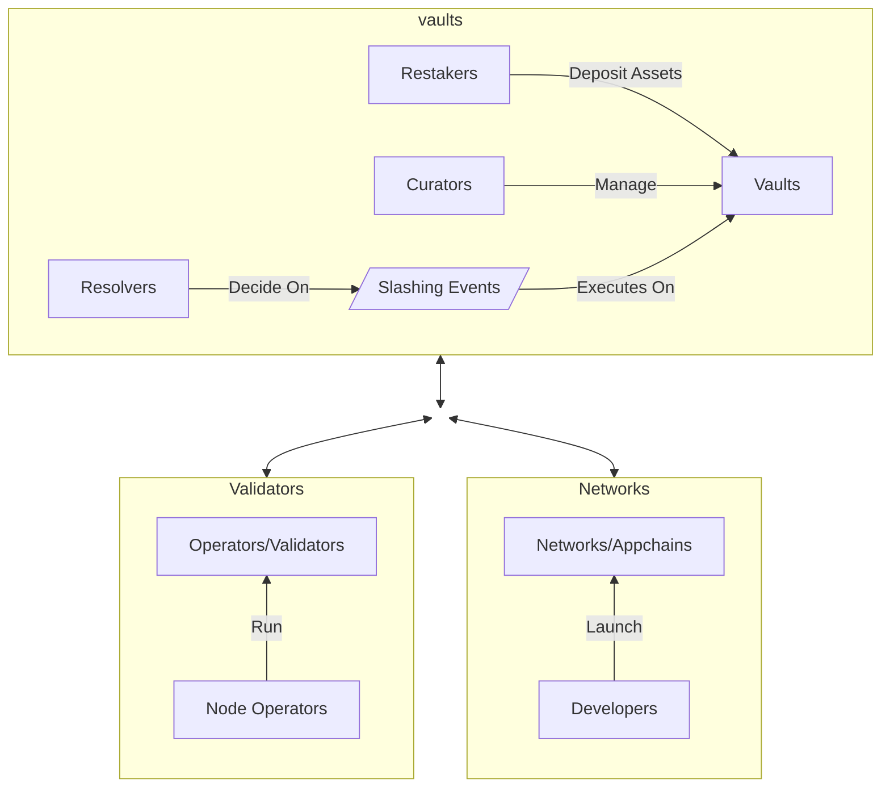

# Ethereum with Symbiotic {: #ethereum-symbiotic }

## Introduction {: #introduction }

The Tanssi protocol takes care of critical infrastructural components, making it easy for developers to launch their networks in a few minutes. In addition to block production, data retrievability, and integrations with essential tools such as wallets, RPC endpoints, block explorers, and others, another major task to tackle is providing security to the network.

Tanssi is designed to offer developers a shared security model, alleviating them from having to source enough economic security or negotiating with operators to run nodes opting-in for their appchains. By deploying appchains through Tanssi, and by choosing [Symbiotic](https://symbiotic.fi/){target=\_blank} as a security provider, developers benefit from Ethereum-grade security, tapping into billions of dollars in shared security from staked ETH.

The following sections describe how the Symbiotic protocol works and how Tanssi appchains can leverage it as their consensus mechanism.

## Ethereum-Grade Security with Symbiotic {: #symbiotic }

[Symbiotic](https://symbiotic.fi/){target=\_blank} is a restaking protocol designed to be permissionless, multi-asset, and network-agnostic. It fosters capital efficiency by allowing users to extend the functionality of their staked assets to secure other networks while providing additional utility.

The protocol provides a coordination layer for its main components and participants, aligning incentives among parties while minimizing execution layer risks by deploying non-upgradeable core contracts on Ethereum. The following diagram resumes all the components and actors participating in the protocol:

Symbiotic's flexible design allows any party to pick and choose what fits their use case best, for example, vaults can choose what forms of collateral they accept, operators can decide which networks they provide services to,decentralized networks can customize their use case and define the desired security form (which collaterals are accepted, for example) and ratios.

The following sections describe the protocol's main components.

### Vaults {: #vaults }

[Vaults](https://docs.symbiotic.fi/modules/vault/introduction){targte=\_blank} are the economic backbone of the protocol, managing liquidity and deposits from restakers, connecting operators and networks, distributing rewards to restakers and operators, and penalizing bad actors.

Vaults are programmable and many vaults with different setups can coexist, each one serving a different purpose. Vaults are managed by curators, who have the responsibility of deciding on critical matters such as:

- **Accounting** - curators configure deposits and withdrawals, which [assets](https://app.symbiotic.fi/restake){target=\_blank} the vault accepts as valid collaterals
- **Delegation Strategies** - curators define how the stake in the vault is delegated accross operators and networks

Vaults managers also whitelist the operators and networks to work with. Since the operators get delegated stake, and could potentially get slashed, they have to be accepted by the vault managers before starting to provide validation services to the networks. In a similar note, vault managers analyze and authorize each network the vault will secure, taking into consideration, for example, the rewards the netwok offers, and other characteristics.

Vault managers also designate [resolvers](https://docs.symbiotic.fi/modules/counterparties/resolvers){target=\_blank}, who are responsible for approving or vetoing [slashing event](https://docs.symbiotic.fi/modules/vault/slasher){target=\_blank} caused by operators on networks with [veto slashing](https://docs.symbiotic.fi/modules/vault/slasher#veto-slashing){target=\_blank} support, like Tanssi Network.

### Operators {: #operators }

[Node operators](/node-operators/){target=\_blank} are entities or individuals responsible for running the [nodes (also known as operators or validators)](https://docs.symbiotic.fi/modules/counterparties/operators){target=\_blank}, which are the computational components validating the networks' transactions. They are responsible for the nodes configuration, hardware setup, uptime, and performance.

Node operators opt-in to provide services to networks, which must accept their request. Also, they opt-in to provide services in vaults, which must accept their request.

Once an operator has been accepted by a vault, and a network connected to that vault, the node can start providing validation services to that network, receiving rewards in exchange.

### Networks {: #networks }

[Networks](https://docs.symbiotic.fi/modules/counterparties/networks){target=\_blank} are the actively validated services or appchains. These application-specific blockchains can be a use case from a wide range of industries, such as Gaming, Defi, RWAs, and others, and are the platforms that, through dApps, the end users interact with.

Since operators opt-in to provide services to networks and the vault managers must accept the networks, the developers are responsible for defining, controlling, and adapting their methodology for onboarding, incentivizing (rewards mechanism), and slashing operators. 

## Tanssi with Symbiotic {: #tanssi-symbiotic }

Developers launching appchains through Tanssi benefit from [block production services](/learn/tanssi/appchain-services/block-production/){target=\_blank}, data retrievability as a service, and the shared security model derived from every vault opting-in to support the Tanssi protocol. This eliminates the hurdle of dealing with infrastructural and security components developers would need to take on otherwise.

Curators running vaults can apply to offer the restaked collaterals as economic security for the Tanssi network. Since Tanssi appchains run in a sandbox-like environment, and the Tanssi protocol manages all the appchains-related responsibilities, vault curators only need to analyze and opt-in to the Tanssi protocol, regardless of the quality and the quantity of appchains that are running through the Tanssi protocol at any given moment. 

Operators opting-in to provide services to the Tanssi protocol (provided that they participate in a vault that supports the Tanssi protocol) have the benefit of running the same setup to provide block production and validation services to the Tanssi network and, consequently, to every appchain deployed through Tanssi. This unique architecture facilitates all the tasks related to running and maintaining the operators, since there are no changes in the setup when a new Tanssi appchain is launched or decommissioned.

All things combined shape a functional and elegant ecosystem where developers can focus on creating and innovating. Tanssi handles the infrastructural components, guaranteeing liveness and performance, and Symbiotic provides the economic safeguards to ensure the validity of the operations.
 
### Slashing and Rewards {: #slashing-rewards }

Well-behaved operators and restakers receive rewards for their participation in TANSSI tokens. Reward payments are managed through the vault.

The Tanssi protocol also implements veto-slashing to penalize bad actors' misbehavings. These are the actions that cause slashing events:

1. Producing Invalid Blocks (blocks including invalid transactions, for example)
2. Invalid Validation (double-signing or breaking protocol rules, for example).
3. Downtime or Unavailability
4. Consensus Violations

When a veto-slashing event is triggered and the authorities designated as resolvers by the vault managers can accept or revert this action.

!!! note
    Slashing events can only be triggered by operators' misbehavings in the Tanssi network itself. Tanssi appchains, even if faulty or malicious, run in a sandboxed environment and can not cause slashing.