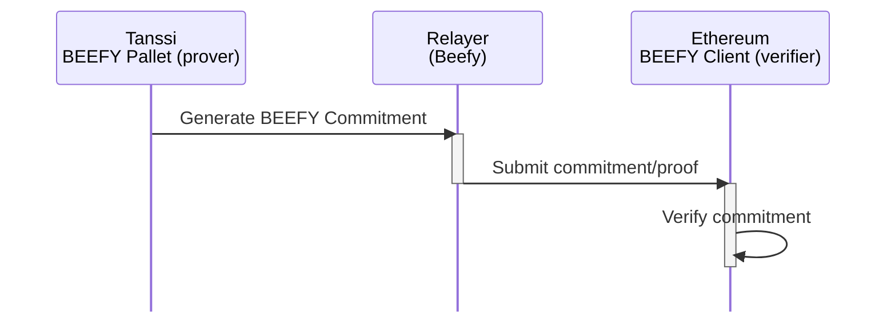
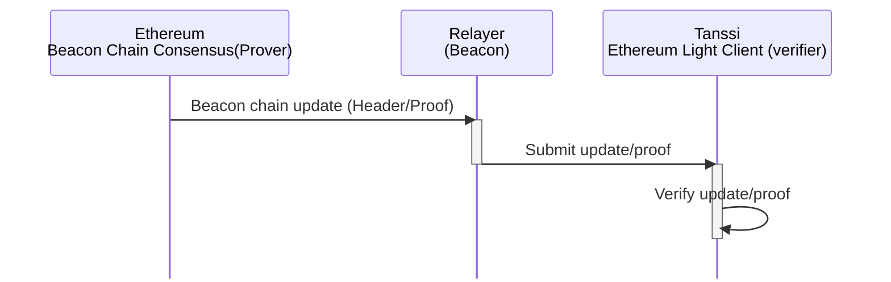
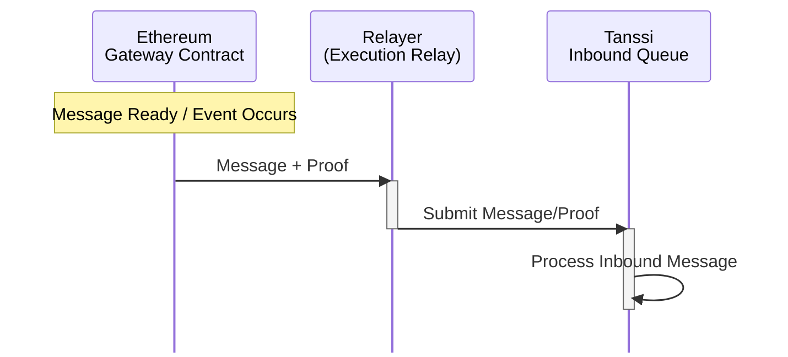
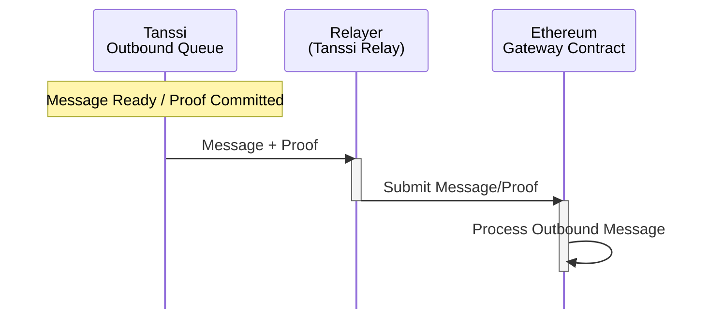
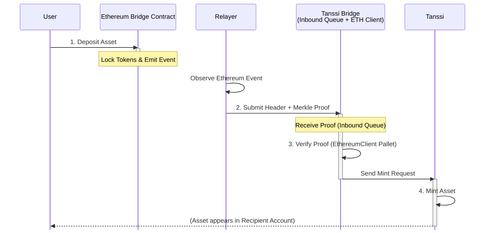
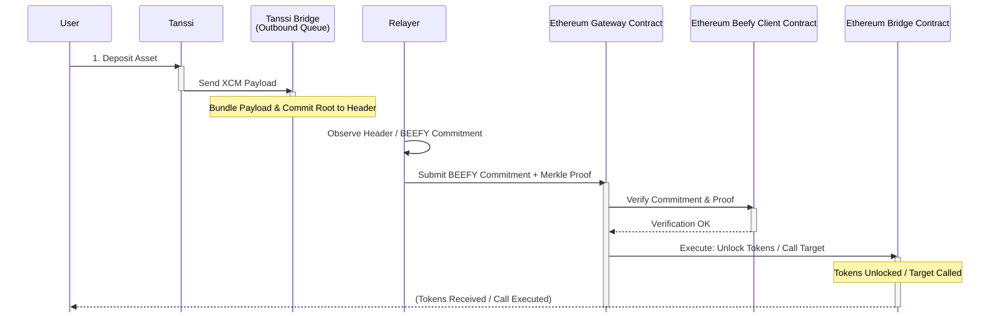

# Tanssi–Ethereum Bridge {: #tanssi-ethereum-bridge }

## Introduction {: #introduction }

In traditional blockchain environments, assets and functionalities are restricted to their respective chains, creating silos that limit interoperability and asset utility. The Tanssi–Ethereum Bridge breaks these limitations by enabling seamless cross-chain operations that benefit both ecosystems.

Consider this bridge not merely an asset exchange mechanism but a secure, standardized protocol allowing direct interaction between different blockchain networks without reliance on centralized intermediaries. This emphasis on eliminating trusted third parties is fundamental to its design, setting it apart from bridge solutions that might introduce central points of failure or control.

## Core Functions { : #core-functions }

The bridge facilitates several critical operations between Tanssi and Ethereum:

- **Operator Management -** Operator stake information is maintained on Ethereum via the Symbiotic restaking protocol, which organizes operators based on their assigned stake. This ordered list is transmitted to Tanssi through the bridge. Tanssi then utilizes this information to select active validators for each era, ensuring a decentralized and economically aligned validator set
- **Economic Operations** Distributing rewards from Tanssi to Ethereum stakers and operators
- Processing slashing requests from Tanssi to Ethereum when validators violate protocol rules
- Transferring assets bilaterally between ecosystems without centralized intermediaries

This interoperability expands the potential of decentralized applications (dApps) and significantly enhances the liquidity and usability of blockchain assets.

## The Bridge Architecture { : #bridge-architecture }

When we look at how the bridge functions, we can approach it from two complementary angles. From a consensus perspective, the bridge relies on three main components: provers that compute cryptographic proofs, verifiers that validate these proofs, and relayers that move data between chains. Components like the BEEFY pallet on Tanssi and the Beacon Chain consensus on Ethereum act as provers that generate consensus data transmitted by specialized relayers. A "light client" of the other chain is maintained on each blockchain. These light clients serve as on-chain verification modules that confirm the authenticity of data from the counterpart network. For example, when sending a message from Tanssi to Ethereum, the Tanssi side creates compact proofs that certain events or state changes are valid according to its consensus rules. The light client on Ethereum then checks these proofs before allowing any action based on that data. This approach means the receiving chain doesn't need to process the entire state of the sending chain - it only needs to verify cryptographic proofs.

### Consensus BEEFY (Tanssi to Ethereum)

### Consensus Beacon (Ethereum to Tanssi)

From a messaging perspective, the bridge relies on dedicated components to handle cross-chain communication while building upon the consensus verification layer. The Execution relay handles message transfers from Ethereum to Tanssi, while the Tanssi relay manages messages flowing from Tanssi to Ethereum. These relayers act as stateless couriers in the system—they submit proofs but cannot forge or steal funds because every proof is independently re-validated on-chain. This design allows multiple relayers to operate simultaneously, improving the system's liveness without giving any single relayer privileged access. The Gateway Contract serves as the central messaging hub on the Ethereum side. It accepts incoming messages from Tanssi (delivered via relayers), verifies their validity using consensus proofs, and executes the appropriate actions, such as unlocking or minting tokens or calling target contracts.

### Inbound Messages (Ethereum to Tanssi)

### Outbound Messages (Tanssi to Ethereum)

The Gateway also handles outbound communications—when Ethereum transactions trigger a cross-chain transfer, it logs an event and locks tokens as needed, preparing the message for delivery to Tanssi. On the Tanssi side, a two-queue system manages message processing. For outgoing messages to Ethereum, the Outbound Queue pallet collects XCM messages, bundles them together, and inserts a cryptographic commitment (a Merkle root of all messages) into each block header. This commitment can then be verified using the consensus mechanisms established earlier. For incoming messages from Ethereum, the Inbound Queue pallet verifies proofs of Ethereum events using the on-chain Ethereum light client, then translates these verified events into XCM instructions that get dispatched to the target parachain. This messaging architecture is built atop the consensus verification layer, ensuring that all cross-chain communication remains secure and trustless throughout the process.

## Message & Token Flow {: #message-flow }

After covering the architecture and security basics, it’s helpful to understand **how the Bridge actually moves assets and messages between chains**. In practice, the flow involves locking or minting assets on one side and performing a complementary action on the other side, always underpinned by verified proofs of action. Below, we describe the typical sequence for each direction of transfer.

The process involved in general terms is the following:

1. **Initiation (Source Chain)**: The user initiates asset transfer
2. **Relay Proof**: Off-chain relayers pick up the event and submit cryptographic proofs to the destination chain
3. **Verification (Destination Chain)**: On-chain light clients independently verify submitted proofs
4. **Execution**: Upon successful verification, tokens are minted/unlocked on the destination chain

### Ethereum to Tanssi Transfer

This flow outlines how assets move from Ethereum to Tanssi to become representative assets.

**1. Lock on Ethereum:** The user interacts with the designated Bridge contract on Ethereum, depositing their asset. The contract securely locks these tokens and emits a corresponding event containing details of the deposit

**2. Relay Proof to Tanssi:** An off-chain relayer service monitors the Ethereum Bridge contract for these events. Upon detecting a finalized event, the relayer constructs a proof package. This typically includes the relevant Ethereum block header (proving finality) and a Merkle proof demonstrating that the specific deposit event occurred within that block

The relayer submits this proof package to the `Inbound Queue` on the Tanssi Bridge

**3. Verify on Tanssi:** The `EthereumClient` pallet, acting as an on-chain light client within the Tanssi Bridge, receives the proof package from the `Inbound Queue`. It verifies the finality and validity of the Ethereum block header and checks the Merkle proof to confirm the deposit event's authenticity

**4. Mint on Tanssi:** Once the `EthereumClient` confirms the proof's validity, the `Inbound Queue` is notified. The `Inbound Queue` mints the asset on the Tanssi network

### Tanssi to Ethereum Transfer

This flow describes the reverse process, moving assets from Tanssi to Ethereum.

**1. Initiate & Commit on Tanssi:** The user initiates the action on Tanssi, and an XCM message containing the transfer details is generated and sent to the Bridge `Outbound Queue`

The `Outbound Queue` processes this message, bundles the payload, and commits its Merkle root to the Tanssi Bridge, the network’s block header. This root cryptographically represents all outgoing messages in that block.

**2. Relay Proof to Ethereum:** An off-chain relayer monitors the Tanssi Bridge for finalized blocks containing relevant `Outbound Queue` Merkle roots. The relayer retrieves the necessary proof components: typically a BEEFY commitment (a signed statement about finalized Tanssi block headers) and a Merkle proof showing that the specific user's transfer payload is included under the committed `Outbound Queue` root. The relayer submits the BEEFY commitment and the Merkle proof to the `Gateway` contract on the Ethereum network.

**3. Verify on Ethereum:** The `Beefy Client` contract on Ethereum (an on-chain light client for Tanssi consensus) receives the BEEFY commitment from the `Gateway`. It verifies the commitment's validity, checking the signatures against the known authorities using techniques like random-sampling signature verification

Once the commitment is verified, the `Gateway` validates the submitted Merkle proof for the user's specific action payload.

**4. Execute on Ethereum:**  Upon successfully verifying the BEEFY commitment and the Merkle proof**,** the `Gateway` contract proceeds with execution.

This typically involves interacting with the main Bridge contract to release the originally locked asset and transfer it to the recipient's Ethereum address. Alternatively, depending on the message payload, it might execute a specified call on a target contract on Ethereum.

