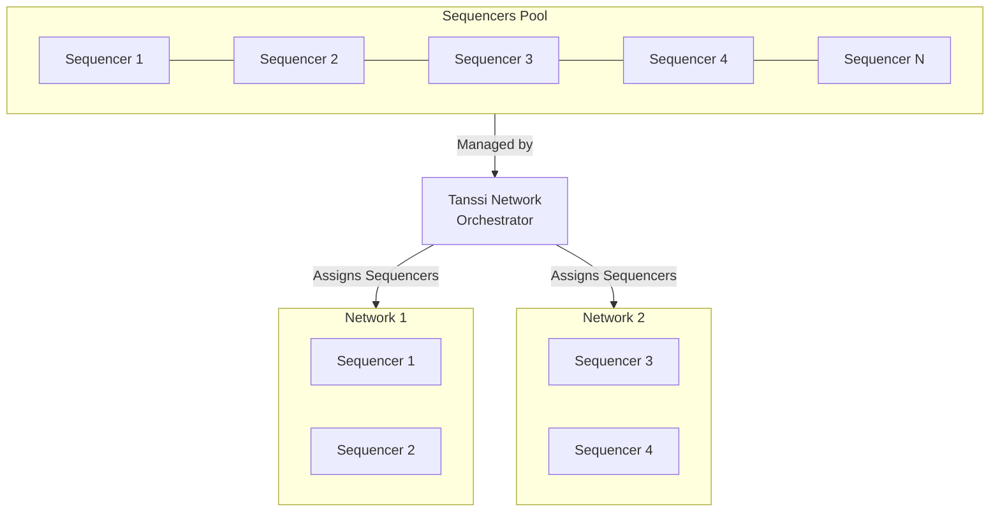

# Block Production Services {: #block-production-services }

## Introduction {: #introduction }

As presented in the [Overview](/learn/tanssi/overview/){target=\_blank} article, Tanssi is an infrastructure protocol that streamlines the deployment of decentralized networks with custom logic fitting a wide range of use cases, including DeFi, NFTs, Gaming, and any other use case development teams may want to address.

Infrastructure poses a huge challenge for developers, requiring them to bootstrap sequencers, data preservers, and RPC endpoints, while also managing integrations, interoperability, and security. This demands valuable time and resources, diverting focus from what truly matters: delivering value to their users.

Tanssi orchestrates resources, allowing developers to deploy decentralized networks (also known as actively validated services or AVSs) that are fully adaptable to any specific application or use case. In this analogy, the Tanssi network resembles [Kubernetes](https://kubernetes.io){target=\_blank} in its role as an orchestrator, managing resources to guarantee the liveness and performance of the networks.

The protocol also tackles the security front by allowing networks to select and connect to external security providers (like [Symbiotic](/learn/tanssi/external-security-providers/symbiotic/){target=\_blank}), ensuring Ethereum-grade security right from the start.

This article covers the necessary aspects to consider when building and deploying your own modular blockchain, along with the most relevant technical aspects of the Tanssi protocol.

## Block Production as a Service {: #block-production-as-a-service }

The Tanssi protocol provides block production as a service, orchestrating a decentralized and trustless set of sequencers, ensuring the networks' liveness. To do so, the protocol bridges both ends:

- **Node operators**: Who run sequencers, offering their block production services to get rewards.
- **Developers**: Who launch networks, which require sequencers.

The protocol assigns a subset of sequencers to provide services to each network, rotating them after a period of time. The sequencers can serve any Tanssi-powered network, regardless of the custom logic they implement. On the other hand, networks deployed through Tanssi can customize their runtime as much as they need to fit their use case and upgrade the logic at any moment in a forkless fashion without worrying about the sequencer's setup.

The following diagram illustrates how Tanssi assigns two sequencers to each active network, selecting them from a decentralized set of sequencers.

### Sequencer Selection Process {: #sequencer-selection-process}

At any given time, all Tanssi networks require a certain number of sequencers, depending on the number of active networks and the current block production configuration set in Tanssi. The configuration sets the maximum number of total sequencers in the set and the number of sequencers each network has to have assigned.

=== "Tanssi MainNet"
    |          Variable          |                                       Value                                        |
    |:--------------------------:|:----------------------------------------------------------------------------------:|
    |    Max. # of Sequencers    |     {{ networks.mainnet.sequencers.configuration.max_block_producers }}      |
    | # of Sequencers (Networks) | {{ networks.mainnet.sequencers.configuration.block_producer_per_container }} |

=== "Dancelight TestNet"
    |          Variable          |                                       Value                                        |
    |:--------------------------:|:----------------------------------------------------------------------------------:|
    |    Max. # of Sequencers    |     {{ networks.dancelight.sequencers.configuration.max_block_producers }}      |
    | # of Sequencers (Networks) | {{ networks.dancelight.sequencers.configuration.block_producer_per_container }} |

Once the required number of sequencers for a given session is known, Tanssi uses two mechanisms to decide the set of sequencers distributed among all networks. 

The first mechanism is through the *Invunerables* module, which sets a list of fixed sequencers prioritized by the protocol and ensures block production stability in certain scenarios, such as TestNets. 

The second mechanism is through the [Tanssi staking module](/learn/tanssi/network-features/staking/){target=\_blank}. The module helps create a decentralized set of sequencers for all Tanssi networks by providing the protocol with a sorted list of sequencers by staked amount. Tanssi appends the sorted list by stake of sequencers to the invulnerable ones (if any), then takes from the list only the exact amount of sequencers needed, starting from the top, leaving out of the next session those sequencers that have less staked value, to finally begin the sequencer assignation process.

### Sequencers Assignment {: #block_producers-assignment }

Once the sequencer set that will participate in the next session is known, Tanssi shuffles the list and assigns them to provide block production services to the active Tanssi networks.

The assignment algorithm will start distributing the sequencers serving the networks by the registration date on a first-come, first-served basis. Once the assignment is made, it will be upheld for at least one session, representing a period measured in blocks with a constant set of sequencers. In Tanssi MainNet, the default session duration is set to {{ networks.mainnet.session.blocks }} blocks, which, with an average block time of six seconds, translates to (roughly) {{ networks.mainnet.session.display }} hours.

Every new assignment works intentionally with a one-session delay, so the sequencers know in advance which one of the networks they are assigned to. Sequencers will start syncing the new network they'll have to serve in the next session with a special syncing mechanism called [warp sync](https://spec.polkadot.network/chap-sync#sect-sync-warp){target=\_blank}. Warp sync allows the sequencers to swiftly sync the new network without acting as an archive node.

When a new session starts, the Tanssi protocol will put the queued assignment into effect. Sequencers will automatically change and start producing blocks in the new Tanssi network they've been assigned to while discarding the chain state from the previous assignment. Tanssi will also calculate the new assignment, considering changes in Tanssi networks that might have been activated or deactivated and sequencers that might have been added or removed from the pool or changed the total staked value. This new assignment will be queued for the next session.

### The Role of the Tanssi Network {: #tanssi-newtwork }

As previously discussed, the Tanssi protocol assigns sequencers to the Tanssi networks, and the result of this assignment is stored within the chain state.  Besides running the network node, the sequencers also run the Tanssi one. Hence, by accessing the data stored in the finalized blocks of the Tanssi Network, they can learn their assignation for the session, and the Tanssi networks can confirm that a certain group of sequencers have been assigned to them. 

As the Tanssi networks produce blocks, those blocks need to be validated and finalized by an external security provider. Once an operator verifies a block, a small proof of validity is produced and stored in Tanssi, keeping track of the proofs for each block of each chain. This small representation of the proof of validity is called [candidate receipt](https://wiki.polkadot.com/learn/learn-parachains-protocol/#candidate-receipts){target=\_blank} and is composed of a set of values, including the state root, which can be used to verify state proofs.

Finally, Tanssi can verify that the author of a network block was the expected one and reward accordingly.

The following diagram shows a simplified model of the data Tanssi stores in its internal state. For every active network (in this example, two), Tanssi stores the assigned sequencers, which are the only ones authorized to produce blocks on the network's behalf, proof of validity (candidate receipts) extended by the security provider's operators, the latest state root, and the latest sequencer. 

### The Role of the Tanssi-Powered Network {: #network }

As a sequencer assigned to a Tanssi-powered network includes built-in Tanssi node functionality, it is technically feasible to read the state from the Tanssi Network.

Leveraging this ability to access the states, the current sequencer with the authority to produce a block will read the state of the latest block produced in the Tanssi chain. It will proceed to include this state in the block of the network, the current set of sequencers assigned to the network, and its public signature, allowing Tanssi to know who produced the block and reward the node operator.

Once the block is filled with network transactions, it will be proposed as a candidate and handed over to the Tanssi chain, where the security provider's operators will ensure that the included state proofs match the state proofs from the latest state of Tanssi (preventing unauthorized block production) and that the transactions produced valid state transitions. Having verified the work of the sequencer, the operators will finalize the proposed block, including its candidate receipt in a Tanssi Network block.

## Block Production Fees  {: #block-production-fees }

As presented in the [Introduction](#introduction), Tanssi is an infrastructure protocol that addresses the complexities and high costs associated with setting up and maintaining blockchain infrastructure, streamlining the deployment of networks. This protocol brings benefits for both participants:

- **Networks**: Teams can focus on the core logic of their product, the UX, and the UI without dealing with the challenges of infrastructure bootstrapping and its management.
- **Sequencers**: Bearing with the responsibility of keeping their hardware and software configuration in optimal conditions, they are incentivized to execute transactions and produce blocks on behalf of the Tanssi networks.

[Block production as a service](#block-production-as-a-service) carries associated costs that must be covered by the networks that want to leverage Tanssi for such a purpose. The following sections cover the general aspects of those costs and associated service payments.

### Service Payments {: #service-payments }

There are three main costs associated with block production as a service that any network must cover using Tanssi tokens to deploy successfully and get the block production services:

- **Registration deposit**: The initial deposit that is locked from the account that signs the network registration transaction.
- **Registration storage deposit**: The initial deposit that is locked from the account that signs the network registration transaction. It is a variable amount depending on the appchain's runtime size.
- **Sequencers assignment**: Every time the Tanssi protocol assigns sequencers, which happens once per session, a fixed fee is charged. This fee gives networks the right to be assigned sequencers and discourages networks whose runtime logic fails to produce valid transactions or blocks.
- **Block production**: Networks must pay for each block produced on their behalf. Since the protocol selects and assigns the sequencers on a per-session basis, networks must have enough funds to cover all the blocks to be produced in an entire session to be served.

The current configuration is set as follows:

=== "Tanssi MainNet"
    |           Variable           |                                                                   Value                                                                    |
    |:----------------------------:|:------------------------------------------------------------------------------------------------------------------------------------------:|
    |     Registration deposit     |                         {{ networks.mainnet.costs.registration_deposit_fee }} {{ networks.mainnet.token_symbol }}                          |
    | Registration storage deposit | {{ networks.mainnet.costs.registration_deposit_per_byte }} x 10-5 {{ networks.mainnet.token_symbol }} per appchain runtime byte |
    |    Sequencers assignment     |                      {{ networks.mainnet.costs.cost_per_assignment }} {{ networks.mainnet.token_symbol }} per session                      |
    |       Block production       |                         {{ networks.mainnet.costs.cost_per_block }} {{ networks.mainnet.token_symbol }} per block                          |

=== "Dancelight TestNet"
    |       Variable        |                                                Value                                                |
    |:---------------------:|:---------------------------------------------------------------------------------------------------:|
    | Registration deposit  | {{ networks.dancelight.costs.registration_deposit_fee }} {{ networks.dancelight.token_symbol }} |
    | Registration storage deposit  | {{ networks.dancelight.costs.registration_deposit_per_byte }} x 10-5 {{ networks.dancelight.token_symbol }} per appchain runtime byte |
    | Sequencers assignment |        {{ networks.dancelight.costs.cost_per_assignment }} x 10-6 {{ networks.dancelight.token_symbol }} per session         |
    |   Block production    |            {{ networks.dancelight.costs.cost_per_block }} x 10-6 {{ networks.dancelight.token_symbol }} per block            |

To ensure block production in the next session, the total balance must be at least enough to cover the sequencers assignment cost plus the cost to produce the {{ networks.mainnet.session.blocks }} blocks that comprise an entire session.

!!! note
    Although the sequencers assignment and block production costs are currently fixed, as protocol development progresses, they might become dynamic, varying in response to the network's workload.

### Tipping {: #tipping }

On some occasions, Tanssi might experience a high demand for its block production services that can not be met with the available resources. For example, if there are ten active networks for the next session and Tanssi can only serve eight, two networks will stall for the entire session duration.

To deal with these high-workload periods, the Tanssi protocol implements a tipping mechanism that allows networks to compete for a higher priority over the rest. Similar to Ethereum-compatible networks, where a priority fee can be set to outbid competing transactions and obtain preferential execution treatment, the Tanssi networks will be served according to the priority given by the tips they offer. Following the previous example, if there are ten active networks for the next session and Tanssi can only serve eight, then only the eight highest bidding networks will get sequencers assigned.