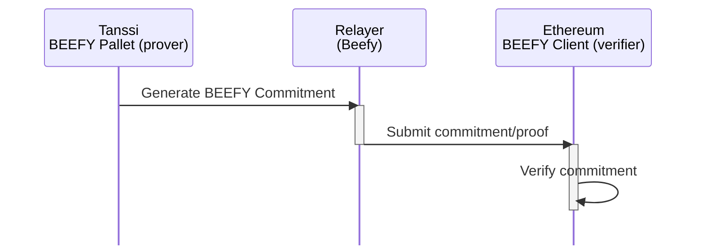
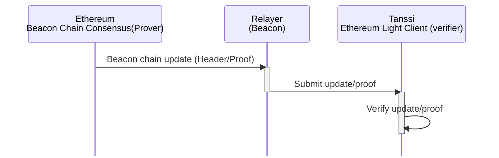
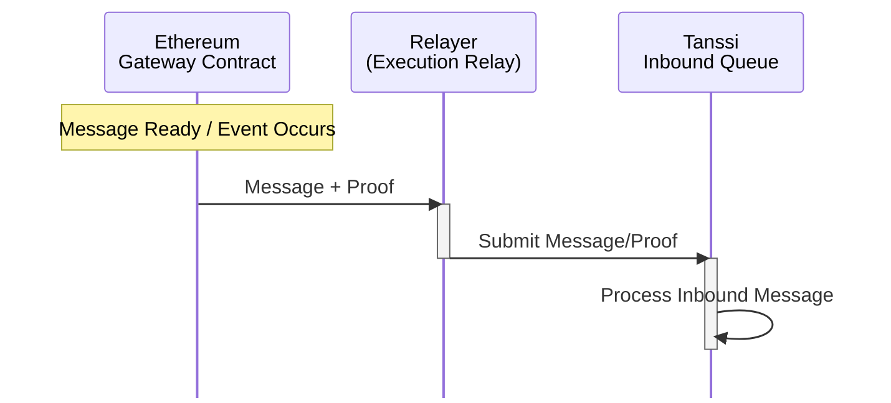
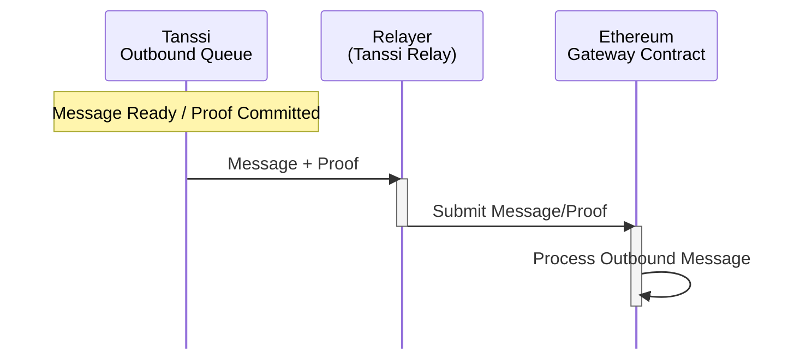
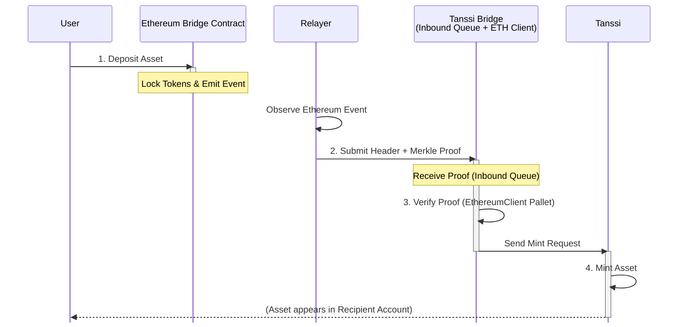
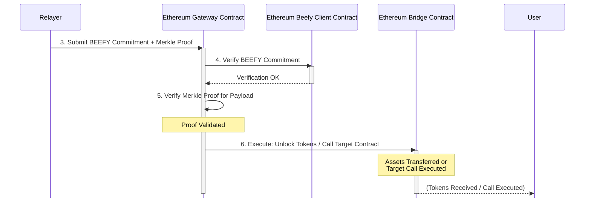

# Tanssi-Ethereum Bridge {: #tanssi-ethereum-bridge }

## Introduction {: #introduction }

Traditional blockchains often create silos, limiting asset and functional interoperability. The Tanssi-Ethereum bridge overcomes these limitations by enabling seamless cross-chain operations that benefit both ecosystems.

The bridge is more than an asset exchange. It’s a secure, standardized protocol for direct cross-chain interaction without centralized intermediaries. Its trustless design avoids the risks of central points of failure that many other bridges face.

This article introduces the Tanssi-Ethereum bridge as a key interoperability layer between the two networks. You’ll learn how it works, including its architecture, operator management, economic model, slashing mechanisms, and asset transfers.

You'll also learn about the consensus layers that secure communication ([BEEFY](https://docs.snowbridge.network/architecture/components#beefyclient){target=\_blank} on [Tanssi](https://docs.tanssi.network/learn/tanssi/){target=\_blank} and the [Ethereum Beacon Chain](https://ethereum.org/en/roadmap/beacon-chain/){target=\_blank}), and the roles of provers, verifiers, and relayers, giving you a clear view of how assets and messages move securely between Tanssi and Ethereum.

## Core Functions { : #core-functions }

The bridge facilitates several critical operations between Tanssi and Ethereum:

- **Operator Management** - maintains operator stake information on Ethereum via the [Symbiotic](/learn/tanssi/external-security-providers/symbiotic/#tanssi-symbiotic){target=\_blank} protocol, providing this data to Tanssi for selecting active, decentralized, and economically aligned operators each era
- **Economic Operations** - distributes [rewards](/learn/tanssi/external-security-providers/symbiotic/#rewards){target=\_blank} from Tanssi to Ethereum stakers and operators
- **Slashing** - processes [slashing requests](/learn/tanssi/external-security-providers/symbiotic/#slashing){target=\_blank} from Tanssi to Ethereum when operators violate protocol rules
- **Asset Transfer** - enables bilateral, trustless asset transfers between Tanssi and Ethereum, enhancing liquidity.

This interoperability expands the potential of decentralized applications and significantly enhances the liquidity and usability of blockchain assets.

## The Bridge Architecture { : #bridge-architecture }

Understanding the bridge's consensus functionality requires examining its core components: provers, verifiers, and relayers. Provers generate cryptographic proofs, verifiers validate them, and relayers move data between chains.

Provers include Tanssi's [BEEFY](https://docs.snowbridge.network/architecture/components#beefyclient){target=\_blank} module and Ethereum's Beacon Chain consensus. They produce consensus data transmitted by specialized relayers.

Each chain runs a [light client](https://ethereum.org/en/developers/docs/nodes-and-clients/light-clients/){target=\_blank} of the other, acting as an on-chain verifier for data legitimacy. For instance, when Tanssi sends a message to Ethereum, it generates compact proofs of events or state changes based on its consensus. Ethereum's light client verifies these proofs before acting. This efficient method avoids processing the entire sending chain's state, relying instead on concise cryptographic proof verification.

### Tanssi to Ethereum Consensus  { : #tanssi-ethereum-consensus }

BEEFY (Bridge Efficiency Enabling Finality Yielder) is Tanssi's consensus protocol, which acts as a prover. It's designed for efficient, trustless bridging to chains like Ethereum that are not natively built for interoperability.

### Ethereum to Tanssi Consensus { : #ethereum-tanssi-consensus }

For Ethereum-to-Tanssi bridging, Ethereum's Beacon Chain consensus is the prover. It provides Tanssi's on-chain light client with proof of Ethereum's finalized state, including events or messages for Tanssi.

From a messaging perspective, the bridge uses its consensus verification layer for secure cross-chain communication. Dedicated relayers transport messages: the Execution Relay for Ethereum to Tanssi, and the Tanssi Relay for Tanssi to Ethereum.

Relayers are stateless and only submit proofs. They cannot forge messages or steal funds, as the consensus mechanism revalidates each proof on-chain. Multiple concurrent relayers improve responsiveness without centralizing power.

Ethereum's `Gateway` contract is the central messaging point. It receives messages from Tanssi via relayers, validates them using consensus proofs, and executes operations like token minting/unlocking or smart contract calls.

### Ethereum to Tanssi Inbound Messages { : #ethereum-tanssi-messages }

This section describes messages from Ethereum to Tanssi, using Ethereum's Beacon Chain consensus for proofs and an Execution Relay (or Beacon Relay).

### Tanssi to Ethereum Outbound Messages { : #tanssi-ethereum-messages }

This section describes messages from Tanssi to Ethereum, using BEEFY consensus to prove Tanssi's state and a Tanssi Relay for transmission.

The `Gateway` manages Ethereum's outbound communications. For cross-chain transfers, it logs an event, locks tokens if necessary, and packages data for relay to Tanssi. Tanssi uses two queues for efficient message processing.

The `Outbound Queue` handles messages to Ethereum. It bundles them and adds a [Merkle root](https://en.wikipedia.org/wiki/Merkle_tree){target=\_blank} (cryptographic commitment) to each block header. This allows Ethereum's light client to verify message inclusion using consensus proofs efficiently.

The `Inbound Queue` processes messages from Ethereum. It receives and verifies proofs of Ethereum events via Tanssi's on-chain Ethereum light client. Verified events become internal instructions in Tanssi. This layered, consensus-secured architecture ensures trustless cross-chain interactions.

## Token Transfers Flow {: #token-transfers-flow }

This section explains how the bridge moves assets and messages. It involves locking/minting assets on one chain and a complementary action on the other, secured by verified proofs. The following describes the typical transfer sequences.

1. **Initiation (Source Chain)** - user initiates asset transfer
2. **Relay Proof** - off-chain relayers pick up the event and submit cryptographic proofs to the destination chain
3. **Verification (Destination Chain)** - on-chain light clients independently verify submitted proofs
4. **Execution** - upon successful verification, tokens are minted/unlocked on the destination chain

### Ethereum to Tanssi Transfer

This section outlines asset movement from Ethereum to Tanssi (as derivative assets).

**1. Lock on Ethereum** - a user deposits assets into Ethereum's Bridge contract. The contract locks the tokens and emits a deposit event
**2. Relay Proof to Tanssi** - an off-chain relayer detects the finalized event, creates a proof package (including Ethereum block header and Merkle proof of the deposit), and submits it to the Tanssi Bridge's `Inbound Queue`
**3. Verify on Tanssi** - Tanssi Bridge's `EthereumClient` module (an on-chain light client) receives the proof from the `Inbound Queue`. It verifies the Ethereum block header's finality/validity and the Merkle proof's authenticity
**4. Mint on Tanssi** - upon successful verification by the `EthereumClient`, the `Inbound Queue` is notified and mints the corresponding asset on Tanssi

### Tanssi to Ethereum Transfer

This flow describes the reverse process, moving assets from Tanssi to Ethereum.

**1. Initiate and Commit on Tanssi** - user initiates a transfer on Tanssi. A message with transfer details goes to the Bridge's `Outbound Queue`. The queue processes it, bundles the payload, and commits its Merkle root to the Tanssi block header, representing all outgoing messages in that block
**2. Relay Proof to Ethereum** - an off-chain relayer monitors Tanssi for finalized blocks with `Outbound Queue` Merkle roots. It retrieves proofs: a BEEFY commitment (signed statement of finalized Tanssi block headers) and a Merkle proof of the user's transfer payload under the committed root
**3. Submit Commitment in Ethereum** - the relayer submits the BEEFY commitment and Merkle proof to Ethereum's `Gateway` contract
**4. Verify on Ethereum** - Ethereum's Beefy Client contract (Tanssi's on-chain light client) receives the BEEFY commitment from the `Gateway` and verifies its validity (including signatures)
**5. Validate Payload** - after commitment verification, the `Gateway` validates the Merkle proof for the user's payload
**6. Execute on Ethereum** - with both proofs verified, the `Gateway` contract executes the action, usually releasing locked assets via the main Bridge contract to the recipient or executing a target contract call on Ethereum

The following diagram illustrates the initiation and commitment phase of the asset transfer process on the Tanssi side.

The subsequent diagram details the relay, verification, and execution steps on the Ethereum side of the asset transfer.

