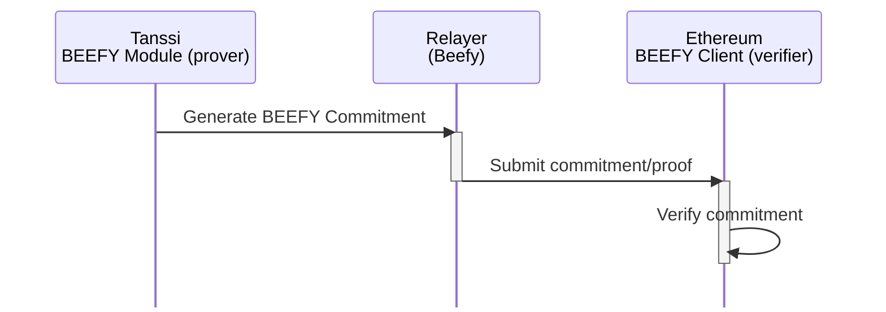
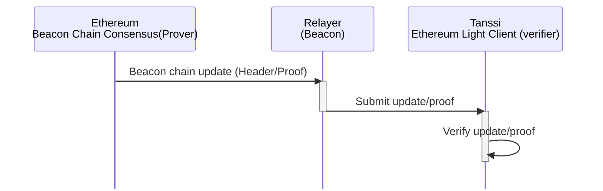
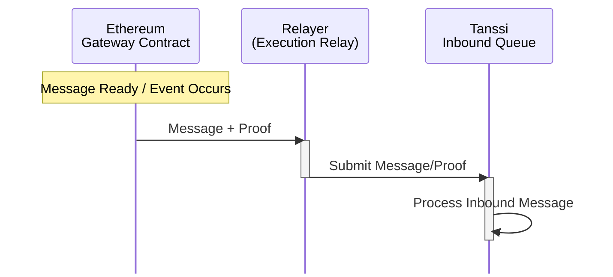
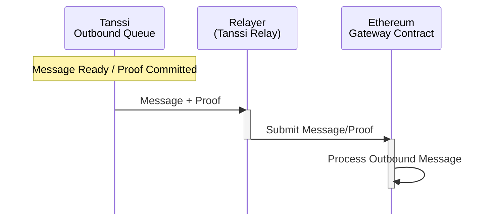
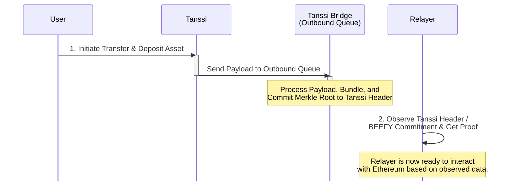
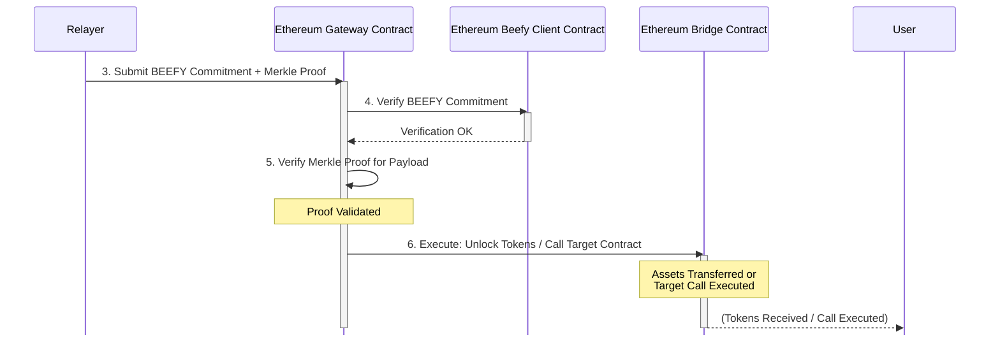

# Tanssi-Ethereum Bridge {: #tanssi-ethereum-bridge }

## Introduction {: #introduction }

In traditional blockchain environments, assets and functionalities are restricted to their respective chains, creating silos that limit interoperability and asset utility. The Tanssi-Ethereum bridge breaks these limitations by enabling seamless cross-chain operations that benefit both ecosystems.

Consider this bridge not merely an asset exchange mechanism but a secure, standardized protocol allowing direct interaction between different blockchain networks without reliance on centralized intermediaries. This emphasis on eliminating trusted third parties is fundamental to its design, setting it apart from bridge solutions that might introduce central points of failure or control.

## Core Functions { : #core-functions }

The bridge facilitates several critical operations between Tanssi and Ethereum:

- **Operator Management** - operator stake information is maintained on Ethereum via the [Symbiotic](/learn/tanssi/external-security-providers/symbiotic/#tanssi-symbiotic){target=\_blank} restaking protocol, which organizes operators based on their assigned stake. This ordered list is transmitted to Tanssi through the bridge. Tanssi then utilizes this information to select active operators for each era, ensuring a decentralized and economically aligned set of operators
- **Economic Operations** - distributing [rewards](/learn/tanssi/external-security-providers/symbiotic/#rewards){target=\_blank} from Tanssi to Ethereum stakers and operators
- **Slashing** - processing [slashing requests](/learn/tanssi/external-security-providers/symbiotic/#slashing){target=\_blank} from Tanssi to Ethereum when operators violate protocol rules
- **Asset Transfer** - transferring assets bilaterally between ecosystems without centralized intermediaries

This interoperability expands the potential of decentralized applications and significantly enhances the liquidity and usability of blockchain assets.

## The Bridge Architecture { : #bridge-architecture }

To understand the bridge's functionality from a consensus standpoint, we can analyze its core components: provers, verifiers, and relayers. Provers generate cryptographic proofs, verifiers validate these proofs, and relayers handle the data movement between the connected chains.

Key examples of provers include the [BEEFY](https://docs.snowbridge.network/architecture/components#beefyclient){target=\_blank} module on Tanssi and the Beacon Chain consensus on Ethereum. These components produce the necessary consensus data, which is then transmitted by specialized relayers.

Each blockchain maintains a [light client](https://ethereum.org/en/developers/docs/nodes-and-clients/light-clients/){target=\_blank} of the other chain. These light clients act as on-chain verifiers, crucial for confirming the legitimacy of data from the opposing network. Consider a message sent from Tanssi to Ethereum: the Tanssi side generates compact proofs confirming that certain events or state changes are valid based on Tanssi's consensus rules. The light client on Ethereum verifies these proofs before allowing any subsequent action. This approach is highly efficient as it eliminates the need for the receiving chain to process the whole state of the sending chain, relying instead on verifying concise cryptographic proofs.

### Tanssi to Ethereum Consensus  { : #tanssi-ethereum-consensus }

The BEEFY (Bridge Efficiency Enabling Finality Yielder) consensus protocol operates as a crucial prover from the Tanssi side of the bridge. It was specifically designed to facilitate efficient and trustless bridging to external blockchains like Ethereum that were not natively built with interoperability features in mind.

### Ethereum to Tanssi Consensus { : #ethereum-tanssi-consensus }

When bridging from Ethereum to Tanssi, the Ethereum Beacon Chain's consensus mechanism acts as the prover. The core idea is to provide Tanssi's on-chain light client with undeniable proof of Ethereum's finalized state, including specific events or messages destined for Tanssi.

Viewing the bridge from a messaging perspective reveals how it manages cross-chain communication, leveraging the underlying consensus verification layer for security. Dedicated relayers are responsible for message transport: the Execution relay handles transfers from Ethereum to Tanssi, and the Tanssi relay manages the flow from Tanssi to Ethereum.

Crucially, these relayers are stateless. Their role is limited to submitting proofs. They cannot forge messages or misappropriate funds because each proof they relay is subject to rigorous, independent re-validation on-chain by the consensus mechanism. This architecture supports multiple relayers working concurrently, improving system responsiveness without concentrating power or granting special privileges to any single relayer.

The `Gateway` contract is Ethereum's central point for messaging. This contract receives messages originating from Tanssi (delivered via the relayers). It validates these incoming messages by checking the associated consensus proofs before executing the appropriate operations, such as unlocking/minting tokens or invoking other smart contracts.

### Ethereum to Tanssi Inbound Messages { : #ethereum-tanssi-messages }

This flow describes messages originating on Ethereum and destined for Tanssi. It utilizes Ethereum's Beacon Chain consensus for proof and a dedicated "Execution Relay" (or "Beacon Relay").

### Tanssi to Ethereum Outbound Messages { : #tanssi-ethereum-messages }

This flow describes messages originating on Tanssi and destined for Ethereum. It utilizes the BEEFY consensus to prove Tanssi's state and a dedicated "Tanssi Relay" for message transmission.

Outbound communications originating from Ethereum are managed by the `Gateway`. When an Ethereum transaction initiates a cross-chain transfer, the `Gateway` logs a specific event and, if needed, locks tokens, effectively packaging the message and data for relay to Tanssi. Two distinct queues efficiently handle message processing on the Tanssi side.

The `Outbound Queue` is used for messages heading to Ethereum. It gathers messages, bundles them, and incorporates a cryptographic commitment – a [Merkle root](https://en.wikipedia.org/wiki/Merkle_tree){target=\_blank} of the bundled messages – into the header of each block. This commitment is crucial as it enables the Ethereum light client to verify the inclusion of these messages efficiently using the established consensus proofs.

The `Inbound Queue` plays a key role in inbound messages arriving from Ethereum. It receives proofs of Ethereum events and verifies their legitimacy by interacting with the on-chain Ethereum light client. Following successful verification, these confirmed events are interpreted and dispatched as internal instructions within the Tanssi environment. This layered messaging architecture, secured by the underlying consensus verification, guarantees that all cross-chain interactions are trustless.

## Message & Token Flow {: #message-flow }

After covering the architecture and security basics, it’s helpful to understand **how the Bridge moves assets and messages between chains**. In practice, the flow involves locking or minting assets on one side and performing a complementary action on the other side, always underpinned by verified proofs of action. Below, we describe the typical sequence for each direction of transfer.

The process involved, in general terms, is the following.

1. **Initiation (Source Chain)** - the user initiates asset transfer
2. **Relay Proof** - off-chain relayers pick up the event and submit cryptographic proofs to the destination chain
3. **Verification (Destination Chain)** - on-chain light clients independently verify submitted proofs
4. **Execution** - upon successful verification, tokens are minted/unlocked on the destination chain

### Ethereum to Tanssi Transfer

This flow outlines how assets move from Ethereum to Tanssi to become representative assets.

**1. Lock on Ethereum** - the user interacts with the designated Bridge contract on Ethereum, depositing their asset. The contract securely locks these tokens and emits a corresponding event containing details of the deposit

**2. Relay Proof to Tanssi** - an off-chain relayer service monitors the Ethereum Bridge contract for these events. Upon detecting a finalized event, the relayer constructs a proof package. This typically includes the relevant Ethereum block header (proving finality) and a Merkle proof demonstrating that the specific deposit event occurred within that block

The relayer submits this proof package to the `Inbound Queue` on the Tanssi Bridge

**3. Verify on Tanssi** - the `EthereumClient` module, acting as an on-chain light client within the Tanssi Bridge, receives the proof package from the `Inbound Queue`. It verifies the finality and validity of the Ethereum block header and checks the Merkle proof to confirm the deposit event's authenticity

**4. Mint on Tanssi** - once the `EthereumClient` confirms the proof's validity, the `Inbound Queue` is notified. The `Inbound Queue` mint the asset on the Tanssi network

### Tanssi to Ethereum Transfer

This flow describes the reverse process, moving assets from Tanssi to Ethereum.

**1. Initiate & Commit on Tanssi** - the user initiates the action on Tanssi, and an internal message containing the transfer details is generated and sent to the Bridge `Outbound Queue`. The `Outbound Queue` processes this message, bundles the payload, and commits its Merkle root to the Tanssi Bridge, the network’s block header. This root cryptographically represents all outgoing messages in that block

**2. Relay Proof to Ethereum** - an off-chain relayer monitors the Tanssi Bridge for finalized blocks containing relevant `Outbound Queue` Merkle roots. The relayer retrieves the necessary proof components: typically a BEEFY commitment (a signed statement about finalized Tanssi block headers) and a Merkle proof showing that the specific user's transfer payload is included under the committed `Outbound Queue` root

**3. Submit Commitment in Ethereum** - the relayer submits the BEEFY commitment and the Merkle proof to the `Gateway` contract on the Ethereum network

**4. Verify on Ethereum** - the `Beefy Client` contract on Ethereum (an on-chain light client for Tanssi consensus) receives the BEEFY commitment from the `Gateway`. It verifies the commitment's validity, checking the signatures

**5. Validate Payload** - once the commitment is verified, the `Gateway` validates the submitted Merkle proof for the user's specific action payload

**6. Execute on Ethereum** - upon successfully verifying the BEEFY commitment and the Merkle proof**,** the `Gateway` contract proceeds with execution. Typically, it involves interacting with the main Bridge contract to release the initially locked asset and transfer it to the recipient's Ethereum address. Alternatively, depending on the message payload, it might execute a specified call on a target contract on Ethereum

#### Part 1: Tanssi Side - Initiation and Commitment

#### Part 2: Ethereum Side - Relay, Verification, and Execution

