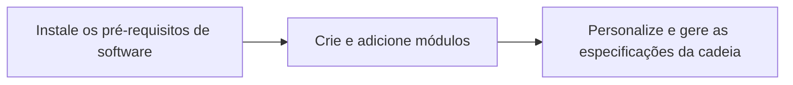

# Personalize Sua Rede com Tanssi

Adapte sua rede para atender aos requisitos exclusivos da sua aplicação. Esta seção fornece orientações sobre como modificar e estender a funcionalidade da sua rede, oferecendo instruções e as melhores práticas para ajudá-lo a alinhá-la com os objetivos do seu projeto.

## Processo para Personalizar Sua Rede

O diagrama abaixo fornece um resumo simplificado das etapas essenciais para começar a construir e personalizar sua rede com Tanssi.

Para prosseguir, consulte a seção a seguir, onde você pode encontrar guias detalhados, passo a passo, para cada uma dessas etapas.

## Explore Esta Seção

:::INSERT_GENERATED_CARDS:::
