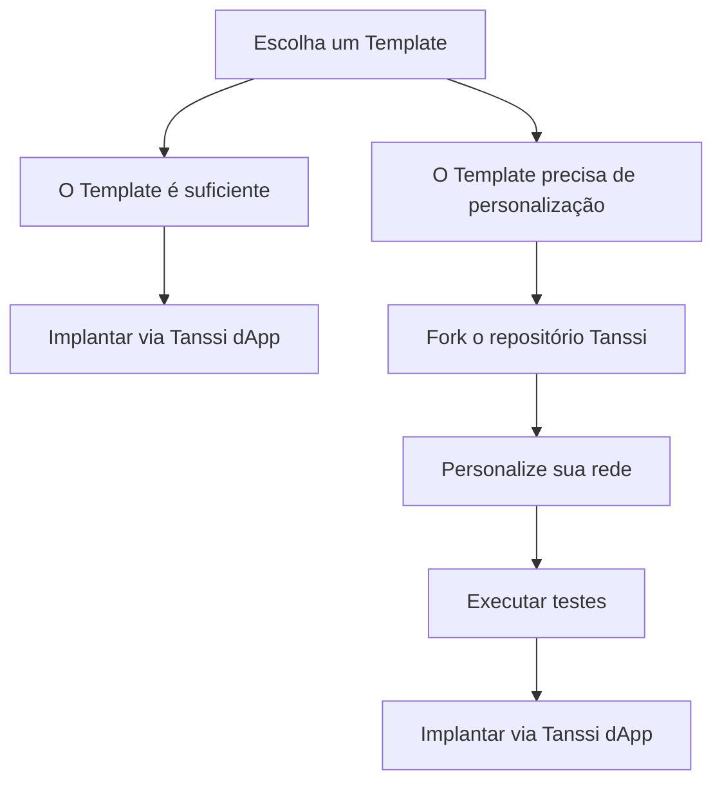

# Construa Sua Rede

Lançar sua rede powered by Tanssi oferece a flexibilidade de escolher entre Templates pré-configurados ou soluções totalmente personalizadas. Estaja você buscando simplicidade ou controle refinado, a Tanssi fornece as ferramentas e orientações para transformar sua visão em realidade. Esta seção cobre tudo, desde a seleção de um Template até a personalização de módulos, testes e implantação de sua rede.

## O Caminho para Implantação

A implantação de uma rede com Tanssi pode ser direta ou altamente personalizável, dependendo de suas necessidades. O diagrama abaixo fornece uma clara divisão dessas opções para orientar sua decisão.

Agora que você explorou os caminhos de implantação, o próximo passo é [aprender mais sobre cada Template](/pt/builders/build/templates) para que você possa escolher aquele que melhor se adapta às suas necessidades.

## Explore Esta Seção

:::INSERT_GENERATED_CARDS:::
