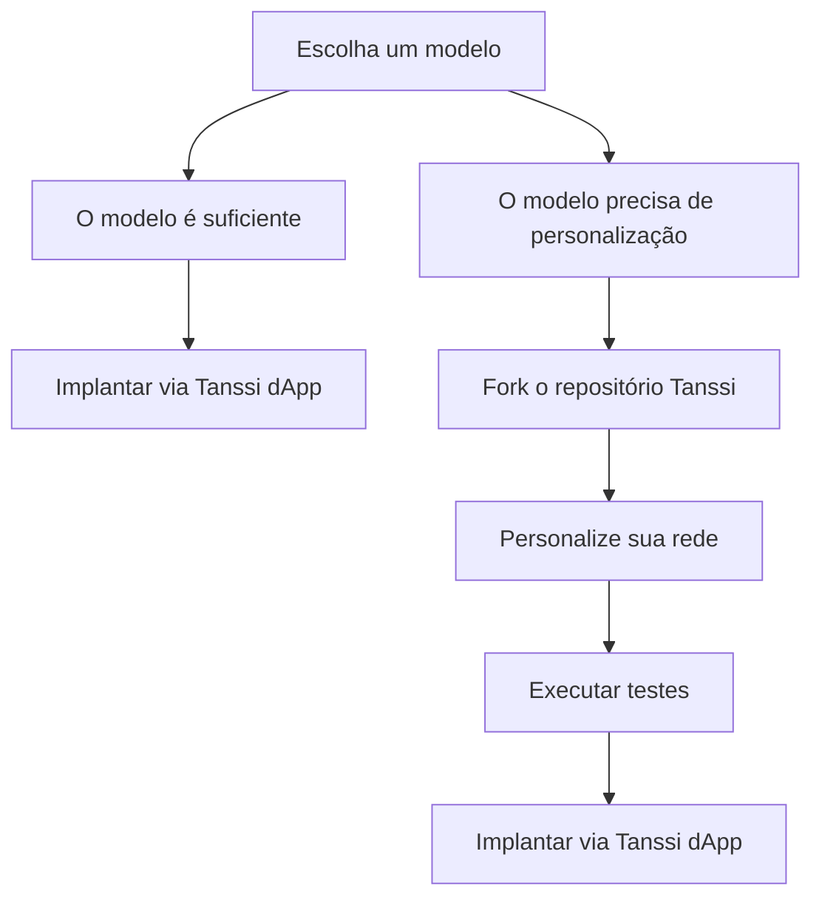

# Construa Sua Rede

Lançar sua rede com tecnologia Tanssi oferece a flexibilidade de escolher entre modelos pré-configurados ou soluções totalmente personalizadas. Seja você buscando simplicidade ou controle preciso, a Tanssi fornece as ferramentas e orientações para dar vida à sua visão. Esta seção cobre tudo, desde a seleção de um modelo até a personalização de módulos, testes e implantação de sua rede.

## O Caminho para Implantação

A implantação de uma rede com Tanssi pode ser direta ou altamente personalizável, dependendo de suas necessidades. O diagrama abaixo fornece uma clara divisão dessas opções para orientar sua decisão.

Agora que você explorou os caminhos de implantação, o próximo passo é [aprender mais sobre cada modelo](/pt/builders/build/templates) para que você possa escolher aquele que melhor se adapta às suas necessidades.

## Explore Esta Seção

:::INSERT_GENERATED_CARDS:::
