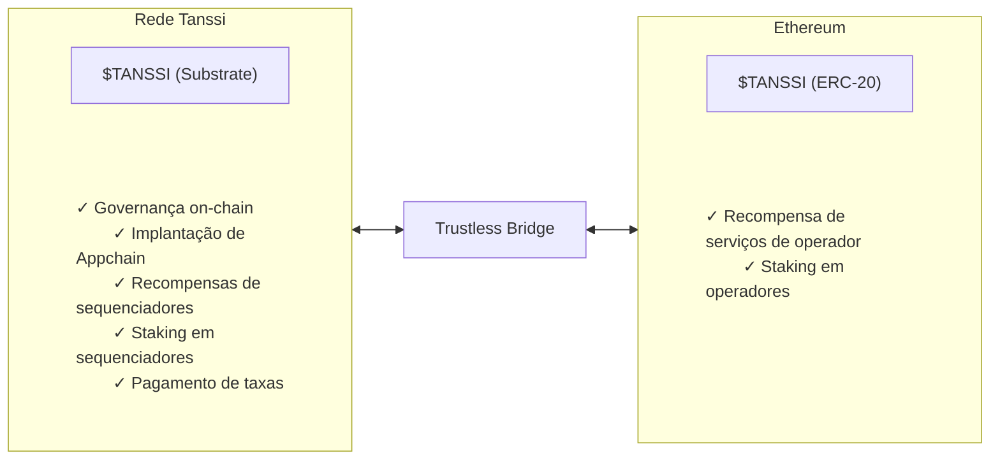

# Token TANSSI {: #tanssi-token }

## Introdução {: #introduction }

O token da rede Tanssi é o token de utilidade que alimenta o protocolo Tanssi. Considerando a [arquitetura da Tanssi](/pt/learn/tanssi/overview/#tanssi-architecture){target=\_blank}, o token existe em duas representações distintas, mas interconectadas: Substrate nativo e ERC-20 Ethereum. As duas versões podem ser interligadas através da [ponte Tanssi-Ethereum](/pt/learn/tanssi/tanssi-ethereum-bridge/){target=\_blank}.

Neste guia, a utilidade do token e as diferenças entre suas duas representações são abordadas, o que é crucial para operadores de rede, stakers, gerentes de appchain e usuários em geral que desejam participar do ecossistema Tanssi.

## Utilidade do Token {: #token-utility }

A Tanssi é um protocolo de infraestrutura descentralizado que facilita a implantação de appchains com lógica personalizada. Ele permite que os desenvolvedores se concentrem no caso de uso, em vez de desviar tempo e energia para gerenciar [os vários componentes necessários](/pt/learn/tanssi/overview/#what-tanssi-provides){target=\_blank} para que uma rede funcione sem problemas.

A execução de um protocolo descentralizado saudável não só requer um mecanismo de governança robusto para garantir que as decisões sejam tomadas de forma transparente, mas também o alinhamento de incentivos e coordenação entre vários atores do ecossistema, incluindo desenvolvedores de appchain, operadores de nós, operadores de sequenciadores, disponibilidade de dados e provedores de RPC, bem como usuários em geral. O token Tanssi serve como a espinha dorsal, fornecendo os mecanismos econômicos necessários para coordenar, incentivar o comportamento adequado e proteger todo o ecossistema. Ele permite uma evolução de protocolo verificável e imposta por código por meio de um processo de tomada de decisão totalmente na cadeia.

O token tem várias utilidades:

- **Governança on-chain**: os detentores de tokens podem usar o token para propor e votar em decisões de governança, como atualizações de software, como gastar fundos do tesouro, alterar regras de protocolo e muito mais.
- **Implantação de Appchain**: use o token para registrar e lançar seu appchain em minutos.
- **Pagamento do serviço de sequenciamento**: use o token para manter seu appchain ativo.
- **Recompensa de serviços de sequenciamento e operador**: obtenha tokens como recompensas pelos serviços de seus nós.
- **Staking em sequenciadores**: os detentores de tokens podem apostar em sequenciadores, recebendo recompensas sem risco de corte.
- **Staking em operadores**: os detentores de tokens podem apostar em operadores, recebendo recompensas por seus serviços de validação.
- **Pagamento de taxas**: use o token para pagar as taxas de interação com a rede Tanssi.

!!! nota
    Todas as taxas de transação na Tanssi são pagas usando o token, com o valor total indo diretamente para financiar a conta do tesouro do protocolo. Esses fundos só podem ser gastos via governança.

## Representações de Token {: #token-representations }

A rede Tanssi é construída usando a estrutura Substrate, aproveitando sua arquitetura modular e alto desempenho. Portanto, o token nativo é do tipo Substrate. Os mecanismos de cunhagem e queima do protocolo acontecem na rede Tanssi, ou, em outras palavras, acontecem na representação do token Substrate.

Além disso, o protocolo Tanssi conta com [provedores de segurança externos](/pt/learn/tanssi/external-security-providers/){target=\_blank}, como o [Symbiotic](/pt/learn/tanssi/external-security-providers/symbiotic/){target=\_blank}, para proteger o ecossistema por meio de ativos reapostados. Esse mecanismo de reaposta é implementado no Ethereum; portanto, uma versão ERC-20 do token também existe para cobrir casos de uso no lado Ethereum.

Aproveitando os [recursos de bridging integrados à](/pt/learn/tanssi/tanssi-ethereum-bridge/){target=\_blank} Tanssi, o token pode ser convertido para (e de) a representação ERC-20 no Ethereum. Quando o token é ponteado para Ethereum, os tokens são travados na conta soberana da ponte, e uma mensagem é enviada ao contrato Ethereum para cunhar a quantia equivalente em ERC-20. Esse mecanismo de travamento e cunhagem garante que a versão ERC-20 seja criada por meio de um mecanismo de bridging sem confiança, mantendo um relacionamento 1:1 com o token nativo.

### Tanssi (Substrate) - Token Nativo {: #tanssi-substrate }

O token Tanssi nativo existe na rede Tanssi como um ativo baseado em Substrate e é a forma original do token que alimenta as operações principais do protocolo.

Este token usa como [conta do tipo Substrate Sr25519](/pt/learn/tanssi/account-types/#key-types-in-tanssi-protocol){target=\_blank}, então requer uma carteira como a [Talisman](/pt/builders/toolkit/substrate-api/wallets/talisman/){target=\_blank} ou qualquer outra [carteira compatível com Substrate](/pt/builders/toolkit/substrate-api/wallets/){target=\_blank}.

!!! nota
    O token nativo Tanssi (Substrate) tem doze (12) casas decimais.

### Tanssi (ERC-20) - Representação Ethereum {: #tanssi-erc-20 }

A versão ERC-20 da Tanssi é um token Ethereum padrão que representa o token nativo na rede Ethereum. Essa versão é criada por meio do mecanismo de ponte sem confiança, utilizando uma estratégia de bloqueio e cunhagem, mantendo assim um relacionamento 1:1 com o token nativo.

Este token, como qualquer outro ativo Ethereum, usa uma [conta ECDSA](/pt/learn/tanssi/account-types/#key-types-in-tanssi-protocol){target=\_blank}, então requer uma carteira como [Metamask](/pt/builders/toolkit/ethereum-api/wallets/metamask/){target=\_blank} ou qualquer outra [carteira compatível com Ethereum](/pt/builders/toolkit/ethereum-api/wallets/){target=\_blank}.

!!! nota
    O Tanssi (ERC-20) tem doze (12) casas decimais.

### Comparação Tanssi (Substrate) e Tanssi (ERC-20) {: #substrate-erc-20-comparison }

Para entender melhor as diferenças entre as duas representações de token, a tabela a seguir fornece um resumo de seus principais recursos:

| **Recurso**            | **Tanssi (Substrate)**                                                                                                                                                                                                  | **Tanssi (ERC-20)**                                                                                                                                                                               |
|------------------------|---------------------------------------------------------------------------------------------------------------------------------------------------------------------------------------------------------|---------------------------------------------------------------------------------------------------------------------------------------------------------------------------------------------------|
| **Rede**            | Rede Tanssi                                                                                                                                                                                                          | Ethereum MainNet                                                                                                                                                                                  |
| **Padrão de Token**     | Ativo Substrate nativo                                                                                                                                                                                                  | Token padrão ERC-20                                                                                                                                                                             |
| **Casas Decimais**     | Doze (12) decimais                                                                                                                                                                                                    | Doze (12) decimais                                                                                                                                                                              |
| **Tipo de Conta**       | [Sr25519](https://wiki.polkadot.com/learn/learn-cryptography/#keypairs-and-signing){target=\_blank}                                                                                                                  | [ECDSA](https://en.wikipedia.org/wiki/Elliptic_Curve_Digital_Signature_Algorithm){target=\_blank}                                                                                                  |
| **Carteiras Compatíveis** | [Talisman](/pt/builders/toolkit/substrate-api/wallets/talisman/){target=\_blank}, [SubWallet](/pt/builders/toolkit/substrate-api/wallets/subwallet/){target=\_blank} e outros                                              | [MetaMask](/pt/builders/toolkit/ethereum-api/wallets/metamask/){target=\_blank}, [Talisman](/pt/builders/toolkit/ethereum-api/wallets/talisman/){target=\_blank} e outras carteiras compatíveis com Ethereum |
| **Principais Utilidades**  | - Participação na governança on-chain - Registro e implantação de Appchain - Pagamento de serviços de sequenciamento - Taxas de transação na rede Tanssi - Staking em sequenciadores - Recompensas de operação do sequenciador | - Recompensas de validação do operador - Staking em operadores                                                                                                                                          |
| **Opções de Staking**    | Staking de sequenciador (para manter a atividade da appchain)                                                                                                                                        | Staking de operador (para validar/proteger todo o ecossistema Tanssi)                                                                                                                            |
| **Conversão de Ponte**  | Pode ser ponteado para ERC-20, pagando taxas em $TANSSI (Substrate)                                                                                                                                                            | Pode ser ponteado para Substrate, pagando taxas em $ETH                                                                                                                                                  |
