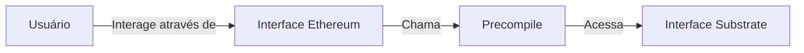

# Precompiles

Precompiles são módulos de blockchain integrados, projetados para lidar com tarefas específicas de forma mais eficiente do que contratos inteligentes padrão. Esses módulos são pré-implantados em endereços fixos e fornecem soluções otimizadas para operações como funções criptográficas, processamento de transações em lote e gerenciamento de tokens.

Como as redes alimentadas pela Tanssi são baseadas em Substrate, os contratos precompilados podem suportar funções compatíveis com Ethereum e operações específicas para a cadeia Substrate subjacente. Essa abordagem dupla garante que os desenvolvedores possam interagir com ferramentas Ethereum familiares, ao mesmo tempo em que aproveitam o desempenho e a flexibilidade exclusivos oferecidos pelo Substrate.

## Fluxo de Interação com Precompiles

O fluxo abaixo ilustra como as solicitações do usuário passam pela interface Ethereum, interagem com precompiles e, por fim, acessam a funcionalidade Substrate, simplificando operações complexas para uma integração perfeita.

## Referência Rápida de Endereços Precompile

| Precompile          | Endereço                                                      |
|---------------------|--------------------------------------------------------------|
| Native Token ERC-20 | <pre>`0x0000000000000000000000000000000000000800`</pre>  |
| Call Permit         | <pre>`0x0000000000000000000000000000000000000802`</pre>  |
| Proxy               | <pre>`0x0000000000000000000000000000000000000805`</pre>  |
| Batch Transactions  | <pre>`0x0000000000000000000000000000000000000801`</pre>  |

Para saber mais sobre cada precompile, confira os guias listados na seção a seguir.

## Explore esta Seção

:::INSERT_GENERATED_CARDS:::
