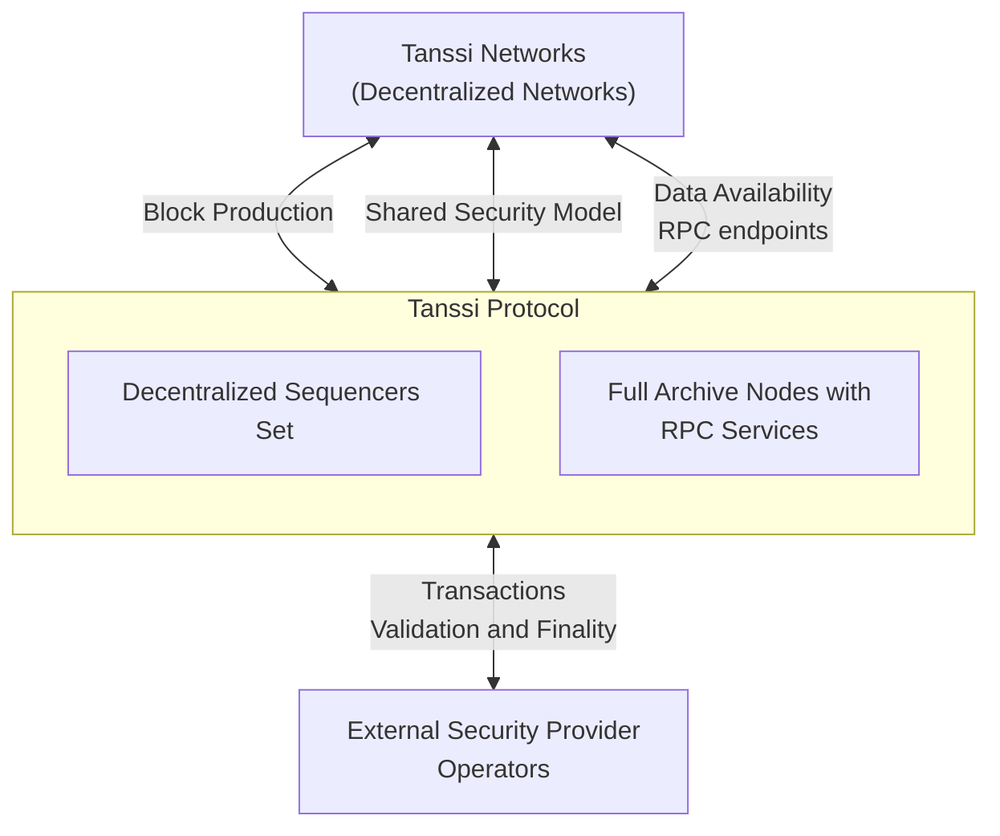

# Visão Geral das Redes Tanssi {: #networks-tanssi-overview }

## Introdução {: #introduction }

As redes implantadas via Tanssi recebem vários [benefícios](/pt/learn/tanssi/overview/#what-tanssi-provides){target=\_blank}, como produção de blocos como serviço, recuperabilidade de dados como serviço e segurança por meio de [provedores externos de segurança](/pt/learn/tanssi/external-security-providers/){target=\_blank}, como [Symbiotic](https://symbiotic.fi/){target=\_blank} na Ethereum.

Além disso, como as redes com tecnologia Tanssi se baseiam em uma [pilha modular](/pt/learn/framework/){target=\_blank}, elas ganham vantagens únicas quando são necessárias customizações em nível de runtime. Essa [modularidade](/pt/learn/framework/modules/){target=\_blank} permite adicionar funcionalidades direto no runtime ou estender as capacidades da própria EVM via precompilados.

Por exemplo, a Tanssi fornece um [template](/pt/learn/decentralized-networks/included-templates#baseline-evm-template){target=\_blank} pronto para uso que inclui os módulos [Frontier](https://github.com/polkadot-evm/frontier){target=\_blank}, possibilitando implantar facilmente redes compatíveis com EVM, similar ao [Moonbeam](https://moonbeam.network){target=\_blank}.

Esta seção aborda os fundamentos de uma rede Tanssi, sua arquitetura, módulos e funcionalidades principais e o mecanismo de taxas de transação.

## Arquitetura Geral {: #general-architecture}

Como mencionado, as redes implantadas via Tanssi são blockchains customizáveis que, entre outras características, recebem produção de blocos como serviço e herdam segurança com finalização determinística em segundos de um provedor externo de segurança.

As redes com tecnologia Tanssi são totalmente descentralizadas. Essa natureza descentralizada aumenta consideravelmente a resiliência e a tolerância a falhas, já que não dependem de uma autoridade única para garantir disponibilidade, segurança e desempenho, mas sim de protocolos trustless e descentralizados. Por exemplo, recebem serviços de produção de blocos de um conjunto descentralizado e incentivado de Sequencers gerenciados pela Tanssi.

O protocolo Tanssi funciona com um [provedor externo de segurança](/pt/learn/tanssi/external-security-providers/){target=\_blank}, que possui um conjunto de operadores (validadores) com ativos em stake, validando as transações da própria rede Tanssi e de todas as redes implantadas via Tanssi. Assim, todas as redes com tecnologia Tanssi herdam a segurança econômica do protocolo Tanssi e, indiretamente, dos operadores, que verificam cada transação de cada rede. As redes Tanssi não precisam manter seu próprio conjunto de operadores nem fazer bootstrapping de liquidez para proteger o protocolo.

As redes Tanssi também se beneficiam de um conjunto de Data-Preservers, com nós de arquivo completos, garantindo a disponibilidade da camada de dados. Esses data-preservers são incentivados pelos serviços de recuperação de dados da Tanssi e também fornecem a infraestrutura RPC para apps e usuários que interagem com redes Tanssi.

## Fluxo de Transações da Rede {: #network-transaction-flow }

Uma transação enviada a uma rede Tanssi segue um caminho complexo porém transparente, desde o envio até a inclusão no bloco e finalização. A infraestrutura da rede, a Tanssi e o [provedor de segurança](/pt/learn/tanssi/external-security-providers/){target=\_blank} escolhido atuam em níveis diferentes para que o processo ocorra o mais rápido possível, geralmente em cerca de 30 segundos. Uma transação em uma rede Tanssi atinge finalização determinística; uma vez final, torna-se irreversível e imutável, e a transição de estado resultante é definitiva.

Por exemplo, um usuário inicia uma transação ao interagir com um aplicativo implantado em uma rede Tanssi. O provedor RPC compartilha a transação, que permanece no pool de transações da cadeia, com todos os participantes. Um Sequencer designado pela Tanssi para essa rede capturará a transação e a incluirá no próximo bloco.

Em seguida, o Sequencer compartilhará com os operadores do provedor de segurança:

- O bloco em si com as transições de estado
- Os componentes de armazenamento no banco de dados da rede Tanssi que o bloco está modificando
- Os hashes necessários dos pontos não afetados na árvore de Merkle do armazenamento

Esses componentes constituem a prova de validade (PoV).

Depois, a PoV é verificada pelos operadores do provedor de segurança. Observe que os operadores não verificam se o storage da rede Tanssi é válido, mas se as transições de estado que o afetam são válidas. Um resumo dessa verificação é disseminado para outros operadores, para que verifiquem e incluam no próximo bloco da Tanssi. Por fim, esse bloco da Tanssi com todas as verificações é finalizado.

O fluxo da transação está resumido no diagrama a seguir:

