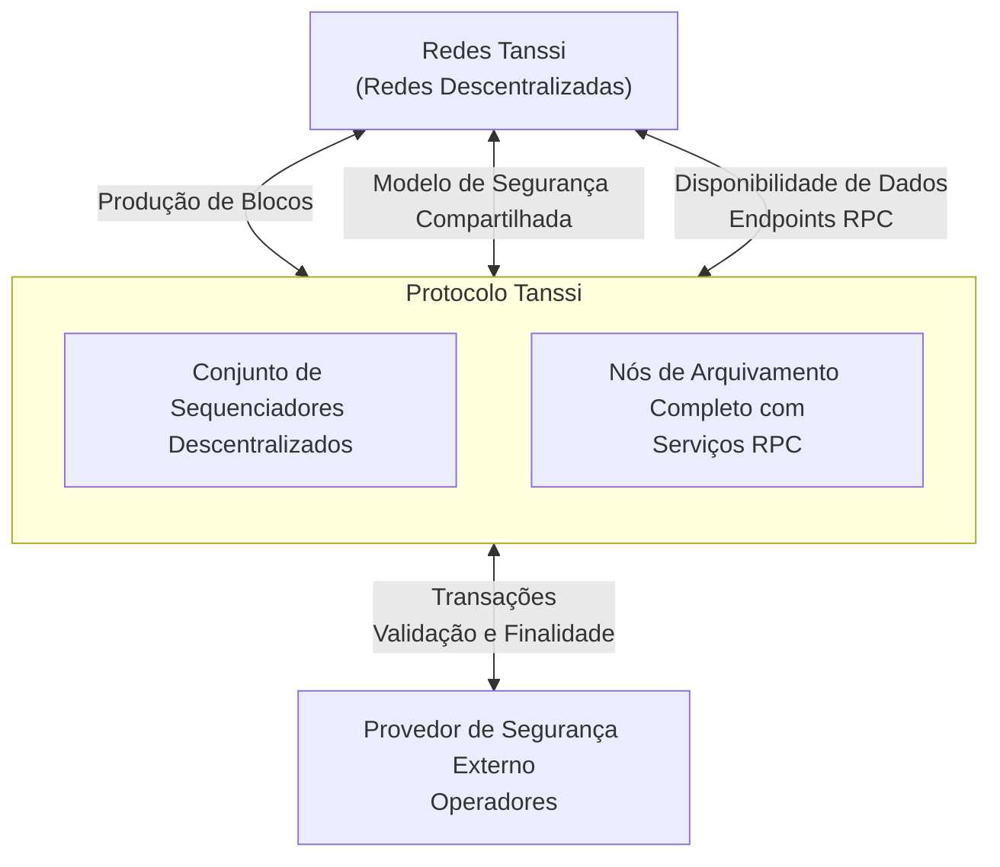

# Visão Geral das Redes Tanssi {: #networks-tanssi-overview }

## Introdução {: #introduction }

As redes implementadas através do Tanssi recebem muitos [benefícios](/pt/learn/tanssi/overview/#what-tanssi-provides){target=\_blank}, como produção de blocos como um serviço, recuperabilidade de dados como um serviço e segurança através de [provedores de segurança externos](/pt/learn/tanssi/external-security-providers/){target=\_blank}, como o [Symbiotic](https://symbiotic.fi/){target=\_blank} no Ethereum.

Além disso, como as redes com tecnologia Tanssi são baseadas em uma [pilha de tecnologia modular](/pt/learn/framework/){target=\_blank}, elas se beneficiam de vantagens exclusivas quando as personalizações são necessárias em um nível de tempo de execução. Esta [modularidade](/pt/learn/framework/modules/){target=\_blank} permite que os desenvolvedores adicionem funcionalidades diretamente no tempo de execução ou estendam as capacidades da própria EVM através de contratos pré-compilados.

Por exemplo, o Tanssi fornece um [modelo](/pt/learn/decentralized-networks/included-templates#baseline-evm-template){target=\_blank} pronto para uso que inclui módulos [Frontier](https://github.com/polkadot-evm/frontier){target=\_blank}, permitindo a implementação sem esforço de redes compatíveis com EVM, semelhante ao [Moonbeam](https://moonbeam.network){target=\_blank}.
Esta seção aborda os fundamentos de uma rede Tanssi, sua arquitetura, seus módulos e funcionalidades principais e o mecanismo de taxas de transação.

## Arquitetura Geral {: #general-architecture}

Como discutido anteriormente, as redes implementadas através do Tanssi são blockchains personalizáveis que, entre outros recursos, recebem a produção de blocos como um serviço e herdam a segurança com finalidade de bloco determinística em segundos de um provedor de segurança externo.

As redes com tecnologia Tanssi são redes totalmente descentralizadas. A natureza descentralizada das redes aumenta consideravelmente sua resiliência e tolerância a falhas, pois não dependem de uma única autoridade ou entidade para garantir sua atividade, segurança e desempenho, mas em protocolos descentralizados e sem confiança. Por exemplo, elas recebem serviços de produção de blocos de um conjunto descentralizado e incentivado de sequenciadores gerenciados pelo Tanssi.

O protocolo Tanssi funciona com um [provedor de segurança externo](/pt/learn/tanssi/external-security-providers/){target=\_blank}, que possui um conjunto de operadores (também chamados de validadores) com ativos em jogo, validando as transações da própria rede Tanssi e de todas as redes implementadas através do Tanssi. Dessa forma, todas as redes com tecnologia Tanssi herdam a segurança econômica derivada do protocolo Tanssi e, indiretamente, dos operadores, que verificam cada transação de cada rede. As redes Tanssi não precisam executar seu próprio conjunto de operadores nem inicializar a liquidez para proteger seu protocolo.

As redes Tanssi também se beneficiam de um conjunto de Preservadores de Dados, com nós de arquivamento completos, garantindo a disponibilidade da camada de disponibilidade de dados. Esses preservadores de dados são incentivados através dos serviços de recuperação de dados do Tanssi e também fornecem a infraestrutura RPC para aplicativos e usuários que interagem com as redes Tanssi.

## Fluxo de Transação de Rede {: #network-transaction-flow }

Uma transação enviada a uma rede com tecnologia Tanssi segue um caminho complexo, mas contínuo, desde o envio até a inclusão e finalização do bloco. A infraestrutura de rede, Tanssi e o [provedor de segurança](/pt/learn/tanssi/external-security-providers/){target=\_blank} escolhidos trabalham juntos em diferentes níveis para garantir que o processo ocorra o mais rápido possível, geralmente levando cerca de 30 segundos. Lembre-se de que uma transação em uma rede Tanssi atinge a finalidade determinística. Consequentemente, uma vez que a transação é final, ela se torna irreversível e imutável, e a transição de estado resultante da execução daquela transação é final.

Por exemplo, um usuário inicia uma transação ao interagir por meio de um aplicativo implantado em uma rede com tecnologia Tanssi. O provedor RPC compartilhará a transação, que fica no pool de transações da cadeia, com todos os participantes da rede. Um sequenciador atribuído pelo Tanssi a essa rede eventualmente pegará a transação e a incluirá no próximo bloco da rede.

Então, o sequenciador compartilhará com os operadores do provedor de segurança:

- O próprio bloco com as transições de estado
- Os componentes de armazenamento no banco de dados da rede Tanssi que o bloco está modificando
- Os hashes necessários dos pontos não afetados na árvore Merkle do armazenamento

Esses componentes constituem a prova de validade (PoV).

Em seguida, o PoV é verificado pelos operadores do provedor de segurança. Observe que os operadores não verificam se o armazenamento da rede Tanssi é válido, mas sim que as transições de estado que o afetam são. Um resumo dessa verificação é então divulgado para outros operadores para que eles possam verificá-lo e incluí-lo no próximo bloco Tanssi. Por fim, esse bloco Tanssi com todas as verificações das redes é finalizado.

O processo de fluxo de transação é resumido no diagrama a seguir:

