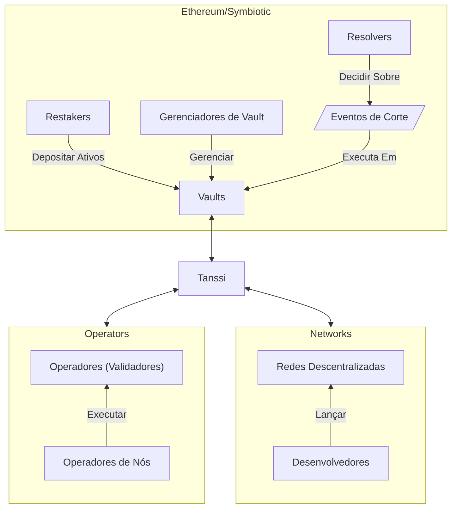
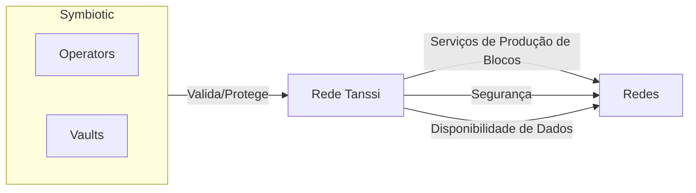

# Ethereum com Symbiotic {: #ethereum-symbiotic }

## Introdução {: #introduction }

O protocolo Tanssi cuida de componentes críticos de infraestrutura, facilitando o lançamento de redes em poucos minutos. Além de produção de blocos, disponibilidade de dados e integrações com ferramentas essenciais (carteiras, endpoints RPC, exploradores de blocos etc.), uma tarefa chave é prover segurança à rede.

A Tanssi foi projetada para oferecer um modelo de segurança compartilhada, evitando que desenvolvedores precisem buscar segurança econômica ou negociar com operadores para rodar nós. Ao implantar redes via Tanssi e escolher a [Symbiotic](https://symbiotic.fi/){target=\_blank} como provedor, os desenvolvedores se beneficiam de segurança de nível Ethereum, alavancando o stake de ETH.

As seções a seguir explicam como o protocolo Symbiotic funciona e como as redes Tanssi podem utilizá-lo como mecanismo de consenso.

## Segurança de Nível Ethereum com Symbiotic {: #symbiotic }

[Symbiotic](https://symbiotic.fi/){target=\_blank} é um protocolo de segurança compartilhada permissionless, multi-ativo e agnóstico de rede. Ele promove eficiência de capital ao permitir que ativos em stake protejam outras redes.

O protocolo fornece uma camada de coordenação para alinhar incentivos entre as partes, minimizando riscos da camada de execução com contratos principais não atualizáveis no Ethereum. O diagrama abaixo resume componentes e atores:

O design flexível da Symbiotic permite que cada parte ajuste sua configuração: vaults escolhem colaterais e estratégias, operadores decidem quais redes atender, e redes definem exigências de segurança.

### Vaults {: #vaults }

[Vaults](https://docs.symbiotic.fi/modules/vault/introduction){target=\_blank} são a espinha dorsal econômica: gerenciam liquidez e depósitos, conectam operadores e redes, e configuram delegação.

Cada vault é atrelado a um token ERC-20 aceito como garantia. Os fundos são representados como ações para rastrear propriedade e distribuir recompensas; o token de recompensa pode ser diferente do colateral.

Três módulos compõem um vault:

- **Slasher** – implementa a lógica de [corte](#slashing).
- **Delegator** – define como os fundos são delegados entre operadores e redes; diferentes [estratégias](https://docs.symbiotic.fi/modules/vault/delegator){target=\_blank} podem ser usadas.
- **Accounting** – lida com depósitos, saques, saldos e eventos de corte; a implementação padrão é [ERC-4626](https://ethereum.org/developers/docs/standards/tokens/erc-4626/){target=\_blank}.

Como o stake dos vaults pode ser cortado, operadores e redes precisam ser aprovados pelos gerentes de vault. Gerentes também indicam [resolvers](https://docs.symbiotic.fi/modules/counterparties/resolvers){target=\_blank}, que podem aprovar ou vetar eventos de corte em vaults com [veto-slashing](https://docs.symbiotic.fi/modules/vault/slasher#veto-slashing){target=\_blank}, como a rede Tanssi.

### Operadores {: #operators }

[Operadores de nós](/pt/node-operators/){target=\_blank} executam os nós (operadores/validadores) que validam transações. Eles optam por oferecer serviço a redes (que devem aceitá-los) e a vaults (que também precisam aceitá-los). Uma vez aceitos por um vault e por uma rede, podem prestar validação e receber recompensas.

### Redes {: #networks }

[Redes](https://docs.symbiotic.fi/modules/counterparties/networks){target=\_blank} são blockchains específicas de aplicativo (games, DeFi, RWA etc.) com as quais usuários interagem via dApps. Como operadores optam por atendê-las e vaults precisam aprová-las, cabe aos desenvolvedores definir como integrar, recompensar e cortar operadores.

!!! nota
    Redes implantadas via Tanssi não precisam lidar diretamente com vaults e operadores, pois o protocolo Tanssi cuida dessas complexidades.

## Tanssi com Symbiotic {: #tanssi-symbiotic }

Redes lançadas pela Tanssi contam com [serviços de produção de blocos](/pt/learn/tanssi/network-services/block-production/){target=\_blank}, disponibilidade de dados como serviço e um modelo de segurança compartilhada herdado dos vaults que optam por suportar o protocolo Tanssi.

Gerentes de vault podem oferecer colateral restakeado como segurança para a rede Tanssi; como a Tanssi gerencia as responsabilidades de rede, eles só precisam avaliar e optar pelo protocolo. Operadores que participam de um vault compatível com Tanssi podem usar a mesma configuração para produzir blocos e validar tanto a rede Tanssi quanto todas as redes implantadas via Tanssi.

!!! nota
    O protocolo Tanssi abstrai os detalhes do conjunto ativo de redes: particularidades das redes não exigem configuração extra dos operadores nem criam risco para os ativos dos vaults.

### Comunicação Tanssi–Ethereum {: #tanssi-ethereum-communication }

Tanssi e Ethereum trocam dados por uma ponte bidirecional. Três componentes-chave:

- **`Relayer`** – monitora ambas as redes e transmite mensagens, garantindo entrega confiável.
- **`Gateway`** – no lado Ethereum: recebe, verifica e roteia mensagens da Tanssi; aceita mensagens para a Tanssi; lida com funcionalidades de nível mais alto, como transferências de tokens.
- **`Middleware`** – implementação da Tanssi para eventos e operações de rede; liga o `Gateway` ao protocolo central, classifica operadores por stake, envia lista para Tanssi, registra operadores, distribui recompensas e processa cortes.

#### Do Ethereum para Tanssi {: #from-ethereum-tanssi }

O `Middleware` envia ao Tanssi o conjunto de operadores por época, ordenado por stake agregado nos vaults. A Tanssi usa isso para atribuir operadores às próximas sessões, criando seleção ponderada por stake.

#### De Tanssi para Ethereum {: #from-tanssi-ethereum }

A Tanssi envia de volta dados operacionais (recompensas, eventos de corte, criação/registro de tokens) pelo mesmo canal, permitindo distribuição e penalidades no Ethereum.

### Recompensas {: #rewards }

Operadores e restakers recebem TANSSI. O fluxo envolve cálculo na Tanssi, envio via Snowbridge, processamento por `Gateway`/`Middleware` e armazenamento em `OperatorRewards`, seguido de reivindicação por operadores e stakers (via `StakerRewards`). O compartilhamento atual é 20% operadores / 80% stakers.

### Slashing {: #slashing }

O protocolo aplica corte para punir mau comportamento. Tanssi envia solicitações de corte via ponte; o `Middleware` valida o operador, consulta stake ativo em cada vault e aplica corte conforme a implementação do vault:

- **Corte instantâneo** – reduz o stake imediatamente.
- **Veto slashing** – requer aprovação de um resolver dentro de uma janela de veto; se não houver veto, o corte é aplicado.

!!! nota
    Eventos de corte só podem ser disparados por mau comportamento de operadores na rede Tanssi; redes atendidas são isoladas em sandbox.

### Burner {: #burner }

O contrato `Burner` executa ações após o corte (por exemplo, queimar o colateral cortado). Pode implementar queima direta, unwrapping antes de queimar, operações cross-chain ou redistribuição, dependendo do design do vault.
