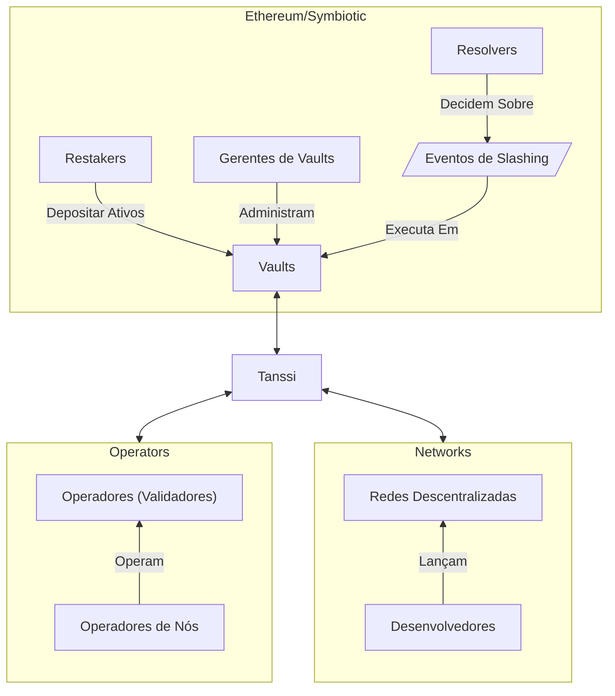
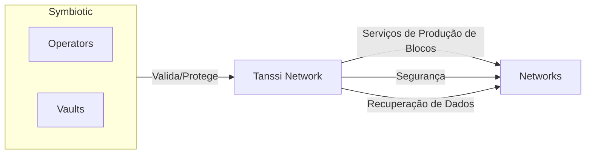
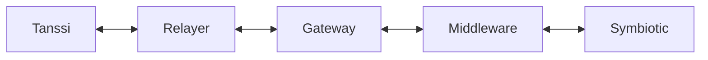
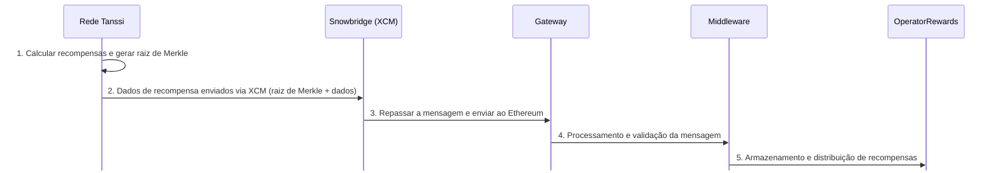
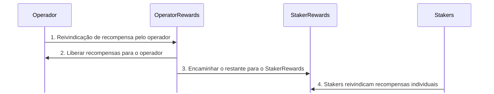
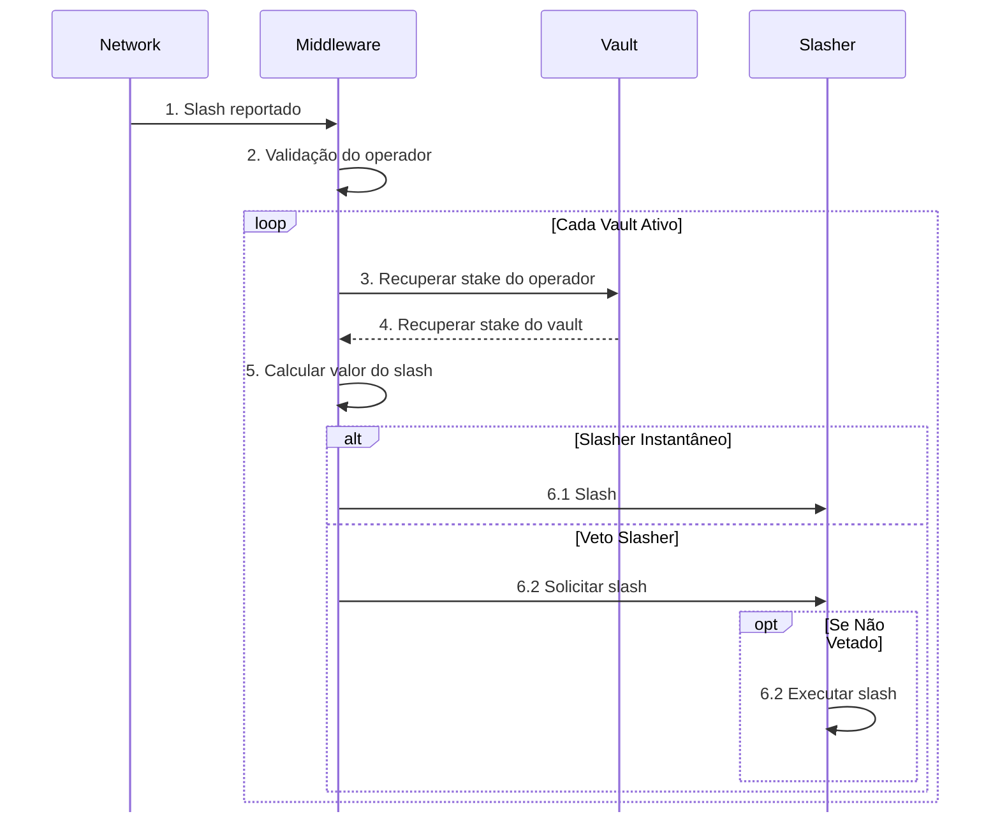

# Ethereum com Symbiotic {: #ethereum-symbiotic }

## Introdução {: #introduction }

O protocolo Tanssi cuida de componentes críticos de infraestrutura, facilitando que desenvolvedores lancem suas redes em poucos minutos. Além da produção de blocos, recuperabilidade de dados e integrações com ferramentas essenciais como carteiras, endpoints RPC, exploradores de blocos e outras, outro grande desafio é fornecer segurança para a rede.

O Tanssi foi criado para oferecer aos desenvolvedores um modelo de segurança compartilhada, evitando que eles tenham de buscar segurança econômica suficiente ou negociar com operadores para rodar nós que façam opt-in para suas redes. Ao implantar redes por meio do Tanssi e escolher o [Symbiotic](https://symbiotic.fi/){target=\_blank} como provedor de segurança, os desenvolvedores se beneficiam de segurança em nível de Ethereum, aproveitando bilhões de dólares em segurança compartilhada de ETH em stake.

As seções a seguir descrevem como funciona o protocolo Symbiotic e como as redes Tanssi podem aproveitá-lo como mecanismo de consenso.

## Segurança em Nível de Ethereum com Symbiotic {: #symbiotic }

O [Symbiotic](https://symbiotic.fi/){target=\_blank} é um protocolo de segurança compartilhada projetado para ser permissionless, multi-ativo e agnóstico à rede. Ele promove eficiência de capital ao permitir que usuários estendam a funcionalidade de seus ativos em stake para proteger outras redes, oferecendo utilidade adicional.

O protocolo fornece uma camada de coordenação para seus principais componentes e participantes, alinhando incentivos entre as partes enquanto minimiza riscos na camada de execução ao implantar contratos centrais não atualizáveis no Ethereum. O diagrama a seguir resume todos os componentes e atores que participam do protocolo:

O design flexível do Symbiotic permite que cada parte decida configurações que melhor atendam seus casos de uso. Por exemplo, os vaults podem escolher quais tipos de colateral aceitam, os operadores podem determinar para quais redes querem prestar serviços e as redes descentralizadas podem personalizar seu caso de uso e definir o nível de segurança (quais colaterais são aceitos, por exemplo) de que precisam.

As seções a seguir descrevem os principais componentes do protocolo.

### Vaults {: #vaults }

Os [Vaults](https://docs.symbiotic.fi/modules/vault/introduction){target=\_blank} são o alicerce econômico do protocolo Symbiotic. Eles gerenciam liquidez e depósitos de restakers, conectam operadores e redes e definem estratégias de delegação.

Cada vault está vinculado a um token específico que atende à interface [ERC20](https://github.com/ethereum/ercs/blob/master/ERCS/erc-20.md){target=\_blank} e é aceito como colateral. Internamente, os fundos dentro do vault são representados como shares, o que fornece um mecanismo para rastrear propriedade e distribuir recompensas. No entanto, o token de recompensa pode ser diferente do token de colateral.

Um vault é composto por três módulos principais, cada um com uma função distinta: o slasher, o delegator e o módulo de contabilidade. A implementação desses módulos pode variar dependendo das decisões do gerente do vault.

- **Módulo Slasher** - implementa a lógica de [slashing](#slashing-process), que penaliza maus atores
- **Módulo Delegator** - define como os fundos são delegados entre operadores e redes. Diversas [estratégias](https://docs.symbiotic.fi/modules/vault/delegator){target=\_blank} estão disponíveis, permitindo ao gerente do vault selecionar quais operadores e redes deseja atender
- **Módulo de Contabilidade** - lida com as operações financeiras do vault, incluindo processar depósitos de usuários, gerenciar pedidos de saque, rastrear saldos ativos e oferta total, e implementar contabilidade baseada em épocas para saques e eventos de slashing. A implementação padrão do módulo de contabilidade é o [ERC-4626](https://ethereum.org/developers/docs/standards/tokens/erc-4626/){target=\_blank}, que oferece um sistema de shares embutido

Como os operadores recebem stake delegado do vault e podem ser alvo de slashing, eles devem ser aprovados previamente pelos gerentes de vault. Da mesma forma, os gerentes de vault analisam e autorizam cada rede que o vault protegerá, considerando, por exemplo, as recompensas que a rede oferece.

Os gerentes de vault também designam [resolvers](https://docs.symbiotic.fi/modules/counterparties/resolvers){target=\_blank}, responsáveis por aprovar ou vetar [eventos de slashing](https://docs.symbiotic.fi/modules/vault/slasher){target=\_blank} causados por operadores em redes com suporte a [veto-slashing](https://docs.symbiotic.fi/modules/vault/slasher#veto-slashing){target=\_blank}, como a Tanssi Network.

### Operadores {: #operators }

Os [operadores de nós](/pt/node-operators/){target=\_blank} são entidades ou indivíduos responsáveis por executar os [nós (também conhecidos como operadores ou validadores)](https://docs.symbiotic.fi/modules/counterparties/operators){target=\_blank}, que são os componentes computacionais que validam as transações das redes. Eles são responsáveis pela configuração dos nós, setup de hardware, disponibilidade e desempenho.

Os operadores de nós fazem opt-in para prestar serviços a redes, que precisam aceitar sua solicitação. Eles também fazem opt-in para prestar serviços em vaults, que igualmente precisam aceitar seu pedido.

Depois que um operador é aceito por um vault e por uma rede conectada a esse vault, o nó pode começar a fornecer serviços de validação para essa rede, recebendo recompensas em troca.

### Redes {: #networks }

As [Redes](https://docs.symbiotic.fi/modules/counterparties/networks){target=\_blank} são os serviços ou redes ativamente validados. Essas blockchains específicas de aplicação podem ser de uma ampla gama de setores, como Gaming, DeFi, RWAs e outros, e são as plataformas com as quais, por meio de dApps, os usuários finais interagem.

Como os operadores fazem opt-in para prestar serviços às redes e os gerentes de vault precisam aceitar as redes, os desenvolvedores são responsáveis por definir, controlar e adaptar sua metodologia para onboarding, recompensa e slashing de operadores.

!!! note
    As redes implantadas por meio do Tanssi não precisam trabalhar o relacionamento com vaults e operadores, pois o protocolo Tanssi lida com essas complexidades.

## Tanssi com Symbiotic {: #tanssi-symbiotic }

Desenvolvedores que lançam redes por meio do Tanssi se beneficiam dos [serviços de produção de blocos](/pt/learn/tanssi/network-services/block-production/){target=\_blank}, recuperabilidade de dados como serviço e do modelo de segurança compartilhada derivado de todos os vaults que fazem opt-in para suportar o protocolo Tanssi. Isso elimina o obstáculo de lidar com componentes de infraestrutura e segurança que, de outra forma, os desenvolvedores precisariam assumir.

Gerentes de vaults podem se candidatar a oferecer os colaterais em restaking como segurança econômica para a Tanssi Network. Como as redes Tanssi rodam em um ambiente semelhante a um sandbox, e o protocolo Tanssi gerencia todas as responsabilidades relacionadas às redes, os gerentes de vaults só precisam analisar e fazer opt-in para o protocolo Tanssi, independentemente da qualidade e quantidade de redes que estejam rodando pelo protocolo Tanssi em qualquer momento.

Operadores que fazem opt-in para prestar serviços ao protocolo Tanssi (desde que participem de um vault que suporta o protocolo Tanssi) têm a vantagem de rodar o mesmo setup para fornecer serviços de produção de blocos e validação para a Tanssi Network e, consequentemente, para todas as redes implantadas via Tanssi. Essa arquitetura única facilita todas as tarefas relacionadas a executar e manter os operadores, já que não há mudanças no setup quando uma nova rede Tanssi é lançada ou desativada.

!!! note
    O protocolo Tanssi efetivamente abstrai os detalhes do conjunto ativo de redes para longe dos gerentes de vaults e operadores. Particularidades das redes não exigem qualquer configuração adicional dos operadores nem representam riscos aos ativos do vault.

Tudo isso forma um ecossistema funcional e elegante no qual os desenvolvedores podem se concentrar em criar e inovar. O Tanssi cuida dos componentes de infraestrutura, garantindo disponibilidade e desempenho, e o Symbiotic fornece os mecanismos econômicos que asseguram a validade das operações.

### Comunicação Tanssi-Ethereum {: #tanssi-ethereum-communication }

É importante entender como Tanssi e Ethereum trocam dados para compreender a mecânica do protocolo. Eles se conectam por meio de uma ponte bidirecional que permite que se comuniquem entre si. Cada protocolo tem um papel específico para viabilizar operações cross-chain.

Existem três componentes-chave entre Symbiotic e Tanssi:

- **`Relayer`** - é o software que monitora continuamente ambas as blockchains e transmite mensagens. Ele habilita comunicação bidirecional confiável entre Tanssi e Ethereum, servindo como a camada de conexão que garante que mensagens sejam entregues corretamente entre as redes

- **`Gateway`** - opera no lado Ethereum da ponte e cumpre três funções essenciais. Ele recebe, verifica e encaminha mensagens recebidas do Tanssi para garantir que sejam processadas corretamente. O contrato aceita mensagens de saída destinadas à rede Tanssi, preparando-as para o relay. Por fim, lida com funcionalidades de aplicação de nível superior, principalmente transferências de tokens entre as duas redes, fornecendo uma interface segura para movimentação de ativos entre cadeias

- **`Middleware`** - é a implementação do Tanssi para lidar com eventos e operações da rede. Ele é o elo crítico entre o `Gateway` e o protocolo central do Tanssi

O `Middleware` desempenha um papel central na coordenação da rede entre Tanssi e Symbiotic. Ele distribui recompensas a operadores e vaults com base em suas contribuições para segurança e desempenho da rede. O contrato ordena os operadores por stake para criar um sistema de ranking meritocrático para sua seleção e transmite a lista de chaves de operadores ordenadas ao Tanssi para atribuição. Além disso, facilita os processos de registro de operadores e gerencia os protocolos de recompensa e slashing que mantêm o alinhamento de incentivos da rede.

#### De Ethereum para Tanssi {: #from-ethereum-tanssi }

O `Middleware` transmite informações sobre o conjunto de operadores para o Tanssi para atribuição de sessões por meio da ponte. Ele envia detalhes sobre operadores ativos para cada época, ordenando-os por seu stake total agregado em todos os vaults. O Tanssi então usa essas informações para atribuir operadores para as próximas sessões, garantindo que os mais alinhados economicamente protejam a rede. Esse mecanismo cria um processo de seleção de operadores ponderado por stake, em que a segurança econômica no Ethereum se traduz em segurança operacional no Tanssi.

#### De Tanssi para Ethereum {: #from-tanssi-ethereum }

O Tanssi envia dados operacionais de volta ao Ethereum através do mesmo canal de comunicação. Essa mensagem inclui informações de recompensa que permitem a distribuição adequada aos stakeholders com base no desempenho da rede. A rede também transmite dados de eventos de slashing quando os operadores falham em desempenhar corretamente ou violam regras do protocolo, permitindo que o protocolo aplique penalidades. O Tanssi também pode solicitar a criação de novos tokens no Ethereum e registrar tokens, facilitando o gerenciamento de ativos entre as duas redes.

### Recompensas {: #rewards }

Operadores e restakers bem-comportados são recompensados por sua participação com tokens TANSSI. O processo de recompensa consiste em duas fases principais: [Fase de Distribuição de Recompensas](#reward-distribution-phase) e [Fase de Reivindicação de Recompensas](#reward-claiming-phase).

#### Fase de Distribuição de Recompensas {: #reward-distribution-phase }

A fase de distribuição de recompensas calcula e aloca recompensas por meio de cinco etapas principais que envolvem operadores, restakers e contratos inteligentes. As etapas são:

1. **Cálculo de Recompensas** - o Tanssi calcula recompensas com base na atividade de operadores e stakers e então cria uma [raiz de Merkle](https://en.wikipedia.org/wiki/Merkle_tree){target=\_blank}. Essa raiz de Merkle é uma impressão digital criptográfica que resume as alocações de recompensas, indicando quem recebe o quê. Stakers são recompensados de acordo com seu stake em cada vault
2. **Dados de Recompensa Enviados via XCM** - os dados de alocação de recompensas são enviados usando [XCM](https://wiki.polkadot.com/learn/learn-xcm/){target=\_blank} (Cross-Consensus Messaging), um protocolo padronizado para comunicação entre blockchains. A [Snowbridge](https://docs.snowbridge.network/){target=\_blank} atua como uma ponte sem confiança entre Tanssi e Ethereum
3. **Recepção da Mensagem no Ethereum** - uma vez que a mensagem é encaminhada para o contrato `Gateway`, esse contrato serve como ponto de entrada autorizado do Tanssi no Ethereum para a ponte Snowbridge
4. **Processamento e Validação da Mensagem** - o `Gateway` encaminha os dados para o [`Middleware`](https://github.com/moondance-labs/tanssi-symbiotic/blob/main/src/contracts/middleware/Middleware.sol){target=\_blank}, que é responsável por várias tarefas, incluindo passar as informações para o contrato `OperatorReward`
5. **Armazenamento e Distribuição de Recompensas** - este é o destino final dos dados. O contrato [`OperatorRewards`](https://github.com/moondance-labs/tanssi-symbiotic/blob/main/src/contracts/rewarder/ODefaultOperatorRewards.sol){target=\_blank} armazena a árvore de Merkle das alocações de recompensa e lida com a transferência de tokens de recompensa quando um claim é feito

#### Fase de Reivindicação de Recompensas {: #reward-claiming-phase }

Na fase de reivindicação de recompensas, operadores e stakers podem reivindicar recompensas com base em sua participação na rede. O Tanssi determina a divisão para operadores e stakers, atualmente fixada em 20% para operadores e 80% para stakers.

1. **Reivindicação de Recompensa pelo Operador** - operadores podem reivindicar sua parcela chamando o contrato `OperatorRewards` usando um recibo criptográfico que comprova seu direito
2. **Liberação de Tokens** - a chamada do operador aciona a liberação de tokens, e o `OperatorRewards` envia o valor estabelecido ao operador
3. **Distribuição de Tokens aos Stakers** - as recompensas restantes são encaminhadas ao contrato `StakerRewards` para posterior reivindicação dos stakers
4. **Alocação dos Stakers** - os 80% restantes das recompensas são direcionados automaticamente ao contrato [`StakerRewards`](https://github.com/moondance-labs/tanssi-symbiotic/blob/main/src/contracts/rewarder/ODefaultStakerRewards.sol){target=\_blank}, onde os stakers podem reivindicar recompensas proporcionais ao seu stake nos vaults

### Slashing {: #slashing }

O protocolo Tanssi implementa slashing para penalizar operadores por mau comportamento. Quando um evento de slashing é acionado, as autoridades designadas como resolvers pelos gerentes de vault podem aceitar ou reverter essa ação.

As seguintes ações podem acionar eventos de slashing:

- Produção de blocos inválidos (por exemplo, blocos que incluem transações inválidas)
- Validação inválida (por exemplo, dupla assinatura ou quebra das regras do protocolo)
- Tempo de inatividade ou indisponibilidade
- Violações de consenso

!!! note
    Eventos de slashing só podem ser acionados por mau comportamento dos operadores dentro da Tanssi Network. Mesmo que redes Tanssi sejam defeituosas ou maliciosas, elas operam em um ambiente isolado e não podem causar slashing.

#### Processo de Slashing {: #slashing-process }

O processo de slashing segue um caminho semelhante ao das recompensas. Quando um operador se comporta mal, a Tanssi Network envia uma mensagem de solicitação de slashing para a ponte sem confiança (Snowbridge). A mensagem passa pelo `Gateway` e chega ao `Middleware`, onde o método de slashing é chamado.

O método de slashing recebe um identificador exclusivo para a identidade do operador, a severidade do slash como uma porcentagem do stake do operador atribuído em cada vault e o contexto temporal em que a infração ocorreu.

O processo de slashing consiste nas seguintes etapas:

1. **Slash Reportado** - o Tanssi envia a solicitação de slashing ao `Middleware` com os parâmetros `operatorKey`, `percentage` e `epoch`
2. **Validação do Operador** - o `Middleware` valida a identidade do operador e verifica se ele está sujeito ao slashing
3. **Recuperar Vaults Ativos** - o `Middleware` percorre todos os vaults ativos durante a época da infração, ignorando qualquer vault inativo
4. **Recuperar Stake do Operador** - para cada vault ativo, o `Middleware` recupera o stake do operador infrator
5. **Calcular Valor do Slash** - o `Middleware` calcula o valor do slashing aplicando a porcentagem de corte ao stake do operador em cada vault
6. **Slashing** - dependendo da implementação de slashing do vault, existem duas rotas possíveis

    - **Slashing Instantâneo** - se o vault usa slashing instantâneo, o stake é reduzido imediatamente

    - **Veto Slashing** - se o vault usa veto slashing, o `Middleware` solicita o slashing a um resolver. Uma janela de veto com tempo limitado é criada (por exemplo, 7 dias)

    O slashing é cancelado se o resolver vetar a solicitação dentro da janela de tempo. Caso contrário, a penalidade de slashing é executada se nenhum veto ocorrer dentro da janela.

Esse processo garante que o slashing de cada vault seja tratado de forma independente, evitando contaminação cruzada, e oferece slashing instantâneo e com atraso, com mecanismos de resolução de disputas.

#### Burner {: #burner }

O contrato `Burner` é uma extensão responsável por lidar com ações que seguem um [evento de slashing](#slashing-process), especialmente a queima do colateral slashed. Uma vez que um slash é executado, o contrato `Slasher` chama o `Burner` para realizar essas tarefas pós-slashing.

Dentro do protocolo, o contrato `Burner` desempenha um papel crucial ao decidir o que acontece após o slashing. Embora existam diferentes maneiras de implementar o processo de queima, a abordagem recomendada é queimar os ativos slashed.
Quando um slash é executado, a função `onSlash` do contrato `Burner` é ativada. Essa função dá início ao processo de queimar os ativos slashed.

O gerente do vault escolhe a implementação específica do processo de queima durante a fase de inicialização do vault e, uma vez definida, o gerente do vault não pode modificá-la. O design exato do contrato `Burner` pode variar dependendo do tipo de ativo colateral envolvido. Abaixo estão algumas opções de implementação em potencial:

- **Queima de Tokens** - se o colateral slashed for um token ERC-20 comum, o `Burner` destrói esses tokens, removendo-os permanentemente de circulação
- **Desembrulhar e Queimar** - se os tokens slashed representarem algo como ativos em stake (por exemplo, tokens de staking líquido) ou tokens de provedor de liquidez (LP) de uma DEX, o `Burner` pode convertê-los de volta à sua forma original antes de queimá-los
- **Operações entre Cadeias** - se os tokens estiverem vinculados a ativos em outra blockchain, o `Burner` pode desembrulhá-los no Ethereum e acionar o processo de queima na rede original
- **Tratamento Alternativo** - às vezes, queimar não é a melhor opção. Em vez disso, o `Burner` pode redistribuir os ativos slashed para outros operadores, compensar usuários afetados ou bloqueá-los em pools de liquidez — conforme o sistema for projetado para fazer

Queimar o colateral slashed é importante porque penaliza operadores que se comportam mal e reduz a oferta total de tokens, o que pode ter efeitos deflacionários.
