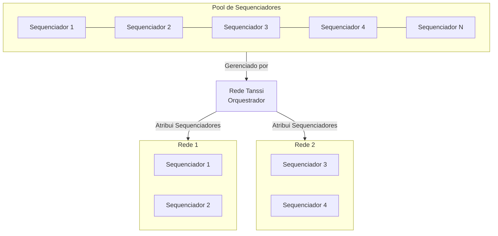

# Serviços de Produção de Blocos {: #block-production-services }

## Introdução {: #introduction }

Como apresentado no artigo [Visão Geral](/pt/learn/tanssi/overview/){target=\_blank}, Tanssi é um protocolo de infraestrutura que agiliza a implantação de redes descentralizadas com lógica personalizada que se adequa a uma ampla gama de casos de uso, incluindo DeFi, NFTs, Jogos e qualquer outro caso de uso que as equipes de desenvolvimento possam querer abordar.

A infraestrutura representa um enorme desafio para os desenvolvedores, exigindo que eles inicializem sequenciadores, preservadores de dados e endpoints RPC, além de gerenciar integrações, interoperabilidade e segurança. Isso exige tempo e recursos valiosos, desviando o foco do que realmente importa: entregar valor aos seus usuários.

Tanssi orquestra recursos, permitindo que os desenvolvedores implantem redes descentralizadas (também conhecidas como serviços validados ativamente ou AVSs) que são totalmente adaptáveis a qualquer aplicativo ou caso de uso específico. Nesta analogia, a rede Tanssi se assemelha ao [Kubernetes](https://kubernetes.io){target=\_blank} em seu papel como orquestrador, gerenciando recursos para garantir a atividade e o desempenho das redes.

O protocolo também aborda a frente de segurança, permitindo que as redes selecionem e se conectem a provedores de segurança externos (como [Symbiotic](/pt/learn/tanssi/external-security-providers/symbiotic/){target=\_blank}), garantindo segurança de nível Ethereum desde o início.

Este artigo aborda os aspectos necessários a serem considerados ao construir e implantar seu próprio blockchain modular, juntamente com os aspectos técnicos mais relevantes do protocolo Tanssi.

## Produção de Blocos como Serviço {: #block-production-as-a-service }

O protocolo Tanssi fornece produção de blocos como serviço, orquestrando um conjunto descentralizado e confiável de sequenciadores, garantindo a atividade das redes. Para fazer isso, o protocolo conecta ambas as extremidades:

- **Operadores de nós**: Que executam sequenciadores, oferecendo seus serviços de produção de blocos para obter recompensas.
- **Desenvolvedores**: Que lançam redes, que exigem sequenciadores.

O protocolo atribui um subconjunto de sequenciadores para fornecer serviços a cada rede, rotacionando-os após um período de tempo. Os sequenciadores podem servir qualquer rede baseada em Tanssi, independentemente da lógica personalizada que implementam. Por outro lado, as redes implantadas por meio do Tanssi podem personalizar seu tempo de execução tanto quanto precisarem para se adequar ao seu caso de uso e atualizar a lógica a qualquer momento de forma sem bifurcação, sem se preocupar com a configuração do sequenciador.

O diagrama a seguir ilustra como o Tanssi atribui dois sequenciadores a cada rede ativa, selecionando-os de um conjunto descentralizado de sequenciadores.

### Processo de Seleção do Sequenciador {: #sequencer-selection-process}

A qualquer momento, todas as redes Tanssi exigem um certo número de sequenciadores, dependendo do número de redes ativas e da configuração atual de produção de blocos definida no Tanssi. A configuração define o número máximo de sequenciadores totais no conjunto e o número de sequenciadores que cada rede deve ter atribuído.

=== "Tanssi MainNet"
|          Variável          |                                       Valor                                        |
|:--------------------------:|:----------------------------------------------------------------------------------:|
|    Máx. nº de Sequenciadores    |     {{ networks.mainnet.sequencers.configuration.max_block_producers }}      |
| nº de Sequenciadores (Redes) | {{ networks.mainnet.sequencers.configuration.block_producer_per_container }} |

=== "Dancelight TestNet"
|          Variável          |                                       Valor                                        |
|:--------------------------:|:----------------------------------------------------------------------------------:|
|    Máx. nº de Sequenciadores    |     {{ networks.dancelight.sequencers.configuration.max_block_producers }}      |
| nº de Sequenciadores (Redes) | {{ networks.dancelight.sequencers.configuration.block_producer_per_container }} |

Assim que o número necessário de sequenciadores para uma determinada sessão for conhecido, o Tanssi usa dois mecanismos para decidir o conjunto de sequenciadores distribuídos entre todas as redes.

O primeiro mecanismo é através do módulo *Invulneráveis*, que define uma lista de sequenciadores fixos priorizados pelo protocolo e garante a estabilidade da produção de blocos em certos cenários, como TestNets.

O segundo mecanismo é através do [módulo de staking do Tanssi](/pt/learn/tanssi/network-features/staking/){target=\_blank}. O módulo ajuda a criar um conjunto descentralizado de sequenciadores para todas as redes Tanssi, fornecendo ao protocolo uma lista de sequenciadores classificados por valor apostado. O Tanssi anexa a lista classificada por aposta de sequenciadores aos invulneráveis (se houver), em seguida, pega da lista apenas a quantidade exata de sequenciadores necessária, começando do topo, deixando de fora da próxima sessão aqueles sequenciadores que têm menos valor apostado, para finalmente iniciar o processo de atribuição do sequenciador.

### Atribuição de Sequenciadores {: #block_producers-assignment }

Assim que o conjunto de sequenciadores que participará da próxima sessão for conhecido, o Tanssi embaralha a lista e os atribui para fornecer serviços de produção de blocos às redes Tanssi ativas.

O algoritmo de atribuição começará a distribuir os sequenciadores que atendem às redes pela data de registro em ordem de chegada. Depois que a atribuição for feita, ela será mantida por pelo menos uma sessão, representando um período medido em blocos com um conjunto constante de sequenciadores. No Tanssi MainNet, a duração da sessão padrão é definida como {{ networks.mainnet.session.blocks }} blocos, o que, com um tempo médio de bloco de seis segundos, se traduz em (aproximadamente) {{ networks.mainnet.session.display }} horas.

Cada nova atribuição funciona intencionalmente com um atraso de uma sessão, para que os sequenciadores saibam com antecedência a qual das redes eles estão atribuídos. Os sequenciadores começarão a sincronizar a nova rede que terão que servir na próxima sessão com um mecanismo de sincronização especial chamado [warp sync](https://spec.polkadot.network/chap-sync#sect-sync-warp){target=\_blank}. O warp sync permite que os sequenciadores sincronizem rapidamente a nova rede sem atuar como um nó de arquivo.

Quando uma nova sessão começa, o protocolo Tanssi colocará a atribuição na fila em vigor. Os sequenciadores mudarão automaticamente e começarão a produzir blocos na nova rede Tanssi a que foram atribuídos, descartando o estado da cadeia da atribuição anterior. O Tanssi também calculará a nova atribuição, considerando as alterações nas redes Tanssi que podem ter sido ativadas ou desativadas e os sequenciadores que podem ter sido adicionados ou removidos do pool ou alterado o valor total apostado. Esta nova atribuição será enfileirada para a próxima sessão.

### O Papel da Rede Tanssi {: #tanssi-newtwork }

Como discutido anteriormente, o protocolo Tanssi atribui sequenciadores às redes Tanssi, e o resultado desta atribuição é armazenado no estado da cadeia. Além de executar o nó da rede, os sequenciadores também executam o Tanssi. Portanto, ao acessar os dados armazenados nos blocos finalizados da Rede Tanssi, eles podem aprender sua atribuição para a sessão, e as redes Tanssi podem confirmar que um determinado grupo de sequenciadores foi atribuído a elas.

À medida que as redes Tanssi produzem blocos, esses blocos precisam ser validados e finalizados por um provedor de segurança externo. Depois que um operador verifica um bloco, uma pequena prova de validade é produzida e armazenada no Tanssi, mantendo o controle das provas para cada bloco de cada cadeia. Esta pequena representação da prova de validade é chamada de [recibo de candidato](https://polkadot.com/blog/the-path-of-a-parachain-block/#candidate-receipts){target=\_blank} e é composta por um conjunto de valores, incluindo a raiz do estado, que pode ser usada para verificar provas de estado.

Finalmente, o Tanssi pode verificar se o autor de um bloco de rede foi o esperado e recompensá-lo de acordo.

O diagrama a seguir mostra um modelo simplificado dos dados que o Tanssi armazena em seu estado interno. Para cada rede ativa (neste exemplo, duas), o Tanssi armazena os sequenciadores atribuídos, que são os únicos autorizados a produzir blocos em nome da rede, prova de validade (recibos de candidatos) estendidos pelos operadores do provedor de segurança, a raiz do estado mais recente e o sequenciador mais recente.

### O Papel da Rede com Tecnologia Tanssi {: #network }

Como um sequenciador atribuído a uma rede com tecnologia Tanssi inclui funcionalidade de nó Tanssi integrada, é tecnicamente viável ler o estado da Rede Tanssi.

Aproveitando essa capacidade de acessar os estados, o sequenciador atual com a autoridade para produzir um bloco lerá o estado do último bloco produzido na cadeia Tanssi. Ele prosseguirá para incluir este estado no bloco da rede, o conjunto atual de sequenciadores atribuídos à rede e sua assinatura pública, permitindo que o Tanssi saiba quem produziu o bloco e recompense o operador do nó.

Depois que o bloco for preenchido com as transações da rede, ele será proposto como candidato e entregue à cadeia Tanssi, onde os operadores do provedor de segurança garantirão que as provas de estado incluídas correspondam às provas de estado do último estado do Tanssi (impedindo a produção não autorizada de blocos) e que as transações produziram transições de estado válidas. Tendo verificado o trabalho do sequenciador, os operadores finalizarão o bloco proposto, incluindo seu recibo de candidato em um bloco de rede Tanssi.

## Taxas de Produção de Blocos  {: #block-production-fees }

Como apresentado na [Introdução](#introduction), Tanssi é um protocolo de infraestrutura que aborda as complexidades e os altos custos associados à configuração e manutenção da infraestrutura blockchain, agilizando a implantação de redes. Este protocolo traz benefícios para ambos os participantes:

- **Redes**: As equipes podem se concentrar na lógica principal de seu produto, na UX e na UI, sem lidar com os desafios da inicialização da infraestrutura e seu gerenciamento.
- **Sequenciadores**: Assumindo a responsabilidade de manter sua configuração de hardware e software em ótimas condições, eles são incentivados a executar transações e produzir blocos em nome das redes Tanssi.

A [produção de blocos como serviço](#block-production-as-a-service) acarreta custos associados que devem ser cobertos pelas redes que desejam alavancar o Tanssi para tal fim. As seções a seguir cobrem os aspectos gerais desses custos e pagamentos de serviços associados.

### Pagamentos de Serviços {: #service-payments }

Existem três custos principais associados à produção de blocos como serviço que qualquer rede deve cobrir usando tokens Tanssi para implantar com sucesso e obter os serviços de produção de blocos:

- **Depósito de registro**: O depósito inicial que é bloqueado da conta que assina a transação de registro da rede.
- **Depósito de armazenamento de registro**: O depósito inicial que é bloqueado da conta que assina a transação de registro da rede. É um valor variável dependendo do tamanho do tempo de execução da appchain.
- **Atribuição de sequenciadores**: Toda vez que o protocolo Tanssi atribui sequenciadores, o que acontece uma vez por sessão, uma taxa fixa é cobrada. Esta taxa dá às redes o direito de serem atribuídas sequenciadores e desencoraja redes cuja lógica de tempo de execução não consegue produzir transações ou blocos válidos.
- **Produção de blocos**: As redes devem pagar por cada bloco produzido em seu nome. Como o protocolo seleciona e atribui os sequenciadores por sessão, as redes devem ter fundos suficientes para cobrir todos os blocos a serem produzidos em uma sessão inteira para serem atendidos.

A configuração atual é definida da seguinte forma:

=== "Tanssi MainNet"
|           Variável           |                                                                   Valor                                                                    |
|:----------------------------:|:------------------------------------------------------------------------------------------------------------------------------------------:|
|     Depósito de registro     |                         {{ networks.mainnet.costs.registration_deposit_fee }} {{ networks.mainnet.token_symbol }}                          |
| Depósito de armazenamento de registro | {{ networks.mainnet.costs.registration_deposit_per_byte }} x 10-5 {{ networks.mainnet.token_symbol }} por byte de tempo de execução da appchain |
|    Atribuição de sequenciadores     |                      {{ networks.mainnet.costs.cost_per_assignment }} {{ networks.mainnet.token_symbol }} por sessão                      |
|       Produção de blocos       |                         {{ networks.mainnet.costs.cost_per_block }} {{ networks.mainnet.token_symbol }} por bloco                          |

=== "Dancelight TestNet"
|       Variável        |                                                Valor                                                |
|:---------------------:|:---------------------------------------------------------------------------------------------------:|
| Depósito de registro  | {{ networks.dancelight.costs.registration_deposit_fee }} {{ networks.dancelight.token_symbol }} |
| Depósito de armazenamento de registro  | {{ networks.dancelight.costs.registration_deposit_per_byte }} x 10-5 {{ networks.dancelight.token_symbol }} por byte de tempo de execução da appchain |
| Atribuição de sequenciadores |        {{ networks.dancelight.costs.cost_per_assignment }} x 10-6 {{ networks.dancelight.token_symbol }} por sessão         |
|   Produção de blocos    |            {{ networks.dancelight.costs.cost_per_block }} x 10-6 {{ networks.dancelight.token_symbol }} por bloco            |

Para garantir a produção de blocos na próxima sessão, o saldo total deve ser pelo menos suficiente para cobrir o custo de atribuição de sequenciadores mais o custo de produção dos {{ networks.mainnet.session.blocks }} blocos que compõem uma sessão inteira.

!!! nota
    Embora os custos de atribuição de sequenciadores e produção de blocos sejam atualmente fixos, à medida que o desenvolvimento do protocolo progride, eles podem se tornar dinâmicos, variando em resposta à carga de trabalho da rede.

### Gorjetas {: #tipping }

Em algumas ocasiões, o Tanssi pode experimentar uma alta demanda por seus serviços de produção de blocos que não pode ser atendida com os recursos disponíveis. Por exemplo, se houver dez redes ativas para a próxima sessão e o Tanssi só puder servir oito, duas redes serão paralisadas durante toda a duração da sessão.

Para lidar com esses períodos de alta carga de trabalho, o protocolo Tanssi implementa um mecanismo de gorjeta que permite que as redes compitam por uma prioridade maior em relação ao restante. Semelhante às redes compatíveis com Ethereum, onde uma taxa de prioridade pode ser definida para superar as transações concorrentes e obter tratamento de execução preferencial, as redes Tanssi serão atendidas de acordo com a prioridade dada pelas gorjetas que oferecem. Seguindo o exemplo anterior, se houver dez redes ativas para a próxima sessão e o Tanssi só puder servir oito, apenas as oito redes com maior lance receberão sequenciadores atribuídos.
