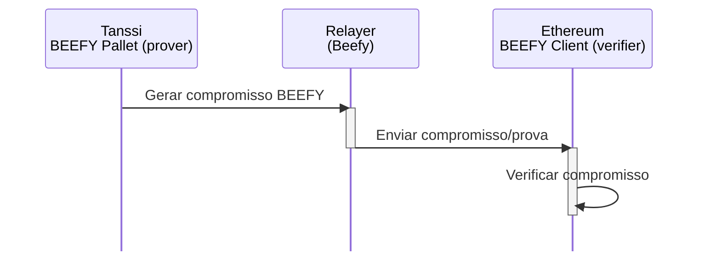
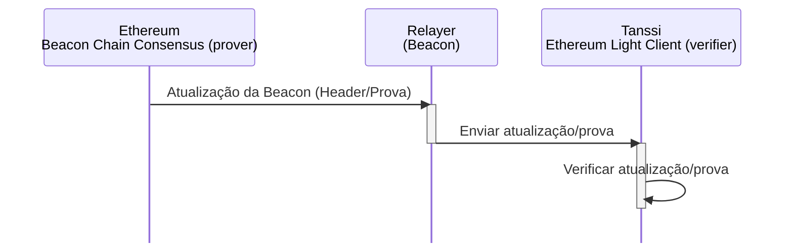
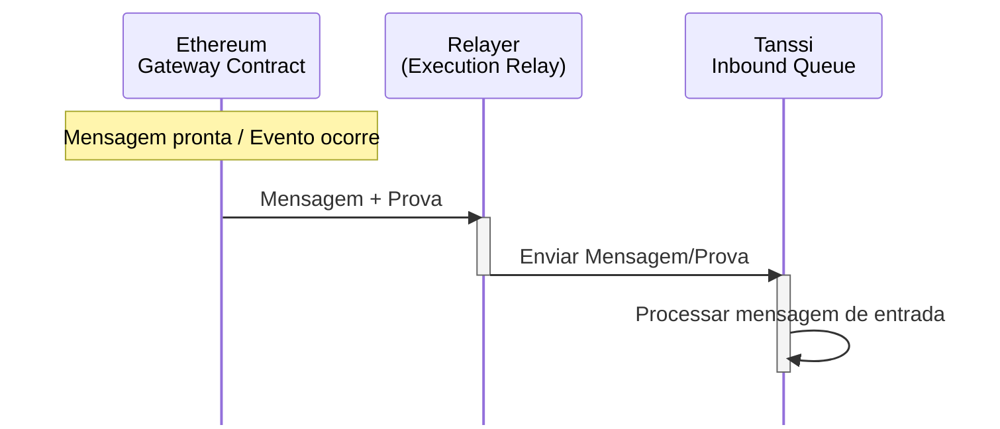
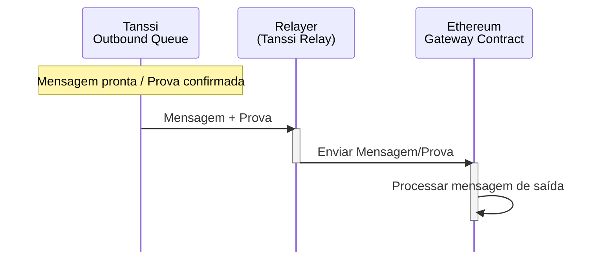
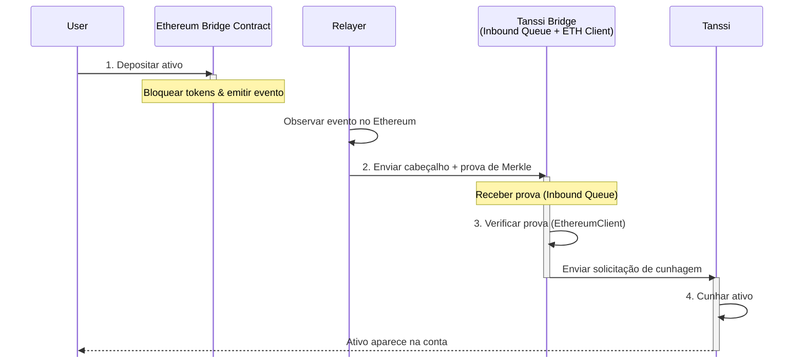
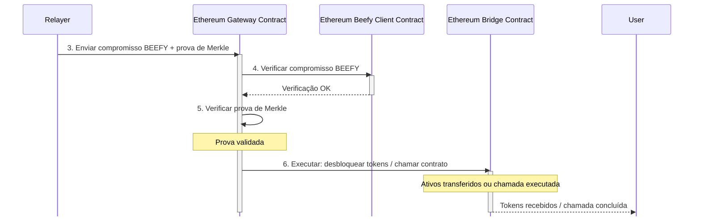

# Ponte Tanssi-Ethereum {: #tanssi-ethereum-bridge }

## Introdução {: #introduction }

Blockchains tradicionais frequentemente criam silos, limitando a interoperabilidade de ativos e funcionalidades. A ponte Tanssi-Ethereum supera essas limitações ao permitir operações entre cadeias que beneficiam ambos os ecossistemas.

A ponte é mais do que uma troca de ativos. É um protocolo seguro e padronizado para interação direta entre cadeias sem intermediários centralizados. Seu design sem confiança evita riscos de pontos únicos de falha.

Este artigo apresenta a ponte Tanssi-Ethereum como uma camada-chave de interoperabilidade entre as duas redes. Você verá como ela funciona, incluindo arquitetura, gerenciamento de operadores, modelo econômico, mecanismos de corte e transferências de ativos.

Também verá as camadas de consenso que protegem a comunicação ([BEEFY](https://docs.snowbridge.network/architecture/components#beefyclient){target=_blank} no [Tanssi](/pt/learn/tanssi/){target=_blank} e a [Ethereum Beacon Chain](https://ethereum.org/roadmap/beacon-chain/){target=_blank}), e os papéis de provadores, verificadores e relayers, oferecendo uma visão clara de como ativos e mensagens circulam com segurança entre Tanssi e Ethereum.

## Funções Principais {: #core-functions }

A ponte facilita operações críticas entre Tanssi e Ethereum:

- **Gerenciamento de Operadores** - mantém informações de stake no Ethereum via [Symbiotic](/pt/learn/tanssi/external-security-providers/symbiotic/#tanssi-symbiotic){target=_blank}, fornecendo dados para o Tanssi selecionar operadores ativos e alinhados economicamente em cada era
- **Operações Econômicas** - distribui [recompensas](/pt/learn/tanssi/external-security-providers/symbiotic/#rewards){target=_blank} do Tanssi para stakers e operadores no Ethereum
- **Corte (Slashing)** - processa [pedidos de corte](/pt/learn/tanssi/external-security-providers/symbiotic/#slashing){target=_blank} do Tanssi para o Ethereum quando operadores violam regras
- **Transferência de Ativos** - permite transferências bilaterais e sem confiança entre Tanssi e Ethereum, aumentando a liquidez

Essa interoperabilidade amplia o potencial de dApps e melhora significativamente a liquidez e usabilidade de ativos.

## A Arquitetura da Ponte {: #bridge-architecture }

Entender a funcionalidade de consenso da ponte exige olhar para provadores, verificadores e relayers. Provadores geram provas criptográficas, verificadores as validam e relayers movem dados entre cadeias.

Os provadores incluem o módulo [BEEFY](https://docs.snowbridge.network/architecture/components#beefyclient){target=_blank} do Tanssi e o consenso da Ethereum Beacon Chain. Eles produzem dados de consenso transmitidos por relayers especializados.

Cada cadeia executa um [cliente leve](https://ethereum.org/developers/docs/nodes-and-clients/light-clients/){target=_blank} da outra, atuando como verificador on-chain da legitimidade dos dados. Por exemplo, quando o Tanssi envia uma mensagem para o Ethereum, gera provas compactas de eventos ou mudanças de estado; o cliente leve do Ethereum as verifica antes de agir.

### Consenso Tanssi → Ethereum {: #tanssi-ethereum-consensus }

BEEFY (Bridge Efficiency Enabling Finality Yielder) é o protocolo de consenso do Tanssi e atua como provador. Ele foi projetado para ponte eficiente e sem confiança com cadeias como Ethereum.

### Consenso Ethereum → Tanssi {: #ethereum-tanssi-consensus }

Para a ponte Ethereum→Tanssi, o consenso da Ethereum Beacon Chain é o provador. Ele fornece ao cliente leve on-chain do Tanssi prova do estado finalizado do Ethereum, incluindo eventos ou mensagens destinados ao Tanssi.

Do ponto de vista das mensagens, a ponte usa essa camada de verificação de consenso para comunicação segura. Relayers dedicados transportam mensagens: o Execution Relay para Ethereum→Tanssi e o Tanssi Relay para Tanssi→Ethereum.

Relayers são sem estado e apenas submetem provas. Eles não podem forjar mensagens ou roubar fundos, pois o consenso revalida cada prova on-chain. Vários relayers paralelos melhoram a responsividade sem centralizar poder.

O contrato `Gateway` no Ethereum é o ponto central de mensagens. Ele recebe mensagens do Tanssi via relayers, valida com provas de consenso e executa operações como cunhagem/desbloqueio de tokens ou chamadas de contratos.

### Mensagens de Entrada Ethereum → Tanssi {: #ethereum-tanssi-messages }

Mensagens do Ethereum para o Tanssi usam o consenso da Beacon Chain para provas e um Execution/Beacon Relay.

### Mensagens de Saída Tanssi → Ethereum {: #tanssi-ethereum-messages }

Mensagens do Tanssi para Ethereum usam o consenso BEEFY para provar o estado do Tanssi e um Tanssi Relay para transmissão.

O `Gateway` gerencia comunicações de saída no Ethereum. Para transferências entre cadeias, registra um evento, bloqueia tokens (se necessário) e empacota dados para retransmissão ao Tanssi. O Tanssi usa duas filas para processar mensagens com eficiência.

A `Outbound Queue` lida com mensagens para o Ethereum, agrupando-as e adicionando uma [raiz Merkle](https://en.wikipedia.org/wiki/Merkle_tree){target=_blank} a cada cabeçalho de bloco. Isso permite que o cliente leve do Ethereum verifique a inclusão com provas de consenso.

A `Inbound Queue` processa mensagens do Ethereum, recebendo e verificando provas via cliente leve Ethereum on-chain do Tanssi. Eventos verificados tornam-se instruções internas no Tanssi. Essa arquitetura em camadas, protegida por consenso, garante interações sem confiança entre cadeias.

## Fluxo de Transferências de Tokens {: #token-transfers-flow }

O fluxo de ativos envolve bloquear/cunhar em uma cadeia e a ação complementar na outra, protegida por provas verificadas:

1. **Iniciação (cadeia de origem)** - usuário inicia a transferência
2. **Prova via Relay** - relayers off-chain captam o evento e enviam provas criptográficas para a cadeia de destino
3. **Verificação (cadeia de destino)** - clientes leves on-chain verificam as provas enviadas
4. **Execução** - após a verificação, tokens são cunhados/desbloqueados na cadeia de destino

### Transferência de Ethereum para Tanssi

1. **Bloqueio no Ethereum** - o usuário deposita ativos no contrato da Bridge no Ethereum; tokens são bloqueados e um evento de depósito é emitido
2. **Relay para Tanssi** - um relayer detecta o evento finalizado, cria um pacote de prova (cabeçalho do bloco + prova de Merkle) e envia para a `Inbound Queue` da Tanssi Bridge
3. **Verificar no Tanssi** - o módulo `EthereumClient` (cliente leve on-chain) verifica a finalidade do cabeçalho do Ethereum e a prova de Merkle
4. **Cunhar no Tanssi** - após verificação, a `Inbound Queue` cunha o ativo correspondente no Tanssi

### Transferência de Tanssi para Ethereum

1. **Iniciar e confirmar no Tanssi** - usuário inicia transferência; mensagem vai para a `Outbound Queue`, que agrupa a carga útil e confirma a raiz Merkle no cabeçalho do Tanssi
2. **Relay para Ethereum** - relayer off-chain busca prova: compromisso BEEFY + prova de Merkle da carga útil
3. **Enviar compromisso no Ethereum** - relayer envia compromisso BEEFY e prova de Merkle ao contrato `Gateway`
4. **Verificar no Ethereum** - contrato Beefy Client verifica o compromisso
5. **Validar carga útil** - `Gateway` valida a prova de Merkle
6. **Executar no Ethereum** - `Gateway` executa a ação (desbloqueio de ativos ou chamada de contrato)

