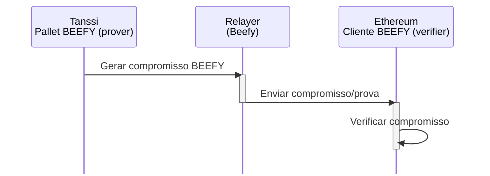
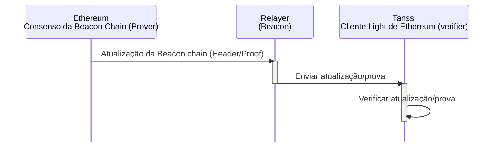
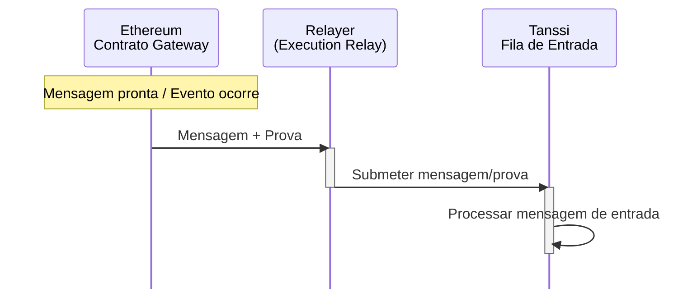
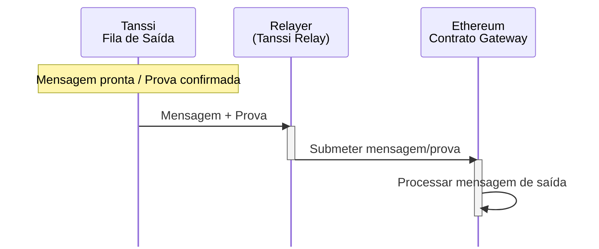
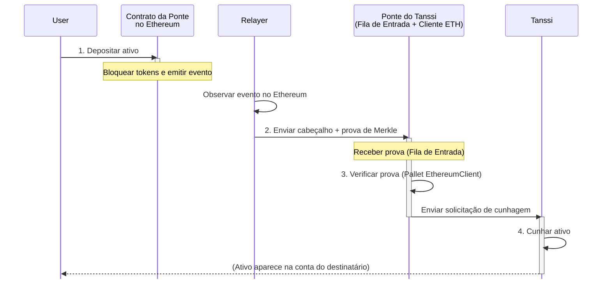
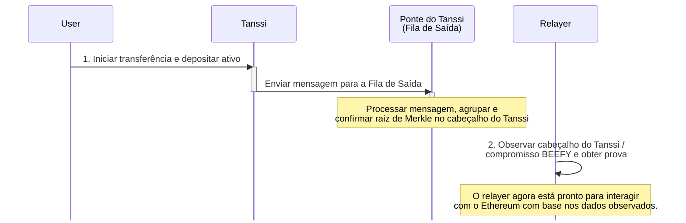
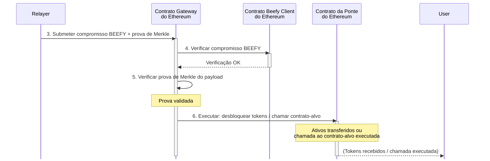

# Ponte Tanssi-Ethereum {: #tanssi-ethereum-bridge }

## Introdução {: #introduction }

Blockchains tradicionais frequentemente criam silos, limitando a interoperabilidade de ativos e funcionalidades. A ponte Tanssi-Ethereum supera essas limitações ao permitir operações multichain contínuas que beneficiam ambos os ecossistemas.

A ponte é mais do que uma troca de ativos. É um protocolo seguro e padronizado para interação direta entre cadeias, sem intermediários centralizados. Seu design sem confiança evita os riscos de pontos centrais de falha que muitas outras pontes enfrentam.

Este artigo apresenta a ponte Tanssi-Ethereum como uma camada fundamental de interoperabilidade entre as duas redes. Você aprenderá como ela funciona, incluindo sua arquitetura, gestão de operadores, modelo econômico, mecanismos de slashing e transferências de ativos.

Você também conhecerá as camadas de consenso que protegem a comunicação ([BEEFY](https://docs.snowbridge.network/architecture/components#beefyclient){target=\_blank} em [Tanssi](/pt/learn/tanssi/){target=\_blank} e a [Beacon Chain do Ethereum](https://ethereum.org/roadmap/beacon-chain/){target=\_blank}), além dos papéis de provers, verifiers e relayers, oferecendo uma visão clara de como ativos e mensagens se movem com segurança entre Tanssi e Ethereum.

## Funções Principais {: #core-functions }

A ponte facilita várias operações críticas entre Tanssi e Ethereum:

- **Gestão de Operadores** - mantém informações de stake de operadores no Ethereum via o protocolo [Symbiotic](/pt/learn/tanssi/external-security-providers/symbiotic/#tanssi-symbiotic){target=\_blank}, fornecendo esses dados ao Tanssi para selecionar operadores ativos, descentralizados e economicamente alinhados a cada era
- **Operações Econômicas** - distribui [recompensas](/pt/learn/tanssi/external-security-providers/symbiotic/#rewards){target=\_blank} do Tanssi para stakers e operadores no Ethereum
- **Slashing** - processa [solicitações de slashing](/pt/learn/tanssi/external-security-providers/symbiotic/#slashing){target=\_blank} do Tanssi para o Ethereum quando operadores violam as regras do protocolo
- **Transferência de Ativos** - permite transferências bilaterais e sem confiança de ativos entre Tanssi e Ethereum, aumentando a liquidez.

Essa interoperabilidade amplia o potencial de aplicações descentralizadas e melhora significativamente a liquidez e a usabilidade de ativos em blockchain.

## Arquitetura da Ponte {: #bridge-architecture }

Entender a funcionalidade de consenso da ponte requer examinar seus componentes principais: provers, verifiers e relayers. Provers geram provas criptográficas, verifiers as validam e relayers transportam dados entre as cadeias.

Os provers incluem o módulo [BEEFY](https://docs.snowbridge.network/architecture/components#beefyclient){target=\_blank} do Tanssi e o consenso da Beacon Chain do Ethereum. Eles produzem dados de consenso transmitidos por relayers especializados.

Cada cadeia executa um [light client](https://ethereum.org/developers/docs/nodes-and-clients/light-clients/){target=\_blank} da outra, atuando como verificador on-chain da legitimidade dos dados. Por exemplo, quando o Tanssi envia uma mensagem ao Ethereum, ele gera provas compactas de eventos ou mudanças de estado baseadas em seu consenso. O light client do Ethereum verifica essas provas antes de agir. Esse método eficiente evita processar todo o estado da cadeia de origem, confiando em vez disso na verificação de provas criptográficas concisas.

### Consenso de Tanssi para Ethereum  {: #tanssi-ethereum-consensus }

BEEFY (Bridge Efficiency Enabling Finality Yielder) é o protocolo de consenso do Tanssi, atuando como prover. Ele foi projetado para ponte sem confiança e eficiente para cadeias como o Ethereum, que não são nativamente construídas para interoperabilidade.

### Consenso de Ethereum para Tanssi {: #ethereum-tanssi-consensus }

Para a ponte de Ethereum para Tanssi, o consenso da Beacon Chain do Ethereum é o prover. Ele fornece ao light client on-chain do Tanssi a prova do estado finalizado do Ethereum, incluindo eventos ou mensagens destinadas ao Tanssi.

Do ponto de vista das mensagens, a ponte usa sua camada de verificação de consenso para comunicação multichain segura. Relayers dedicados transportam mensagens: o Execution Relay para Ethereum → Tanssi e o Tanssi Relay para Tanssi → Ethereum.

Relayers são stateless e apenas submetem provas. Eles não podem forjar mensagens ou roubar fundos, pois o mecanismo de consenso revalida cada prova on-chain. Vários relayers em paralelo melhoram a responsividade sem centralizar poder.

O contrato `Gateway` do Ethereum é o ponto central de mensagens. Ele recebe mensagens do Tanssi via relayers, valida-as usando provas de consenso e executa operações como cunhagem/desbloqueio de tokens ou chamadas de contratos inteligentes.

### Mensagens de Entrada de Ethereum para Tanssi {: #ethereum-tanssi-messages }

Esta seção descreve mensagens de Ethereum para Tanssi, usando o consenso da Beacon Chain do Ethereum para provas e um Execution Relay (ou Beacon Relay).

### Mensagens de Saída de Tanssi para Ethereum {: #tanssi-ethereum-messages }

Esta seção descreve mensagens de Tanssi para Ethereum, usando o consenso BEEFY para provar o estado do Tanssi e um Tanssi Relay para a transmissão.

O `Gateway` gerencia as comunicações de saída do Ethereum. Para transferências entre cadeias, ele registra um evento, bloqueia tokens se necessário e empacota os dados para envio ao Tanssi. O Tanssi usa duas filas para processar mensagens com eficiência.

A `Fila de Saída` lida com mensagens para o Ethereum. Ela as agrupa e adiciona uma [raiz de Merkle](https://en.wikipedia.org/wiki/Merkle_tree){target=\_blank} (compromisso criptográfico) a cada cabeçalho de bloco. Isso permite que o light client do Ethereum verifique a inclusão de mensagens usando provas de consenso de forma eficiente.

A `Fila de Entrada` processa mensagens vindas do Ethereum. Ela recebe e verifica provas de eventos do Ethereum por meio do light client de Ethereum on-chain do Tanssi. Eventos verificados tornam-se instruções internas no Tanssi. Essa arquitetura em camadas, protegida por consenso, garante interações sem confiança entre cadeias.

## Fluxo de Transferência de Tokens {: #token-transfers-flow }

Esta seção explica como a ponte move ativos e mensagens. Ela envolve o bloqueio/cunhagem de ativos em uma cadeia e uma ação complementar na outra, protegida por provas verificadas. A seguir, são descritas as sequências típicas de transferência.

1. **Início (Cadeia de Origem)** - o usuário inicia a transferência de ativos
2. **Prova via Relay** - relayers off-chain coletam o evento e enviam provas criptográficas para a cadeia de destino
3. **Verificação (Cadeia de Destino)** - light clients on-chain verificam de forma independente as provas enviadas
4. **Execução** - após verificação bem-sucedida, tokens são cunhados/desbloqueados na cadeia de destino

### Transferência de Ethereum para Tanssi

Esta seção detalha a movimentação de ativos do Ethereum para o Tanssi (como ativos derivativos).

1. **Bloquear no Ethereum** - um usuário deposita ativos no contrato da Ponte do Ethereum. O contrato bloqueia os tokens e emite um evento de depósito
2. **Enviar Prova ao Tanssi** - um relayer off-chain detecta o evento finalizado, cria um pacote de prova (incluindo o cabeçalho do bloco do Ethereum e a prova de Merkle do depósito) e o envia para a `Fila de Entrada` da Ponte do Tanssi
3. **Verificar no Tanssi** - o módulo `EthereumClient` da Ponte do Tanssi (um light client on-chain) recebe a prova da `Fila de Entrada`. Ele verifica a finalização/validade do cabeçalho do bloco do Ethereum e a autenticidade da prova de Merkle
4. **Cunhar no Tanssi** - após a verificação bem-sucedida pelo `EthereumClient`, a `Fila de Entrada` é notificada e cunha o ativo correspondente no Tanssi

### Transferência de Tanssi para Ethereum

Este fluxo descreve o processo inverso, movendo ativos do Tanssi para o Ethereum.

1. **Iniciar e Confirmar no Tanssi** - o usuário inicia uma transferência no Tanssi. Uma mensagem com os detalhes da transferência vai para a `Fila de Saída` da Ponte. A fila processa, agrupa o payload e confirma sua raiz de Merkle no cabeçalho do bloco do Tanssi, representando todas as mensagens de saída nesse bloco
2. **Enviar Prova ao Ethereum** - um relayer off-chain monitora o Tanssi em busca de blocos finalizados com raízes de Merkle da `Fila de Saída`. Ele obtém as provas: um compromisso BEEFY (declaração assinada de cabeçalhos de bloco finalizados do Tanssi) e uma prova de Merkle do payload da transferência do usuário sob a raiz confirmada
3. **Submeter Compromisso no Ethereum** - o relayer envia o compromisso BEEFY e a prova de Merkle para o contrato `Gateway` do Ethereum
4. **Verificar no Ethereum** - o contrato Beefy Client do Ethereum (light client on-chain do Tanssi) recebe o compromisso BEEFY do `Gateway` e verifica sua validade (incluindo assinaturas)
5. **Validar Payload** - após a verificação do compromisso, o `Gateway` valida a prova de Merkle do payload do usuário
6. **Executar no Ethereum** - com ambas as provas verificadas, o contrato `Gateway` executa a ação, normalmente liberando ativos bloqueados pelo contrato principal da Ponte para o destinatário ou executando uma chamada para o contrato-alvo no Ethereum

O diagrama a seguir ilustra a fase de início e confirmação do processo de transferência de ativos no Tanssi.

O diagrama seguinte detalha as etapas de relay, verificação e execução no lado do Ethereum para a transferência de ativos.

